##############################################################################
Board_Test
##############################################################################

This tutorial is designed to help you quickly verify the hardware functionality of the development board through a browser without using a local development environment (e.g., Arduino/VS Code).

**If you have any concerns, please feel free to contact us via** support@freenove.com

What You Need
***************************

Hardware: Freenove development board, USB data cable

Software: **Google Chrome** or **Microsoft Edge** are recommended

:combo:`red font-bolder:Important:`

   :combo:`red font-bolder:1. Use the USB cable included with our kit. Some cables on the market are for power only and do not support data transfer.`

   :combo:`red font-bolder:2. Online firmware flashing via browser is currently available for specific models only.`

How to Test
*************************

This tutorial take FNK0104 (https://github.com/Freenove/Freenove_ESP32_S3_Display) as an example to show you how to do the est. 

1. Open https://freenove.com/flasher

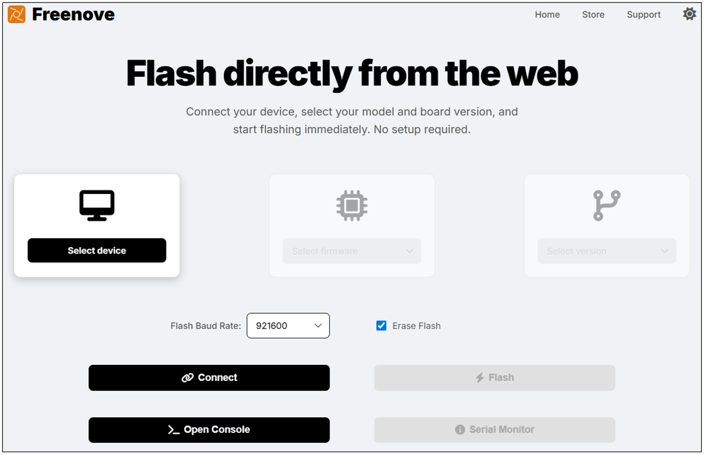

2.	Click ”Select device”

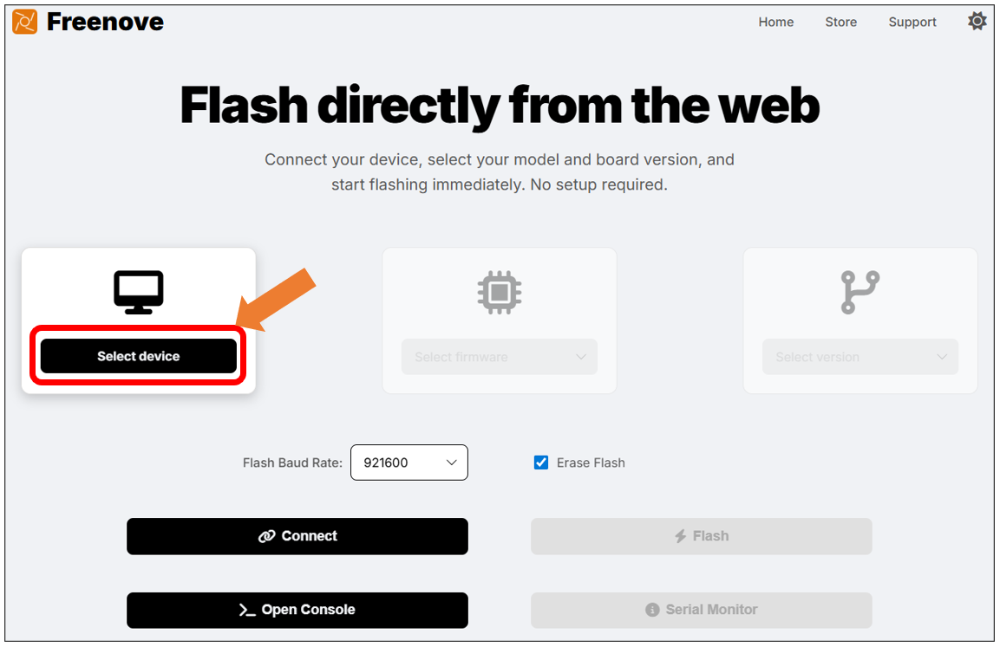
   
3. Select the device model.

:combo:`red font-bolder:Please note: The online programming feature is only supported on certain models. Please refer to the real-time list of devices displayed on the webpage. If your device is not listed, this feature is not supported for it at this time.`

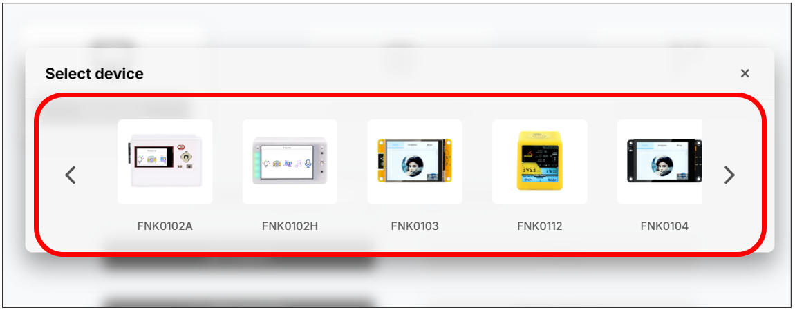

**If you have any concerns, please feel free to contact us via** support@freenove.com

4. Click "Select firmware"

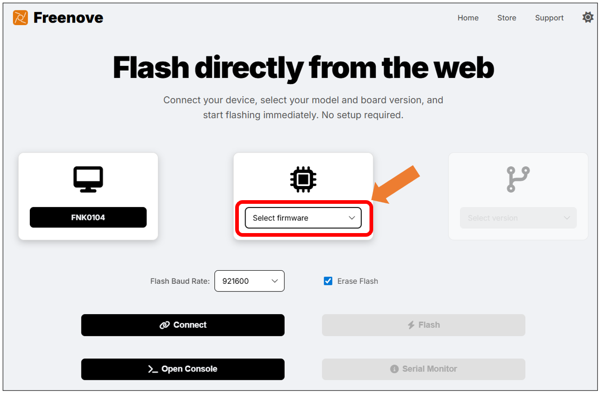
   
5.	Select "**Sketch**"

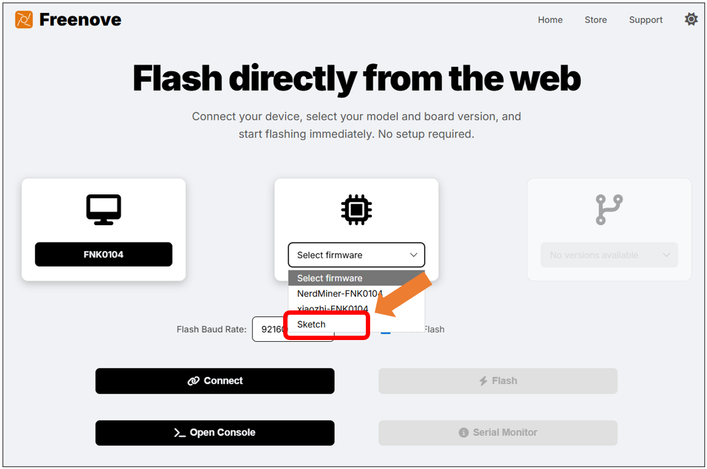
   
6.	Click "Select version"

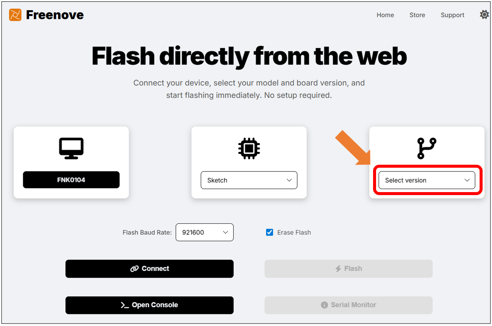
   
7. Select the sketch to upload.

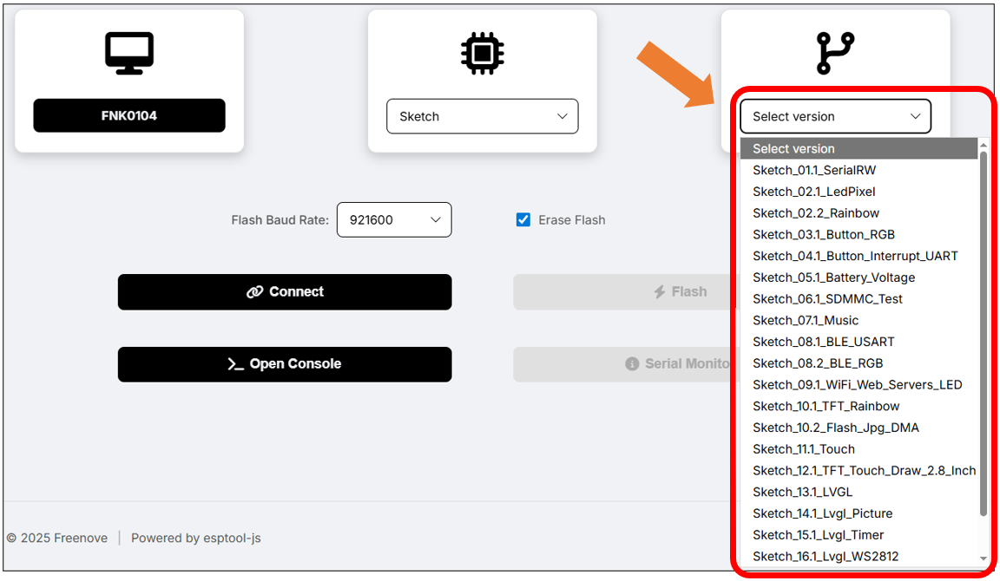

**If you have any concerns, please feel free to contact us via** support@freenove.com

8.	Click "Connect"

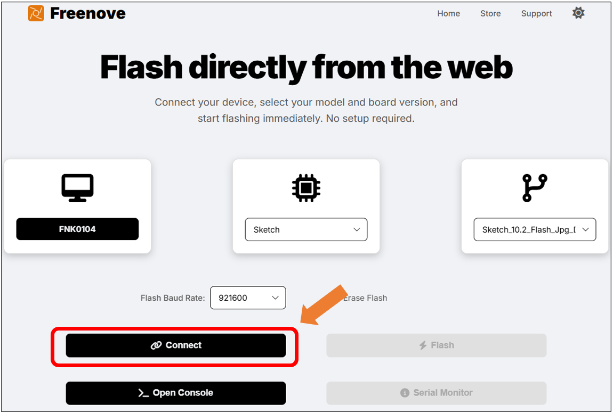
   
9.	Select the port of the device.

:combo:`red font-bolder:Notes:`

:combo:`red font-bolder:1. The port number (e.g., COMx) is dynamically assigned by your system. The specific value (such as COM3, COM5, etc.) may differ from the example in the diagram. Please select the port that is actually displayed.`

:combo:`red font-bolder:2. COM1 is typically not the port for the target device. Please select a different port to connect.`

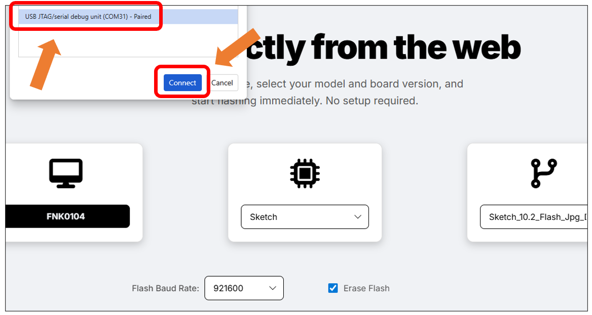

10. Click "**Flash**"

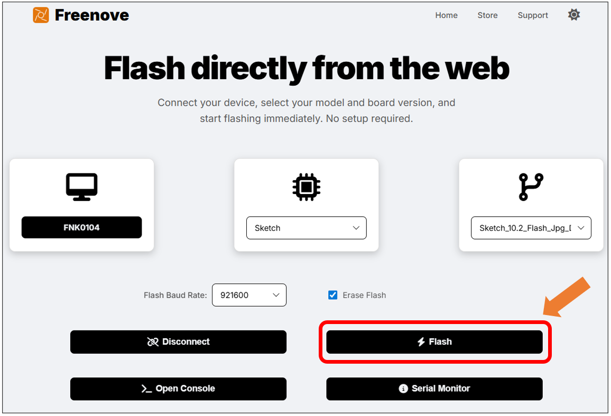

The console will launch automatically and show a live progress bar. The message "Device ready" indicates a successful download.

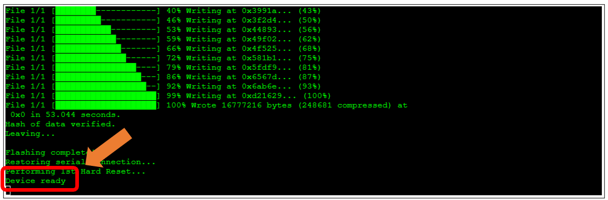
   
:combo:`red font-bolder:Note: For development boards equipped with a screen, note that not all code samples are designed to activate the display. If you need to verify the screen functionality, please flash a screen-specific example program.`

**If you have any concerns, please feel free to contact us via** support@freenove.com

11. Click “**Serial Monitor**“

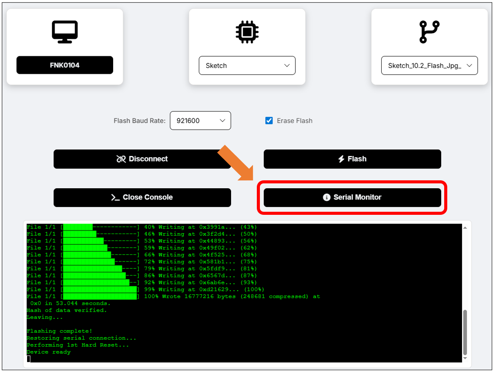
   
Set the baudrate to 115200 to view the debugging information on the serial monitor.

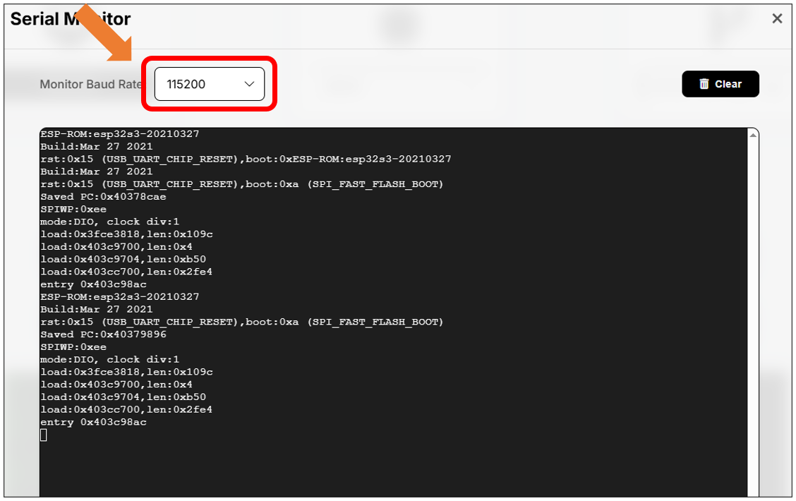