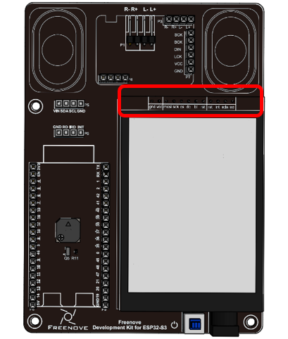

##############################################################################
0. Chapter Assembly
##############################################################################

Installation of Brass Standoffs
****************************************

Mount four M3*5 brass standoffs to the ESP32-S3 WROOM shield with four M3*4 screws, as shown below:

.. list-table:: 
   :width: 100%
   :header-rows: 1 
   :align: center
   
   * -  |Chapter00_00|
     -  |Chapter00_01|

Installation of Screen 
*************************************

Mount four M3*8+3 single-pass standoffs to the back of the screen.  

.. list-table:: 
   :width: 100%
   :header-rows: 1 
   :align: center
   
   * -  |Chapter00_02|
     -  |Chapter00_03|

Plug the screen to ESP32-S3 WROOM Shield.

.. list-table:: 
   :width: 100%
   :header-rows: 1 
   :align: center
   
   * -  |Chapter00_04|
     -  |Chapter00_05|

It should be noted that when plugging the screen, you should have the pins in line with each other to avoid misalignment.

Fix the screen to ESP32-S3 WROOM Shield with four M3*4 screws. 

.. list-table:: 
   :width: 100%
   :header-rows: 1 
   :align: center
   
   * -  |Chapter00_06|
     -  |Chapter00_07|

.. |Chapter00_06| image:: ../_static/imgs/0_Assembly/Chapter00_06.png

Installation of Speakers
********************************

Carefully tear the sticker on the back of the speakers and attach them to the ESP32-S3 WROOM Shield.

.. list-table:: 
   :width: 100%
   :header-rows: 1 
   :align: center
   
   * -  |Chapter00_08|
     -  |Chapter00_09|

Connect the wires of the speakers to ESP32-S3 WROOM Shield, as shown below:

Installation of the Audio Module
******************************************

Plug the audio module to the shield.

.. list-table:: 
   :width: 100%
   :header-rows: 1 
   :align: center
   
   * -  |Chapter00_11|
     -  |Chapter00_12|

Connection of Camera
*****************************

Gently pull up the camera connector and insert the camera module, and then press it down until it clicks into place. 

.. note:: 
    
    All cameras in this tutorial are mounted on the esp32s3 board. If you want to extend it, you can mount the camera onto the expansion pad and use the fpc cable to expand.

Connect the camera to its extension board.

Plug one end of the camera cable into the camera extension board. **Pay attention to blue side** .

Plug the other end into the ESP32.

Connection of ESP32-S3 WROOM
*************************************

Plug the ESP32-S3 WROOM to the shield.

.. list-table:: 
   :width: 100%
   :header-rows: 1 
   :align: center
   
   * -  |Chapter00_17|
     -  |Chapter00_18|

When installing the ESP32-S3 WROOM, ensure that the ESP32-S3 wroom is not improperly installed.

Connection of MAX30102
**************************************

Plug the MAX30102to the shield.

.. list-table:: 
   :width: 100%
   :header-rows: 1 
   :align: center
   
   * -  |Chapter00_17|
     -  |Chapter00_18|

:red:`Important notes:`

:red:`The MAX30102 module should not be connected reversely, otherwise it may affect the circuit, or even cause damages. It must be connected strictly according to the texts on the board. Make sure the pins are connected pin to pin. `

