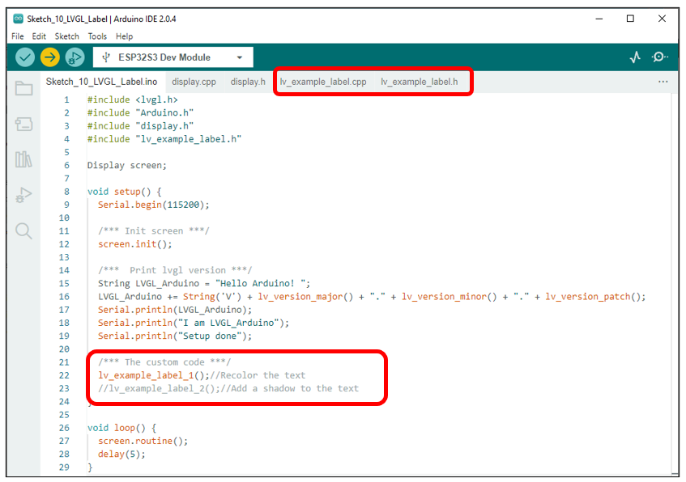
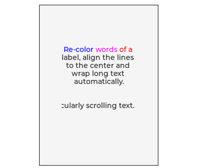
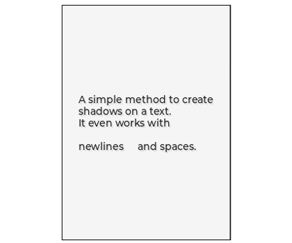

##############################################################################
Chapter LVGL Lable
##############################################################################

In this chapter, we will learn how to use the label component on the screen.

Project 10.1 LVGL Lable
**************************************

We have prepared two examples in the code, through which we will learn how to use the label component, how to display text in different colors, and how to add shadow effects to the text.

Component List 
=================================

+--------------------------+----------------+----------------+
| ESP32-S3 WROOM x1        | USB cable x1   | 2.8-inch Screen|
|                          |                |                |
| |Chapter02_00|           | |Chapter02_01| | |Chapter07_00| |
+--------------------------+----------------+----------------+
| ESP32-S3 WROOM Shield x1                                   |
|                                                            |
| |Chapter01_01|                                             |
+------------------------------------------------------------+

.. |Chapter01_01| image:: ../_static/imgs/1_ADC_Test/Chapter01_01.png
.. |Chapter02_00| image:: ../_static/imgs/2_WS2812/Chapter02_00.png
.. |Chapter02_01| image:: ../_static/imgs/2_WS2812/Chapter02_01.png
.. |Chapter07_00| image:: ../_static/imgs/7_Drving_Freenove_2.8-Inch_Screen/Chapter07_00.png

Circuit
===================================

Connect Freenove ESP32-S3 to the computer using the USB cable. 

Hardware connection. If you need any support, please feel free to contact us via: support@freenove.com

.. image:: ../_static/imgs/10_LVGL_Lable/Chapter10_00.png
    :align: center

Sketch
===============================

Sketch_10_LVGL_Lable
----------------------------------

In the code, we have prepared two examples. After compiling and uploading the code with commented lines, the screen will display different content based on each example.

The following images show the display of the two examples.

.. list-table::
   :width: 100%
   :header-rows: 1 
   :align: center
   
   * -  lv_example_label_1
     -  lv_example_label_2

   * -  |Chapter10_02|
     -  |Chapter10_03|

The following is the program code:

Sketch_10_LVGL_Lable.ino
-----------------------------------

.. literalinclude:: ../../../freenove_Kit/Sketches/Sketch_10_LVGL_Label/Sketch_10_LVGL_Label.ino
    :linenos: 
    :language: c
    :dedent:

To use some libraries, first you need to include their header files.

.. literalinclude:: ../../../freenove_Kit/Sketches/Sketch_10_LVGL_Label/Sketch_10_LVGL_Label.ino
    :linenos: 
    :language: c
    :lines: 1-4
    :dedent:

Request a screen operation object to operate the screen.

.. literalinclude:: ../../../freenove_Kit/Sketches/Sketch_10_LVGL_Label/Sketch_10_LVGL_Label.ino
    :linenos: 
    :language: c
    :lines: 6-6
    :dedent:

Initialize and configure the screen.

.. literalinclude:: ../../../freenove_Kit/Sketches/Sketch_10_LVGL_Label/Sketch_10_LVGL_Label.ino
    :linenos: 
    :language: c
    :lines: 12-12
    :dedent:

Screen refresh function, by continuously calling this function, the interface can work properly.

.. literalinclude:: ../../../freenove_Kit/Sketches/Sketch_10_LVGL_Label/Sketch_10_LVGL_Label.ino
    :linenos: 
    :language: c
    :lines: 27-27
    :dedent:

Here are two examples of lables. We can comment out one of them to display the other. For the specific code, please refer to lv_example_lable.cpp and lv_example_lable.h files.

.. literalinclude:: ../../../freenove_Kit/Sketches/Sketch_10_LVGL_Label/Sketch_10_LVGL_Label.ino
    :linenos: 
    :language: c
    :lines: 21-23
    :dedent:

lv_example_lable.h
--------------------------------

Declare two example functions so that they can be called in the ino file.

.. literalinclude:: ../../../freenove_Kit/Sketches/Sketch_10_LVGL_Label/lv_example_label.h
    :linenos: 
    :language: c
    :dedent:

lv_example_lable.cpp
----------------------------

Here is the complete code.

.. literalinclude:: ../../../freenove_Kit/Sketches/Sketch_10_LVGL_Label/lv_example_label.cpp
    :linenos: 
    :language: c
    :dedent:

Create a label component in the current interface and assign it to a component type pointer variable label1.

.. literalinclude:: ../../../freenove_Kit/Sketches/Sketch_10_LVGL_Label/lv_example_label.cpp
    :linenos: 
    :language: c
    :lines: 11-11
    :dedent:

Sets the mode of this label component.

.. literalinclude:: ../../../freenove_Kit/Sketches/Sketch_10_LVGL_Label/lv_example_label.cpp
    :linenos: 
    :language: c
    :lines: 22-22
    :dedent:

To re-customize the color of the font, please refer to the following two sentences.

.. literalinclude:: ../../../freenove_Kit/Sketches/Sketch_10_LVGL_Label/lv_example_label.cpp
    :linenos: 
    :language: c
    :lines: 23-24
    :dedent:

Set the display width of the label component. If the content to be displayed exceeds this length, the remaining text will be displayed according to the default settings of the label component.

.. literalinclude:: ../../../freenove_Kit/Sketches/Sketch_10_LVGL_Label/lv_example_label.cpp
    :linenos: 
    :language: c
    :lines: 25-25
    :dedent:

Set the text content of the label component to be displayed in the center.

.. literalinclude:: ../../../freenove_Kit/Sketches/Sketch_10_LVGL_Label/lv_example_label.cpp
    :linenos: 
    :language: c
    :lines: 26-26
    :dedent:

Set the label component to be located 40 pixels down from the center of the screen as a reference point.

.. literalinclude:: ../../../freenove_Kit/Sketches/Sketch_10_LVGL_Label/lv_example_label.cpp
    :linenos: 
    :language: c
    :lines: 27-27
    :dedent:

Declare a variable of type "style" and name it "style_shadow", then initialize this variable.

.. literalinclude:: ../../../freenove_Kit/Sketches/Sketch_10_LVGL_Label/lv_example_label.cpp
    :linenos: 
    :language: c
    :lines: 43-44
    :dedent:

Set the opacity of style_shadow to 30% and the color to black.

.. literalinclude:: ../../../freenove_Kit/Sketches/Sketch_10_LVGL_Label/lv_example_label.cpp
    :linenos: 
    :language: c
    :lines: 45-46
    :dedent:

Create a label component to serve as the shadow effect with the style set to style_shadow.

.. literalinclude:: ../../../freenove_Kit/Sketches/Sketch_10_LVGL_Label/lv_example_label.cpp
    :linenos: 
    :language: c
    :lines: 49-50
    :dedent:

Define a label component to display the main text and set its content.

.. literalinclude:: ../../../freenove_Kit/Sketches/Sketch_10_LVGL_Label/lv_example_label.cpp
    :linenos: 
    :language: c
    :lines: 53-57
    :dedent:

Read the content of the main_lable1 component and copy the content to the shadow_label component

.. literalinclude:: ../../../freenove_Kit/Sketches/Sketch_10_LVGL_Label/lv_example_label.cpp
    :linenos: 
    :language: c
    :lines: 60-60
    :dedent:

Display the content of the main_lable1 component in the center of the screen, and use main_lable1 as a reference to display the content of shadow_label1 2 pixels below and 2 pixels to the right of main_lable1, creating a shadow effect.

.. literalinclude:: ../../../freenove_Kit/Sketches/Sketch_10_LVGL_Label/lv_example_label.cpp
    :linenos: 
    :language: c
    :lines: 62-66
    :dedent:

To learn more abou LVGL, please refer to the link below:

https://docs.lvgl.io/8.1/widgets/core/label.html