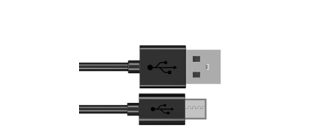

##############################################################################
Chapter LVGL Button
##############################################################################

In this Chapter, we will learn how to use the button component on the screen

Project 11.1 LVGL Button
**************************************

We have prepared three examples in the code to learn how to use the button component.

Component List 
====================================

+--------------------------+----------------+----------------+
| ESP32-S3 WROOM x1        | USB cable x1   | 2.8-inch Screen|
|                          |                |                |
| |Chapter02_00|           | |Chapter02_01| | |Chapter07_00| |
+--------------------------+----------------+----------------+
| ESP32-S3 WROOM Shield x1                                   |
|                                                            |
| |Chapter01_01|                                             |
+------------------------------------------------------------+

.. |Chapter01_01| image:: ../_static/imgs/1_ADC_Test/Chapter01_01.png
.. |Chapter02_00| image:: ../_static/imgs/2_WS2812/Chapter02_00.png

.. |Chapter07_00| image:: ../_static/imgs/7_Drving_Freenove_2.8-Inch_Screen/Chapter07_00.png

Circuit
===================================

Connect Freenove ESP32-S3 to the computer using the USB cable. 

Hardware connection. If you need any support, please feel free to contact us via: support@freenove.com

Sketch
=============================

Sketch_11_LVGL_Btn
------------------------------

After commenting out the code, compiling and uploading it, different content can be displayed on the screen.

Below are displaying examples

The following is the program code:

Sketch_11_LVGL_Btn.ino
---------------------------------

.. literalinclude:: ../../../freenove_Kit/Sketches/Sketch_11_LVGL_Btn/Sketch_11_LVGL_Btn.ino
    :linenos: 
    :language: c
    :dedent:

There are three examples of button components. We can comment out two of them and remain one to display on the screen. The specific code can be found in the lv_example_btn.cpp and lv_example_btn.h files.

.. literalinclude:: ../../../freenove_Kit/Sketches/Sketch_11_LVGL_Btn/Sketch_11_LVGL_Btn.ino
    :linenos: 
    :language: c
    :lines: 21-24
    :dedent:

lv_example_btn.h
--------------------------------

Declare threee functions so that they can be called in the ino file.

.. literalinclude:: ../../../freenove_Kit/Sketches/Sketch_11_LVGL_Btn/lv_example_btn.h
    :linenos: 
    :language: c
    :dedent:

lv_example_btn.cpp
------------------------------

Here is the complete code.

.. literalinclude:: ../../../freenove_Kit/Sketches/Sketch_11_LVGL_Btn/lv_example_btn.cpp
    :linenos: 
    :language: c
    :dedent:

Create a button component in the current interface and assign it to a component type pointer variable btn1.

.. literalinclude:: ../../../freenove_Kit/Sketches/Sketch_11_LVGL_Btn/lv_example_btn.cpp
    :linenos: 
    :language: c
    :lines: 17-17
    :dedent:

Associate the button btn1 with a callback function event_handler to be triggered when the button is pressed.

.. literalinclude:: ../../../freenove_Kit/Sketches/Sketch_11_LVGL_Btn/lv_example_btn.cpp
    :linenos: 
    :language: c
    :lines: 18-18
    :dedent:

Display the button btn1 40 pixels above the center of the screen.

.. literalinclude:: ../../../freenove_Kit/Sketches/Sketch_11_LVGL_Btn/lv_example_btn.cpp
    :linenos: 
    :language: c
    :lines: 19-19
    :dedent:

Add a label component to button btn1 with the text "Button" displayed at the center of the button btn1.

.. literalinclude:: ../../../freenove_Kit/Sketches/Sketch_11_LVGL_Btn/lv_example_btn.cpp
    :linenos: 
    :language: c
    :lines: 20-22
    :dedent:

Set the button btn2 to have a selected toggle state effect, and set it to default height and width.

.. literalinclude:: ../../../freenove_Kit/Sketches/Sketch_11_LVGL_Btn/lv_example_btn.cpp
    :linenos: 
    :language: c
    :lines: 27-28
    :dedent:

Create a style object and use it to set the component to have a background color gradient from blue to dark blue, with a 3-pixel rounded corner and 100% opacity.

.. literalinclude:: ../../../freenove_Kit/Sketches/Sketch_11_LVGL_Btn/lv_example_btn.cpp
    :linenos: 
    :language: c
    :lines: 38-44
    :dedent:

Apply a style to the component with 40% non-transparent border opacity, 2-pixel border width, and gray border color.

.. literalinclude:: ../../../freenove_Kit/Sketches/Sketch_11_LVGL_Btn/lv_example_btn.cpp
    :linenos: 
    :language: c
    :lines: 45-47
    :dedent:

Set the shadow of the component style to occupy 8 pixel rows, with the color gray, and the shadow offset relative to the main body is 8 pixel rows downward.

.. literalinclude:: ../../../freenove_Kit/Sketches/Sketch_11_LVGL_Btn/lv_example_btn.cpp
    :linenos: 
    :language: c
    :lines: 48-50
    :dedent:

Set the outline of the component style to be fully opaque, and set the outline color to blue. 

.. literalinclude:: ../../../freenove_Kit/Sketches/Sketch_11_LVGL_Btn/lv_example_btn.cpp
    :linenos: 
    :language: c
    :lines: 51-52
    :dedent:

Set the component style font color to white and set the font distance from the component's border to 10 pixels.

.. literalinclude:: ../../../freenove_Kit/Sketches/Sketch_11_LVGL_Btn/lv_example_btn.cpp
    :linenos: 
    :language: c
    :lines: 53-54
    :dedent:

Set the outline of component style_pr to 30 pixels and the outline opacity to fully transparent.

.. literalinclude:: ../../../freenove_Kit/Sketches/Sketch_11_LVGL_Btn/lv_example_btn.cpp
    :linenos: 
    :language: c
    :lines: 60-61
    :dedent:

Set the component style_pr to have a downward offset of 5 pixels for the main body and 3 pixels for the shadow.

.. literalinclude:: ../../../freenove_Kit/Sketches/Sketch_11_LVGL_Btn/lv_example_btn.cpp
    :linenos: 
    :language: c
    :lines: 62-63
    :dedent:

Set the background color to be 2 shades darker than the normal blue color. Set the background gradient color to be 4 shades darker than the normal blue color.

.. literalinclude:: ../../../freenove_Kit/Sketches/Sketch_11_LVGL_Btn/lv_example_btn.cpp
    :linenos: 
    :language: c
    :lines: 64-65
    :dedent:

Apply for a transition object, set the transition time to 300ms, and associate it with the style_pr component.

.. literalinclude:: ../../../freenove_Kit/Sketches/Sketch_11_LVGL_Btn/lv_example_btn.cpp
    :linenos: 
    :language: c
    :lines: 68-71
    :dedent:

Create a button object btn1 and remove all default styles. Set the style of the button in its normal state to style. When the button is pressed, trigger a transition effect from style to style_pr. Set the button to default width and height, and display it in the center of the screen.

.. literalinclude:: ../../../freenove_Kit/Sketches/Sketch_11_LVGL_Btn/lv_example_btn.cpp
    :linenos: 
    :language: c
    :lines: 73-78
    :dedent:

Set the width of the style_pr component to double its original size, decrease its height to half of its original size, and increase the font spacing by double.

.. literalinclude:: ../../../freenove_Kit/Sketches/Sketch_11_LVGL_Btn/lv_example_btn.cpp
    :linenos: 
    :language: c
    :lines: 106-108
    :dedent:
