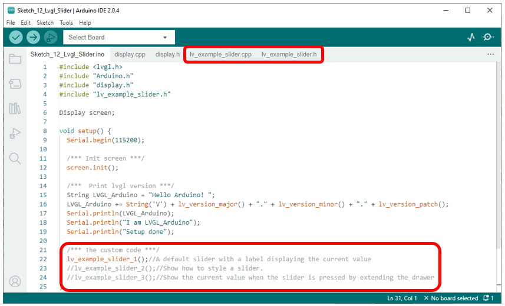
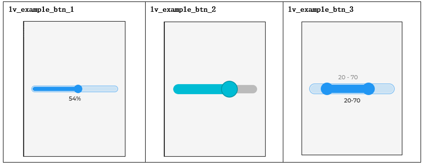

##############################################################################
Chapter LVGL Slider
##############################################################################

In this Chapter, we will learn how to use the Slider component on the screen.

Project 12.1 LVGL Slider
***************************************

We have prepared three examples in the code, through which we will learn how to use the Slider component.

Component List 
====================================

+--------------------------+----------------+----------------+
| ESP32-S3 WROOM x1        | USB cable x1   | 2.8-inch Screen|
|                          |                |                |
| |Chapter02_00|           | |Chapter02_01| | |Chapter07_00| |
+--------------------------+----------------+----------------+
| ESP32-S3 WROOM Shield x1                                   |
|                                                            |
| |Chapter01_01|                                             |
+------------------------------------------------------------+

.. |Chapter01_01| image:: ../_static/imgs/1_ADC_Test/Chapter01_01.png
.. |Chapter02_00| image:: ../_static/imgs/2_WS2812/Chapter02_00.png
.. |Chapter02_01| image:: ../_static/imgs/2_WS2812/Chapter02_01.png
.. |Chapter07_00| image:: ../_static/imgs/7_Drving_Freenove_2.8-Inch_Screen/Chapter07_00.png

Circuit
===================================

Connect Freenove ESP32-S3 to the computer using the USB cable. 

Hardware connection. If you need any support, please feel free to contact us via: support@freenove.com

.. image:: ../_static/imgs/10_LVGL_Lable/Chapter10_00.png
    :align: center

Sketch
=============================

Sketch_12_LVGL_Slider
-----------------------------

After commenting out the code, compiling and uploading, the screen will display different contents depending on which example is uncommented.

Here are illustrations of the examples.

The following is the program code:

Sketch_12_LVGL_Slider.ino
---------------------------------

.. literalinclude:: ../../../freenove_Kit/Sketches/Sketch_12_Lvgl_Slider/Sketch_12_Lvgl_Slider.ino
    :linenos: 
    :language: c
    :dedent:

Here are three examples of Slider. We can comment out two of them to display the remaining one. You can refer to the lv_example_slider.cpp and lv_example_slider.h files for the specific code.

.. literalinclude:: ../../../freenove_Kit/Sketches/Sketch_12_Lvgl_Slider/Sketch_12_Lvgl_Slider.ino
    :linenos: 
    :language: c
    :lines: 22-24
    :dedent:

lv_example_slider.h
------------------------------

Declare three functions so that they can be called in the ino file.

.. literalinclude:: ../../../freenove_Kit/Sketches/Sketch_12_Lvgl_Slider/lv_example_slider.h
    :linenos: 
    :language: c
    :dedent:

lv_example_slider.cpp
--------------------------------

Here is the complete code.

.. literalinclude:: ../../../freenove_Kit/Sketches/Sketch_12_Lvgl_Slider/lv_example_slider.cpp
    :linenos: 
    :language: c
    :dedent:

Create a slider component with a width of 200 pixels and a height of 10 pixels, center it on the screen, and associate it with the callback function slider_event_cb_1.

.. literalinclude:: ../../../freenove_Kit/Sketches/Sketch_12_Lvgl_Slider/lv_example_slider.cpp
    :linenos: 
    :language: c
    :lines: 14-27
    :dedent:

Get the object responsible for triggering the slider event and assign it to the variable "slider".

.. literalinclude:: ../../../freenove_Kit/Sketches/Sketch_12_Lvgl_Slider/lv_example_slider.cpp
    :linenos: 
    :language: c
    :lines: 8-11
    :dedent:

Get the value of the slider, use the lv_snprintf() function to concatenate the data together, and display the content on a label.

.. literalinclude:: ../../../freenove_Kit/Sketches/Sketch_12_Lvgl_Slider/lv_example_slider.cpp
    :linenos: 
    :language: c
    :lines: 7-7
    :dedent:

Create a background color transition object with a transition time of 300ms.

.. literalinclude:: ../../../freenove_Kit/Sketches/Sketch_12_Lvgl_Slider/lv_example_slider.cpp
    :linenos: 
    :language: c
    :lines: 32-34
    :dedent:

Set the "style_main" component's background to fully opaque, the background color to gray, and to rounded cornered. Also, make the indicator two pixels larger than the slider on the top and bottom.

.. literalinclude:: ../../../freenove_Kit/Sketches/Sketch_12_Lvgl_Slider/lv_example_slider.cpp
    :linenos: 
    :language: c
    :lines: 40-44
    :dedent:

Set the background opacity of style_indicator component to fully opaque, set the background color to blue, set the component to rounded corner, and add a transition display for background color.

.. literalinclude:: ../../../freenove_Kit/Sketches/Sketch_12_Lvgl_Slider/lv_example_slider.cpp
    :linenos: 
    :language: c
    :lines: 46-50
    :dedent:

Set the background opacity of the style_knob component to be completely opaque, set the background color to cyan, set the edge color to 2 shades darker than cyan. Set the edge width of the component to 2 pixels, set the component as rounded, and set the knob 10 pixels larger than the slider.

.. literalinclude:: ../../../freenove_Kit/Sketches/Sketch_12_Lvgl_Slider/lv_example_slider.cpp
    :linenos: 
    :language: c
    :lines: 52-59
    :dedent:

Set the background color of the style_pressed_color component to 2 shades darker than cyan.

.. literalinclude:: ../../../freenove_Kit/Sketches/Sketch_12_Lvgl_Slider/lv_example_slider.cpp
    :linenos: 
    :language: c
    :lines: 61-62
    :dedent:

Create a slider component, remove the default style attribute, add new attributes to the slider, and set the slider width to 200 pixels, height to 20 pixels, and display it in the center of the screen.

.. literalinclude:: ../../../freenove_Kit/Sketches/Sketch_12_Lvgl_Slider/lv_example_slider.cpp
    :linenos: 
    :language: c
    :lines: 64-73
    :dedent:

If the drawing area of the indicator part changes, get the value of the slider and display it.

.. literalinclude:: ../../../freenove_Kit/Sketches/Sketch_12_Lvgl_Slider/lv_example_slider.cpp
    :linenos: 
    :language: c
    :lines: 8-11
    :dedent:

Create a slider component with a width of 200 pixels, a height of 20 pixels, and display it in the center of the screen.

.. literalinclude:: ../../../freenove_Kit/Sketches/Sketch_12_Lvgl_Slider/lv_example_slider.cpp
    :linenos: 
    :language: c
    :lines: 17-19
    :dedent:

Change the slider mode from normal mode to range mode. Set the starting value of the slider to 20 and the ending value to 70.

.. literalinclude:: ../../../freenove_Kit/Sketches/Sketch_12_Lvgl_Slider/lv_example_slider.cpp
    :linenos: 
    :language: c
    :lines: 98-100
    :dedent:

Associate the slider with the callback function slider_event_cb_3. Refresh the drawing size.

.. literalinclude:: ../../../freenove_Kit/Sketches/Sketch_12_Lvgl_Slider/lv_example_slider.cpp
    :linenos: 
    :language: c
    :lines: 102-103
    :dedent:

Create a label component, which displays the content of the slider 10 pixels below the slider.

.. literalinclude:: ../../../freenove_Kit/Sketches/Sketch_12_Lvgl_Slider/lv_example_slider.cpp
    :linenos: 
    :language: c
    :lines: 105-108
    :dedent:

For more information about LVGL, please refer to the link below:

https://docs.lvgl.io/8.1/widgets/core/slider.html