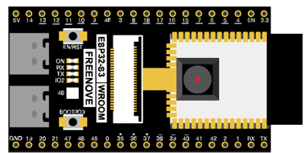
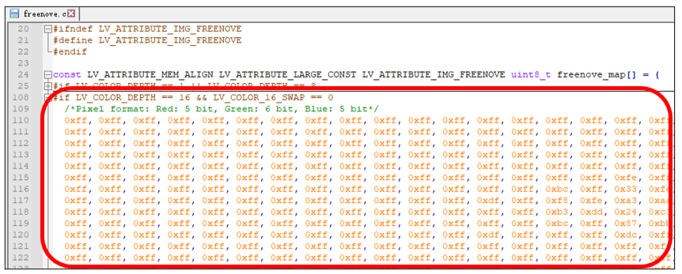

##############################################################################
Chapter LVGL Img
##############################################################################

In this chapter, we will explore how to use the img component to display images on the screen in LVGL.

Project 13.1 LVGL Img
*********************************

In this section, we will cover three examples that demonstrate how to use the img component in LVGL. Through these examples, you will learn how to effectively display images on the screen using the img component.

Component List 
====================================

+--------------------------+----------------+----------------+
| ESP32-S3 WROOM x1        | USB cable x1   | 2.8-inch Screen|
|                          |                |                |
| |Chapter02_00|           | |Chapter02_01| | |Chapter07_00| |
+--------------------------+----------------+----------------+
| ESP32-S3 WROOM Shield x1                                   |
|                                                            |
| |Chapter01_01|                                             |
+------------------------------------------------------------+

.. |Chapter01_01| image:: ../_static/imgs/1_ADC_Test/Chapter01_01.png

.. |Chapter02_01| image:: ../_static/imgs/2_WS2812/Chapter02_01.png
.. |Chapter07_00| image:: ../_static/imgs/7_Drving_Freenove_2.8-Inch_Screen/Chapter07_00.png

Circuit
===================================

Connect Freenove ESP32-S3 to the computer using the USB cable. 

Hardware connection. If you need any support, please feel free to contact us via: support@freenove.com

.. image:: ../_static/imgs/10_LVGL_Lable/Chapter10_00.png
    :align: center

Sketch
=================================

Sketch_13_LVGL_Img
---------------------------------

By commenting out different sections of the code, compiling and uploading, you can display different content on the screen.

Below are the illustrations of the the examples.

The following is the program code:

Sketch_13_LVGL_Img.ino
--------------------------------

.. literalinclude:: ../../../freenove_Kit/Sketches/Sketch_13_Lvgl_Img/Sketch_13_Lvgl_Img.ino
    :linenos: 
    :language: c
    :dedent:

Here are three examples. We can comment out two of them to display the remaining one. Please refer to the lv_example_img.cpp and lv_example_img.h files for the specific code.

.. literalinclude:: ../../../freenove_Kit/Sketches/Sketch_13_Lvgl_Img/Sketch_13_Lvgl_Img.ino
    :linenos: 
    :language: c
    :lines: 21-24
    :dedent:

lv_example_img.h
-----------------------------

Declare three functions so that they can be called in the ino file.

.. literalinclude:: ../../../freenove_Kit/Sketches/Sketch_13_Lvgl_Img/lv_example_img.h
    :linenos: 
    :language: c
    :dedent:

Here is the complete code.

lv_example_img.cpp
----------------------------

.. literalinclude:: ../../../freenove_Kit/Sketches/Sketch_13_Lvgl_Img/lv_example_img.cpp
    :linenos: 
    :language: c
    :dedent:

Here we provide a website: https://lvgl.io/tools/imageconverter

It is an official website that allows you to convert images into arrays. You can click on the "Browse" button to select an image and convert it into an array file using the following configuration. Here we take the Freenove logo as an example.

Click "Convert" and the website will generate and download the corresponding array file. Open this file and find the definition shown below.

Define an array img_freenove_map and copy the content of the previously generated array to it.

.. code-block:: c
    :linenos:
    
    const uint8_t img_freenove_map[] = {
        ......
    };

Define an image type variable img_freenove and write a function lv_img_freenove_init() to initialize it. 

Please note that the resolution of the original image must be filled in correctly. "w" and "h" represent the width and height of the original image resolution, respectively. "data_size" represents the size of the image, while "data" represents the actual image data. It is recommended not to modify other options.

.. literalinclude:: ../../../freenove_Kit/Sketches/Sketch_13_Lvgl_Img/lv_example_img.cpp
    :linenos: 
    :language: c
    :lines: 88-98
    :dedent:

Call the lv_img_freenove_init() function to configure img_freenove.

.. literalinclude:: ../../../freenove_Kit/Sketches/Sketch_13_Lvgl_Img/lv_example_img.cpp
    :linenos: 
    :language: c
    :lines: 101-101
    :dedent:

Create a new image component and assign it to img1, set the image content to img_freenove, and display the image 20 pixels above the center of the screen. Set the size of the component to 80 pixels wide and 80 pixels high.

.. literalinclude:: ../../../freenove_Kit/Sketches/Sketch_13_Lvgl_Img/lv_example_img.cpp
    :linenos: 
    :language: c
    :lines: 102-105
    :dedent:

Create a new image component and assign it to img2. Display an internal symbol and text on img2. Set img2 to be positioned 20 pixels below img1.

.. literalinclude:: ../../../freenove_Kit/Sketches/Sketch_13_Lvgl_Img/lv_example_img.cpp
    :linenos: 
    :language: c
    :lines: 107-109
    :dedent:

Write a slider creation function, set the range, size, background color, and associated function of the slider.

.. literalinclude:: ../../../freenove_Kit/Sketches/Sketch_13_Lvgl_Img/lv_example_img.cpp
    :linenos: 
    :language: c
    :lines: 125-133
    :dedent:

Create 4 sliders, and set them to different colors.

.. literalinclude:: ../../../freenove_Kit/Sketches/Sketch_13_Lvgl_Img/lv_example_img.cpp
    :linenos: 
    :language: c
    :lines: 138-141
    :dedent:

Use the values of three sliders to redefine the color of the image, and use the value of one slider to modify the opacity of the image background.

.. literalinclude:: ../../../freenove_Kit/Sketches/Sketch_13_Lvgl_Img/lv_example_img.cpp
    :linenos: 
    :language: c
    :lines: 116-123
    :dedent:

Trigger a slider event manually.

.. literalinclude:: ../../../freenove_Kit/Sketches/Sketch_13_Lvgl_Img/lv_example_img.cpp
    :linenos: 
    :language: c
    :lines: 158-158
    :dedent:

Image rotation function.

.. literalinclude:: ../../../freenove_Kit/Sketches/Sketch_13_Lvgl_Img/lv_example_img.cpp
    :linenos: 
    :language: c
    :lines: 163-163
    :dedent:

Image scaling function.

.. literalinclude:: ../../../freenove_Kit/Sketches/Sketch_13_Lvgl_Img/lv_example_img.cpp
    :linenos: 
    :language: c
    :lines: 167-167
    :dedent:

Create an image component, set the display content and display position. Set the origin position of the image.

.. literalinclude:: ../../../freenove_Kit/Sketches/Sketch_13_Lvgl_Img/lv_example_img.cpp
    :linenos: 
    :language: c
    :lines: 172-177
    :dedent:

Create an animation object, associate the animation object with the img component, set the animation time to 3000ms, and the animation playback time to 3000ms, and play the animation repeatedly.

.. literalinclude:: ../../../freenove_Kit/Sketches/Sketch_13_Lvgl_Img/lv_example_img.cpp
    :linenos: 
    :language: c
    :lines: 179-184
    :dedent:

Set the animation object associated with the set_angle function, with a precision of 0.1 degrees and 360 degrees corresponding to 3600. Start the animation.

.. literalinclude:: ../../../freenove_Kit/Sketches/Sketch_13_Lvgl_Img/lv_example_img.cpp
    :linenos: 
    :language: c
    :lines: 186-188
    :dedent:

Associate the animation object with the set_zoom function, with 256 as the original image size, 128 representing the image being reduced to half its size, and 512 representing the image being enlarged to twice its size. Start the animation.

.. literalinclude:: ../../../freenove_Kit/Sketches/Sketch_13_Lvgl_Img/lv_example_img.cpp
    :linenos: 
    :language: c
    :lines: 190-192
    :dedent:

For more information about LVGL, please refer to the link below: https://docs.lvgl.io/8.1/widgets/core/img.html