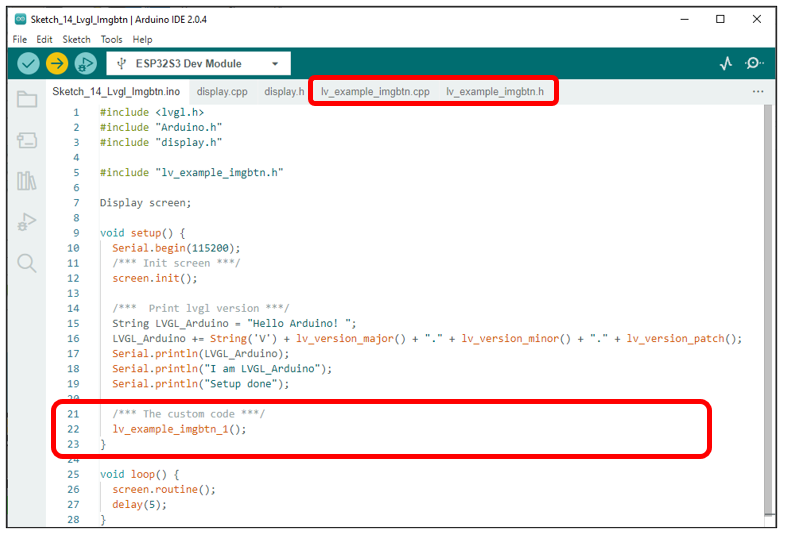
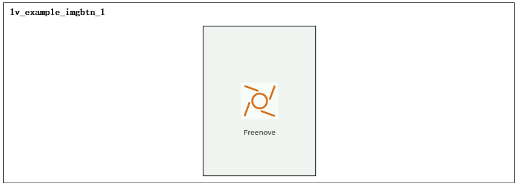
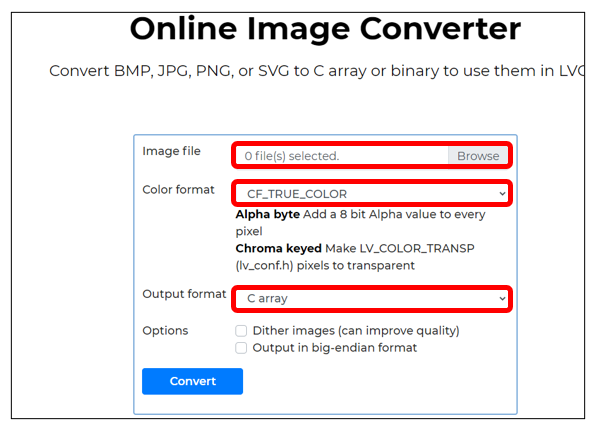
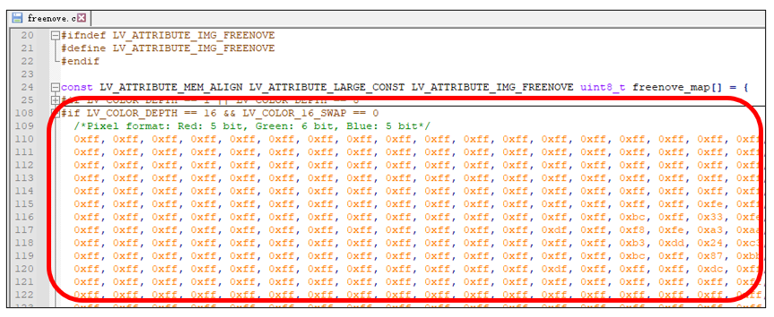

##############################################################################
Chapter LVGL Imgbtn
##############################################################################

In this chapter, we will learn the usage of imgbtn component on the screen.

Project 14.1 LVGL Imgbtn
****************************************

We have provided an example in the code. With the example, we will learn how to use the imgbtn component.

Component List 
====================================

+--------------------------+----------------+----------------+
| ESP32-S3 WROOM x1        | USB cable x1   | 2.8-inch Screen|
|                          |                |                |
| |Chapter02_00|           | |Chapter02_01| | |Chapter07_00| |
+--------------------------+----------------+----------------+
| ESP32-S3 WROOM Shield x1                                   |
|                                                            |
| |Chapter01_01|                                             |
+------------------------------------------------------------+

.. |Chapter01_01| image:: ../_static/imgs/1_ADC_Test/Chapter01_01.png
.. |Chapter02_00| image:: ../_static/imgs/2_WS2812/Chapter02_00.png
.. |Chapter02_01| image:: ../_static/imgs/2_WS2812/Chapter02_01.png
.. |Chapter07_00| image:: ../_static/imgs/7_Drving_Freenove_2.8-Inch_Screen/Chapter07_00.png

Circuit
===================================

Connect Freenove ESP32-S3 to the computer using the USB cable. 

Hardware connection. If you need any support, please feel free to contact us via: support@freenove.com

.. image:: ../_static/imgs/10_LVGL_Lable/Chapter10_00.png
    :align: center

Sketch
=====================

Sketch_14_LVGL_Imgbtn
------------------------------

Here is an illustration of the example:

The following is the program code:

Sketch_14_LVGL_Imgbtn.ino
---------------------------------

.. literalinclude:: ../../../freenove_Kit/Sketches/Sketch_14_Lvgl_Imgbtn/Sketch_14_Lvgl_Imgbtn.ino
    :linenos: 
    :language: c
    :dedent:

lv_example_imgbtn.h
--------------------------------

We can define the three example functions and call them in the ino file.

.. literalinclude:: ../../../freenove_Kit/Sketches/Sketch_14_Lvgl_Imgbtn/lv_example_imgbtn.h
    :linenos: 
    :language: c
    :dedent:

Here is the complete code:

lv_example_imgbtn.cpp
-------------------------------

.. literalinclude:: ../../../freenove_Kit/Sketches/Sketch_14_Lvgl_Imgbtn/lv_example_imgbtn.cpp
    :linenos: 
    :language: c
    :dedent:

Here we provide a website: https://lvgl.io/tools/imageconverter

You can use the official website to convert an image to an array. Click "Browse" to select an image and convert it to an array file with the following configuration. Here we take the Freenove logo as an example.

Click "Convert" and the website will generate and download the corresponding array file. Open this file and find the definition shown below.

Define an array img_freenove_map and copy the content of the previously generated array to it.

.. code-block:: c

    const uint8_t img_freenove_map[] = {
    ......
    };

Define a variable img_freenove of type lv_img_dsc_t and write a function lv_img_freenove_init() to initialize it.

Please note that the original image resolution must be correctly filled in. "w" and "h" represent the width and height of the original image resolution, respectively. "data_size" represents the size of the image, while "data" represents the actual image data. It is recommended not to modify other options.

.. literalinclude:: ../../../freenove_Kit/Sketches/Sketch_14_Lvgl_Imgbtn/lv_example_imgbtn.cpp
    :linenos: 
    :language: c
    :lines: 88-98
    :dedent:

Call the lv_img_freenove_init() function to configure img_freenove.

.. literalinclude:: ../../../freenove_Kit/Sketches/Sketch_14_Lvgl_Imgbtn/lv_example_imgbtn.cpp
    :linenos: 
    :language: c
    :lines: 101-101
    :dedent:

Create a style component, when this component is triggered, move the component down 5 pixels.

.. literalinclude:: ../../../freenove_Kit/Sketches/Sketch_14_Lvgl_Imgbtn/lv_example_imgbtn.cpp
    :linenos: 
    :language: c
    :lines: 102-105
    :dedent:

Create an image button component. Trigger the effect of the style when the component is pressed.

.. literalinclude:: ../../../freenove_Kit/Sketches/Sketch_14_Lvgl_Imgbtn/lv_example_imgbtn.cpp
    :linenos: 
    :language: c
    :lines: 107-109
    :dedent:

Set the size and position of the image button component, and display a picture on it.

.. literalinclude:: ../../../freenove_Kit/Sketches/Sketch_14_Lvgl_Imgbtn/lv_example_imgbtn.cpp
    :linenos: 
    :language: c
    :lines: 111-113
    :dedent:

Create a label and display the content of the label 20 pixels below the image button component.

.. literalinclude:: ../../../freenove_Kit/Sketches/Sketch_14_Lvgl_Imgbtn/lv_example_imgbtn.cpp
    :linenos: 
    :language: c
    :lines: 115-118
    :dedent:

For more information about LVGL, please refer to the link below: 

https://docs.lvgl.io/8.1/widgets/extra/imgbtn.html