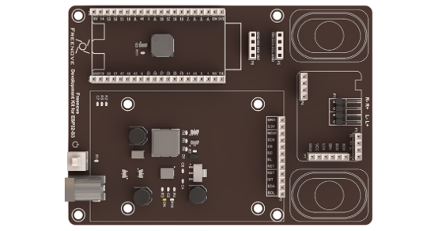

##############################################################################
Chapter LVGL Camera
##############################################################################

In this chapter, we will learn how to create a camera example. 

Project 15.1 LVGL Camera
************************************

In this project, we will learn how to display the images captured by the camera on the screen.

Component List 
====================================

+---------------------------------+-----------------------------+------------------------------------------+
| ESP32-S3 WROOM x1               | USB cable x1                | SDcard x1                                |
|                                 |                             |                                          |
| |Chapter02_00|                  | |Chapter02_01|              | |Chapter04_00|                           |
+---------------------------------+-----------------------------+------------------------------------------+
| Card reader x1 (random color)                                 | 2.8-inch screen                          |
|                                                               |                                          |
| :red:`(Not a USB flash drive.)`                               |                                          |
|                                                               |                                          |
| |Chapter04_01|                                                | |Chapter07_00|                           |
+-----------------------------------------------+---------------+------------------------------------------+
| ESP32-S3 WROOM Shield x1                      | 9V battery x1                                            |
|                                               |                                                          |
| :red:`(Not a USB flash drive.)`               | :red:`(Not included in the kit, prepared by yourself)`   |
|                                               |                                                          |
| |Chapter01_01|                                | |Chapter01_03|                                           |
|                                               +----------------------------------------------------------+
|                                               | 9V battery cable x1                                      |
|                                               |                                                          |
|                                               | |Chapter05_02|                                           |
+-----------------------------------------------+----------------------------------------------------------+

.. |Chapter01_03| image:: ../_static/imgs/1_ADC_Test/Chapter01_03.png
.. |Chapter02_00| image:: ../_static/imgs/2_WS2812/Chapter02_00.png
.. |Chapter02_01| image:: ../_static/imgs/2_WS2812/Chapter02_01.png
.. |Chapter04_00| image:: ../_static/imgs/4_Read_and_Write_the_SDcard/Chapter04_00.png
.. |Chapter04_01| image:: ../_static/imgs/4_Read_and_Write_the_SDcard/Chapter04_01.png
.. |Chapter07_00| image:: ../_static/imgs/7_Drving_Freenove_2.8-Inch_Screen/Chapter07_00.png
.. |Chapter05_02| image:: ../_static/imgs/5_Play_SD_card_music/Chapter05_02.png

Circuit
==============================

If you have not yet used the SD card, please refer to Chapter 4. Click :ref:`here <SDcard>` to navigate back to Chapter 4.

Before connecting the USB cable, insert the SD card into the SD card slot on the back of the ESP32-S3.

.. image:: ../_static/imgs/5_Play_SD_card_music/Chapter05_08.png
    :align: center

Connect Freenove ESP32-S3 to the computer using the USB cable. 

.. image:: ../_static/imgs/5_Play_SD_card_music/Chapter05_09.png
    :align: center

Sketch
============================

.. note::
    
    If you press the button to take a picture in the project, the picture will be saved to the picture folder of the sd card. You can use a card reader to access these pictures.

If you want to flip the image of the display, just swipe the screen slightly from left to right.

Sketch_15_LVGL_Camera
------------------------------

The following is the program code:

.. literalinclude:: ../../../freenove_Kit/Sketches/Sketch_15_Lvgl_Camera/Sketch_15_Lvgl_Camera.ino
    :linenos: 
    :language: c
    :dedent:

Initialize the SD card, camera, and screen. Note that the LVGL library file system has already been configured to include the SD card by default. Therefore, in order to use the file system to manipulate the SD card in LVGL, SD card initialization must be performed before screen initialization.

.. literalinclude:: ../../../freenove_Kit/Sketches/Sketch_15_Lvgl_Camera/Sketch_15_Lvgl_Camera.ino
    :linenos: 
    :language: c
    :lines: 14-16
    :dedent:

Configure the camera interface and load this interface.

.. literalinclude:: ../../../freenove_Kit/Sketches/Sketch_15_Lvgl_Camera/Sketch_15_Lvgl_Camera.ino
    :linenos: 
    :language: c
    :lines: 23-24
    :dedent:

camera_ui.h
-------------------------

Declare the functions so that they can be called in the INO file.

.. literalinclude:: ../../../freenove_Kit/Sketches/Sketch_15_Lvgl_Camera/camera_ui.h
    :linenos: 
    :language: c
    :dedent:

camera_ui.cpp
----------------------------

.. literalinclude:: ../../../freenove_Kit/Sketches/Sketch_15_Lvgl_Camera/camera_ui.cpp
    :linenos: 
    :language: c
    :dedent:

Obtain the raw data of the camera through esp_camera_fb_get(), store the data in fb_buf, and release the camera for the next acquisition of camera data.

.. literalinclude:: ../../../freenove_Kit/Sketches/Sketch_15_Lvgl_Camera/camera_ui.cpp
    :linenos: 
    :language: c
    :lines: 43-45
    :dedent:

Obtain the raw data from the camera using esp_camera_fb_get() function, store the data in fb_buf, and release the camera for the next data acquisition.

.. literalinclude:: ../../../freenove_Kit/Sketches/Sketch_15_Lvgl_Camera/camera_ui.cpp
    :linenos: 
    :language: c
    :lines: 47-52
    :dedent:

Assign the processed data to the lvgl img component and display it on the screen.

.. literalinclude:: ../../../freenove_Kit/Sketches/Sketch_15_Lvgl_Camera/camera_ui.cpp
    :linenos: 
    :language: c
    :lines: 53-54
    :dedent:

Create a video streaming thread to have the ESP32-S3 collect camera data and display it on the screen.

.. literalinclude:: ../../../freenove_Kit/Sketches/Sketch_15_Lvgl_Camera/camera_ui.cpp
    :linenos: 
    :language: c
    :lines: 15-23
    :dedent:

When camera_task_flag is set to 0, the video thread will exit and delete the handle cameraTaskHandle. Therefore, when calling the stop_camera_task() function, just set camera_task_flag to 0, and then determine whether cameraTaskHandle has been deleted.

.. literalinclude:: ../../../freenove_Kit/Sketches/Sketch_15_Lvgl_Camera/camera_ui.cpp
    :linenos: 
    :language: c
    :lines: 25-37
    :dedent:

Call the function to calculate the number of members in the current linked list,

.. literalinclude:: ../../../freenove_Kit/Sketches/Sketch_15_Lvgl_Camera/camera_ui.cpp
    :linenos: 
    :language: c
    :lines: 87-88
    :dedent:

Save the obtained camera raw image data as a 16-bit deep bmp file.

.. literalinclude:: ../../../freenove_Kit/Sketches/Sketch_15_Lvgl_Camera/camera_ui.cpp
    :linenos: 
    :language: c
    :lines: 91-91
    :dedent:

Call the tail insertion method to add the file name to the linked list.

.. literalinclude:: ../../../freenove_Kit/Sketches/Sketch_15_Lvgl_Camera/camera_ui.cpp
    :linenos: 
    :language: c
    :lines: 92-92
    :dedent:

Picture button home, nothing is executed here, only the button trigger information is printed.

.. literalinclude:: ../../../freenove_Kit/Sketches/Sketch_15_Lvgl_Camera/camera_ui.cpp
    :linenos: 
    :language: c
    :lines: 103-104
    :dedent:

Create an operation object and assign it to the camera member in the ui structure.

.. literalinclude:: ../../../freenove_Kit/Sketches/Sketch_15_Lvgl_Camera/camera_ui.cpp
    :linenos: 
    :language: c
    :lines: 156-157
    :dedent:

Generate a linked list according to the picture folder in the sd card.

.. literalinclude:: ../../../freenove_Kit/Sketches/Sketch_15_Lvgl_Camera/camera_ui.cpp
    :linenos: 
    :language: c
    :lines: 158-158
    :dedent:

Configure the image data for the two image buttons used in the camera interface.

.. literalinclude:: ../../../freenove_Kit/Sketches/Sketch_15_Lvgl_Camera/camera_ui.cpp
    :linenos: 
    :language: c
    :lines: 159-160
    :dedent:

Apply a style to the image button to make it move down 5 pixels every time it is pressed.

.. literalinclude:: ../../../freenove_Kit/Sketches/Sketch_15_Lvgl_Camera/camera_ui.cpp
    :linenos: 
    :language: c
    :lines: 167-170
    :dedent:

Add an img component to the ui structure's camera member to display the image.

.. literalinclude:: ../../../freenove_Kit/Sketches/Sketch_15_Lvgl_Camera/camera_ui.cpp
    :linenos: 
    :language: c
    :lines: 172-175
    :dedent:

Add an image button with the camera icon as its image content. Set the position and size of the image. Add a downshift effect to the button when it is pressed.

.. literalinclude:: ../../../freenove_Kit/Sketches/Sketch_15_Lvgl_Camera/camera_ui.cpp
    :linenos: 
    :language: c
    :lines: 177-182
    :dedent:

Add a picture button, and set the picture content as home. Set the picture position and size, and add a pressed effect that moves the button down.

.. literalinclude:: ../../../freenove_Kit/Sketches/Sketch_15_Lvgl_Camera/camera_ui.cpp
    :linenos: 
    :language: c
    :lines: 177-182
    :dedent:

Associate each of the two image buttons with their respective callback functions.

.. literalinclude:: ../../../freenove_Kit/Sketches/Sketch_15_Lvgl_Camera/camera_ui.cpp
    :linenos: 
    :language: c
    :lines: 191-193
    :dedent:

Call the function to create a camera thread to display the camera image on the screen.

.. literalinclude:: ../../../freenove_Kit/Sketches/Sketch_15_Lvgl_Camera/camera_ui.cpp
    :linenos: 
    :language: c
    :lines: 194-194
    :dedent: