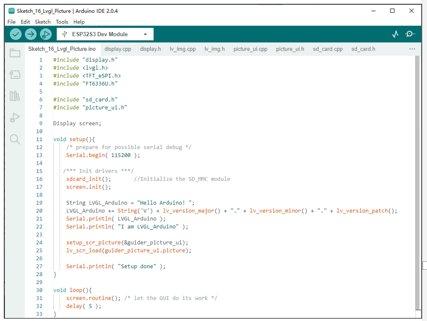

##############################################################################
Chapter LVGL Picture
##############################################################################

In this chapter, we will learn how to create an image viewer.

Project 16.1 LVGL Picture
************************************

In this project, we will learn how to view pictures saved in SD card.

Component List 
====================================

+---------------------------------+-----------------------------+------------------------------------------+
| ESP32-S3 WROOM x1               | USB cable x1                | SDcard x1                                |
|                                 |                             |                                          |
| |Chapter02_00|                  | |Chapter02_01|              | |Chapter04_00|                           |
+---------------------------------+-----------------------------+------------------------------------------+
| Card reader x1 (random color)                                 | 2.8-inch screen                          |
|                                                               |                                          |
| :red:`(Not a USB flash drive.)`                               |                                          |
|                                                               |                                          |
| |Chapter04_01|                                                | |Chapter07_00|                           |
+-----------------------------------------------+---------------+------------------------------------------+
| ESP32-S3 WROOM Shield x1                      | 9V battery x1                                            |
|                                               |                                                          |
| :red:`(Not a USB flash drive.)`               | :red:`(Not included in the kit, prepared by yourself)`   |
|                                               |                                                          |
| |Chapter01_01|                                | |Chapter01_03|                                           |
|                                               +----------------------------------------------------------+
|                                               | 9V battery cable x1                                      |
|                                               |                                                          |
|                                               | |Chapter05_02|                                           |
+-----------------------------------------------+----------------------------------------------------------+

.. |Chapter01_01| image:: ../_static/imgs/1_ADC_Test/Chapter01_01.png
.. |Chapter01_03| image:: ../_static/imgs/1_ADC_Test/Chapter01_03.png
.. |Chapter02_00| image:: ../_static/imgs/2_WS2812/Chapter02_00.png
.. |Chapter02_01| image:: ../_static/imgs/2_WS2812/Chapter02_01.png
.. |Chapter04_00| image:: ../_static/imgs/4_Read_and_Write_the_SDcard/Chapter04_00.png
.. |Chapter04_01| image:: ../_static/imgs/4_Read_and_Write_the_SDcard/Chapter04_01.png
.. |Chapter07_00| image:: ../_static/imgs/7_Drving_Freenove_2.8-Inch_Screen/Chapter07_00.png
.. |Chapter05_02| image:: ../_static/imgs/5_Play_SD_card_music/Chapter05_02.png

Circuit
==============================

If you have not yet used the SD card, please refer to Chapter 4. Click :ref:`here <SDcard>` to navigate back to Chapter 4.

Before connecting the USB cable, insert the SD card into the SD card slot on the back of the ESP32-S3.

.. image:: ../_static/imgs/5_Play_SD_card_music/Chapter05_08.png
    :align: center

Connect Freenove ESP32-S3 to the computer using the USB cable. 

.. image:: ../_static/imgs/5_Play_SD_card_music/Chapter05_09.png
    :align: center

Sketch
================================

Before starting the project, please make sure that there is a folder named picture in your sd card, and the pictures inside are of bmp format, and their resolution is 240*240.

Sketch_16_LVGL_Picture
----------------------------------

The following is the program code:

.. literalinclude:: ../../../freenove_Kit/Sketches/Sketch_16_Lvgl_Picture/Sketch_16_Lvgl_Picture.ino
    :linenos: 
    :language: c
    :dedent:

Configure the image viewing interface and load this interface.

.. literalinclude:: ../../../freenove_Kit/Sketches/Sketch_16_Lvgl_Picture/Sketch_16_Lvgl_Picture.ino
    :linenos: 
    :language: c
    :lines: 23-24
    :dedent:

picture_ui.h
---------------------------

Declare the functions so that they can be called in the ino file.

.. literalinclude:: ../../../freenove_Kit/Sketches/Sketch_16_Lvgl_Picture/Sketch_16_Lvgl_Picture.ino
    :linenos: 
    :language: c
    :dedent:

picture_ui.cpp
-------------------------

.. literalinclude:: ../../../freenove_Kit/Sketches/Sketch_16_Lvgl_Picture/picture_ui.cpp
    :linenos: 
    :language: c
    :dedent:

Declare the header files.

.. literalinclude:: ../../../freenove_Kit/Sketches/Sketch_16_Lvgl_Picture/picture_ui.cpp
    :linenos: 
    :language: c
    :lines: 1-4
    :dedent:

"pic_show" is used to store image data. "guider_picture_ui" is used to configure the interface. "picture_index_num" is used to record the position of the picture.

.. literalinclude:: ../../../freenove_Kit/Sketches/Sketch_16_Lvgl_Picture/picture_ui.cpp
    :linenos: 
    :language: c
    :lines: 6-7
    :dedent:

In the image display interface, we will use 3 image buttons. Here, we need to configure the image data.

.. literalinclude:: ../../../freenove_Kit/Sketches/Sketch_16_Lvgl_Picture/picture_ui.cpp
    :linenos: 
    :language: c
    :lines: 69-71
    :dedent:

Set a style to configure the image button so that it moves down 5 pixels each time it is pressed.

.. literalinclude:: ../../../freenove_Kit/Sketches/Sketch_16_Lvgl_Picture/picture_ui.cpp
    :linenos: 
    :language: c
    :lines: 73-77
    :dedent:

Apply for a picture button component, set its position, size, displayed picture content, and add the effect of the button being pressed.

.. literalinclude:: ../../../freenove_Kit/Sketches/Sketch_16_Lvgl_Picture/picture_ui.cpp
    :linenos: 
    :language: c
    :lines: 79-84
    :dedent:

Search the "picture" folder on the SD card and add all the BMP file names to the linked list "list_picture".

:red:`Please note that you can directly put custom pictures in the SD card and display them on the screen, but the resolution of the pictures must be 240x240. Resolutions that are too large or too small may not be displayed well. `

.. literalinclude:: ../../../freenove_Kit/Sketches/Sketch_16_Lvgl_Picture/picture_ui.cpp
    :linenos: 
    :language: c
    :lines: 106-106
    :dedent:

Calculate the number of members in the linked list list_picture, and assign the value back to picture_index_num.

.. literalinclude:: ../../../freenove_Kit/Sketches/Sketch_16_Lvgl_Picture/picture_ui.cpp
    :linenos: 
    :language: c
    :lines: 107-107
    :dedent:

Call the list_find_node() function to obtain the file name of the node specified in the linked list list_picture. Call the picture_imgbtn_display() function to load and display the picture on the screen.

.. literalinclude:: ../../../freenove_Kit/Sketches/Sketch_16_Lvgl_Picture/picture_ui.cpp
    :linenos: 
    :language: c
    :lines: 108-108
    :dedent:

Associate the three picture buttons with their respective callback functions.

.. literalinclude:: ../../../freenove_Kit/Sketches/Sketch_16_Lvgl_Picture/picture_ui.cpp
    :linenos: 
    :language: c
    :lines: 110-112
    :dedent:

Image button display function. When the file name is empty, print a prompt message. When the file name is not empty, generate the correct image path according to the file name, and load this file to the image component.

.. literalinclude:: ../../../freenove_Kit/Sketches/Sketch_16_Lvgl_Picture/picture_ui.cpp
    :linenos: 
    :language: c
    :lines: 115-127
    :dedent: