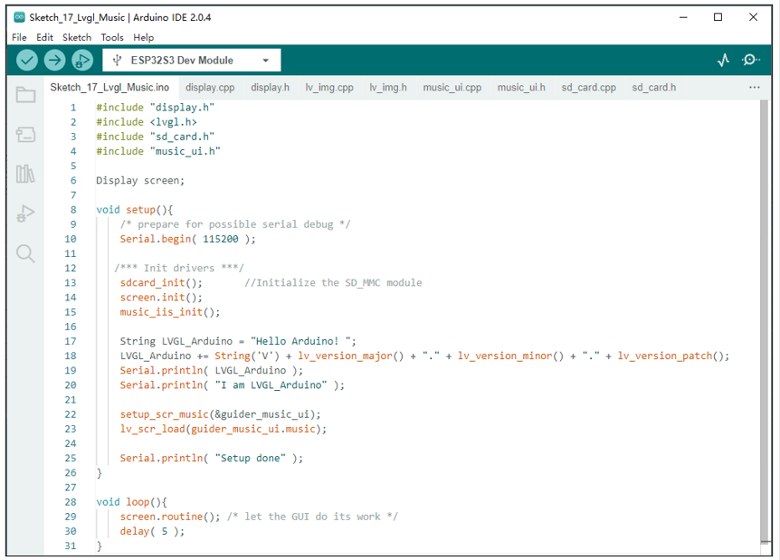

##############################################################################
Chapter LVGL Music
##############################################################################

In this chapter, we will learn how to create a simple music player.

Project 17.1 LVGL Music
*********************************

In this project, we will learn how to make a simple mp3 player and play the music of mp3 format in the SD card through the speaker.

Component List 
====================================

+---------------------------------+-----------------------------+------------------------------------------+
| ESP32-S3 WROOM x1               | USB cable x1                | SDcard x1                                |
|                                 |                             |                                          |
| |Chapter02_00|                  | |Chapter02_01|              | |Chapter04_00|                           |
+---------------------------------+-----------------------------+------------------------------------------+
| Card reader x1 (random color)                                 | 2.8-inch screen                          |
|                                                               |                                          |
| :red:`(Not a USB flash drive.)`                               |                                          |
|                                                               |                                          |
| |Chapter04_01|                                                | |Chapter07_00|                           |
+-----------------------------------------------+---------------+------------------------------------------+
| ESP32-S3 WROOM Shield x1                      | 9V battery x1                                            |
|                                               |                                                          |
| :red:`(Not a USB flash drive.)`               | :red:`(Not included in the kit, prepared by yourself)`   |
|                                               |                                                          |
| |Chapter01_01|                                | |Chapter01_03|                                           |
|                                               +----------------------------------------------------------+
|                                               | 9V battery cable x1                                      |
|                                               |                                                          |
|                                               | |Chapter05_02|                                           |
+-----------------------------------------------+----------------------------------------------------------+

.. |Chapter01_01| image:: ../_static/imgs/1_ADC_Test/Chapter01_01.png
.. |Chapter01_03| image:: ../_static/imgs/1_ADC_Test/Chapter01_03.png
.. |Chapter02_00| image:: ../_static/imgs/2_WS2812/Chapter02_00.png
.. |Chapter02_01| image:: ../_static/imgs/2_WS2812/Chapter02_01.png
.. |Chapter04_00| image:: ../_static/imgs/4_Read_and_Write_the_SDcard/Chapter04_00.png

.. |Chapter07_00| image:: ../_static/imgs/7_Drving_Freenove_2.8-Inch_Screen/Chapter07_00.png
.. |Chapter05_02| image:: ../_static/imgs/5_Play_SD_card_music/Chapter05_02.png

Circuit
==============================

If you have not yet used the SD card, please refer to Chapter 4. Click :ref:`here <SDcard>` to navigate back to Chapter 4.

Before connecting the USB cable, insert the SD card into the SD card slot on the back of the ESP32-S3.

.. image:: ../_static/imgs/5_Play_SD_card_music/Chapter05_08.png
    :align: center

Connect Freenove ESP32-S3 to the computer using the USB cable. 

.. image:: ../_static/imgs/5_Play_SD_card_music/Chapter05_09.png
    :align: center

Sketch
==============================

Before starting the project, please make sure that there is a folder named music in your sd card, and the songs inside are in mp3 format.

Sketch_17_LVGL_Music
-------------------------------

The following is the program code:

.. literalinclude:: ../../../freenove_Kit/Sketches/Sketch_17_Lvgl_Music/Sketch_17_Lvgl_Music.ino
    :linenos: 
    :language: c
    :dedent:

Configure the music player interface and load this interface.

.. literalinclude:: ../../../freenove_Kit/Sketches/Sketch_17_Lvgl_Music/Sketch_17_Lvgl_Music.ino
    :linenos: 
    :language: c
    :lines: 22-23
    :dedent:

music_ui.h
-------------------------------

Declare the functions so that they can be called in the ino file.

.. literalinclude:: ../../../freenove_Kit/Sketches/Sketch_17_Lvgl_Music/music_ui.h
    :linenos: 
    :language: c
    :dedent:

music_ui.cpp
------------------------------

.. literalinclude:: ../../../freenove_Kit/Sketches/Sketch_17_Lvgl_Music/music_ui.cpp
    :linenos: 
    :language: c
    :dedent:

Callback functions, which are called when the corresponding screen events are triggered.

.. code-block:: C

    static void music_imgbtn_home_event_handler(lv_event_t *e) 
    static void music_imgbtn_left_event_handler(lv_event_t *e)
    static void music_imgbtn_right_event_handler(lv_event_t *e)
    static void music_imgbtn_play_event_handler(lv_event_t *e)
    static void music_imgbtn_stop_event_handler(lv_event_t *e)
    static void music_slider_change_event_handler(lv_event_t * e)

Music player interface setting function.

.. literalinclude:: ../../../freenove_Kit/Sketches/Sketch_17_Lvgl_Music/music_ui.cpp
    :linenos: 
    :language: c
    :lines: 201-201
    :dedent:

The display function of the label component. If the text is empty, the prompt information will be printed. If not empty, the content is displayed.

.. literalinclude:: ../../../freenove_Kit/Sketches/Sketch_17_Lvgl_Music/music_ui.cpp
    :linenos: 
    :language: c
    :lines: 285-293
    :dedent:

Some audio driver functions, which can be used to control music playback, pause, playback position view, etc.

.. code-block:: C
    
    void music_iis_init(void)
    void music_set_volume(int volume) 
    int music_read_volume(void) 
    void music_load_mp3(char *name) 
    void music_pause_resume(void)
    void music_stop(void)
    bool music_is_running(void) 
    long music_get_total_playing_time(void)
    long music_get_file_duration(void)
    bool music_set_play_position(int second)
    long music_read_play_position(void)

When the music parameters are properly configured, the audio task execution function should continuously call the music_loop() function to enable uninterrupted music playback. Failure to call this function in a timely manner can lead to issues such as frozen or failed mp3 playback.

.. literalinclude:: ../../../freenove_Kit/Sketches/Sketch_17_Lvgl_Music/music_ui.cpp
    :linenos: 
    :language: c
    :lines: 340-340
    :dedent:

Music playback thread. When music_task_flag is 1, the thread content is executed, the music_loop() function is continuously called to play music, and the music playback time is obtained and set on the progress bar. If the music has finished playing, close the music playback thread.

.. literalinclude:: ../../../freenove_Kit/Sketches/Sketch_17_Lvgl_Music/music_ui.cpp
    :linenos: 
    :language: c
    :lines: 345-373
    :dedent:

Thread creation function. Determine whether the thread flag music_task_flag has been configured to 1. If the value is 1, the thread already exists and there is no need to create a thread again. If the value is 0, a thread needs to be created.

.. literalinclude:: ../../../freenove_Kit/Sketches/Sketch_17_Lvgl_Music/music_ui.cpp
    :linenos: 
    :language: c
    :lines: 375-383
    :dedent:

Thread shutdown function. Set the thread flag music_task_flag to zero, the thread will end and delete the handle musicTaskHandle. Use the eTaskGetState() function to determine whether the handle musicTaskHandle has been deleted. If it has been deleted, the thread has been closed; Otherwise, wait until the thread is deleted.

.. literalinclude:: ../../../freenove_Kit/Sketches/Sketch_17_Lvgl_Music/music_ui.cpp
    :linenos: 
    :language: c
    :lines: 385-397
    :dedent:

If music_task_flag is 1, it means that the thread already exists. If it is 0, it means that the thread has been closed.

.. literalinclude:: ../../../freenove_Kit/Sketches/Sketch_17_Lvgl_Music/music_ui.cpp
    :linenos: 
    :language: c
    :lines: 399-402
    :dedent:

Every time the music information is loaded, the basic information of the music will be printed out.

.. literalinclude:: ../../../freenove_Kit/Sketches/Sketch_17_Lvgl_Music/music_ui.cpp
    :linenos: 
    :language: c
    :lines: 404-408
    :dedent:

Every time when playing music ends, print the end prompt message.

.. literalinclude:: ../../../freenove_Kit/Sketches/Sketch_17_Lvgl_Music/music_ui.cpp
    :linenos: 
    :language: c
    :lines: 409-412
    :dedent: