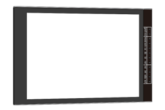

##############################################################################
Chapter LVGL Heartrate
##############################################################################

In this chapter, we will learn how to create a heartrate monitor.

Project 18.1 LVGL Heartrate
************************************

In this project, we will learn how to obtain the raw data and heartrate data of the MAX30102 module and display them on the screen.

Component List 
====================================

+---------------------------------+-----------------------------+------------------------------------------+
| ESP32-S3 WROOM x1               | USB cable x1                | SDcard x1                                |
|                                 |                             |                                          |
| |Chapter02_00|                  | |Chapter02_01|              | |Chapter04_00|                           |
+---------------------------------+-----------------------------+------------------------------------------+
| Card reader x1 (random color)                                 | 2.8-inch screen                          |
|                                                               |                                          |
| :red:`(Not a USB flash drive.)`                               |                                          |
|                                                               |                                          |
| |Chapter04_01|                                                | |Chapter07_00|                           |
+-----------------------------------------------+---------------+------------------------------------------+
| ESP32-S3 WROOM Shield x1                      | 9V battery x1                                            |
|                                               |                                                          |
| :red:`(Not a USB flash drive.)`               | :red:`(Not included in the kit, prepared by yourself)`   |
|                                               |                                                          |
| |Chapter01_01|                                | |Chapter01_03|                                           |
|                                               +----------------------------------------------------------+
|                                               | 9V battery cable x1                                      |
|                                               |                                                          |
|                                               | |Chapter05_02|                                           |
+-----------------------------------------------+----------------------------------------------------------+

.. |Chapter01_01| image:: ../_static/imgs/1_ADC_Test/Chapter01_01.png
.. |Chapter01_03| image:: ../_static/imgs/1_ADC_Test/Chapter01_03.png
.. |Chapter02_00| image:: ../_static/imgs/2_WS2812/Chapter02_00.png
.. |Chapter02_01| image:: ../_static/imgs/2_WS2812/Chapter02_01.png
.. |Chapter04_00| image:: ../_static/imgs/4_Read_and_Write_the_SDcard/Chapter04_00.png
.. |Chapter04_01| image:: ../_static/imgs/4_Read_and_Write_the_SDcard/Chapter04_01.png

.. |Chapter05_02| image:: ../_static/imgs/5_Play_SD_card_music/Chapter05_02.png

Circuit
==============================

If you have not yet used the SD card, please refer to Chapter 4. Click :ref:`here <SDcard>` to navigate back to Chapter 4.

Before connecting the USB cable, insert the SD card into the SD card slot on the back of the ESP32-S3.

.. image:: ../_static/imgs/5_Play_SD_card_music/Chapter05_08.png
    :align: center

Connect Freenove ESP32-S3 to the computer using the USB cable. 

.. image:: ../_static/imgs/5_Play_SD_card_music/Chapter05_09.png
    :align: center

Sketch
===============================

Sketch_18_LVGL_Heartrate
--------------------------------

.. image:: ../_static/imgs/18_LVGL_Heartrate/Chapter18_00.png
    :align: center

The following is the program code:

.. literalinclude:: ../../../freenove_Kit/Sketches/Sketch_18_Lvgl_Heartrate/Sketch_18_Lvgl_Heartrate.ino
    :linenos: 
    :language: c
    :lines: 1-32
    :dedent:

Configure the heart rate monitor interface and load this interface.

.. literalinclude:: ../../../freenove_Kit/Sketches/Sketch_18_Lvgl_Heartrate/Sketch_18_Lvgl_Heartrate.ino
    :linenos: 
    :language: c
    :lines: 23-24
    :dedent:

heartrate_ui.h
------------------------------

Declare the functions so that they can be called in the ino file.

.. literalinclude:: ../../../freenove_Kit/Sketches/Sketch_18_Lvgl_Heartrate/heartrate_ui.h
    :linenos: 
    :language: c
    :lines: 1-34
    :dedent:

heartrate_ui.cpp
--------------------------------

.. literalinclude:: ../../../freenove_Kit/Sketches/Sketch_18_Lvgl_Heartrate/heartrate_ui.cpp
    :linenos: 
    :language: c
    :lines: 1-205
    :dedent:

Initialize the heart rate module and configure it to sleep mode.

.. literalinclude:: ../../../freenove_Kit/Sketches/Sketch_18_Lvgl_Heartrate/heartrate_ui.cpp
    :linenos: 
    :language: c
    :lines: 26-34
    :dedent:

Heartrate module sleep function and module wake-up function.

.. literalinclude:: ../../../freenove_Kit/Sketches/Sketch_18_Lvgl_Heartrate/heartrate_ui.cpp
    :linenos: 
    :language: c
    :lines: 36-44
    :dedent:

Average the heartrate values obtained multiple times.

.. literalinclude:: ../../../freenove_Kit/Sketches/Sketch_18_Lvgl_Heartrate/heartrate_ui.cpp
    :linenos: 
    :language: c
    :lines: 36-44
    :dedent:

Acquire raw infrared data.

.. literalinclude:: ../../../freenove_Kit/Sketches/Sketch_18_Lvgl_Heartrate/heartrate_ui.cpp
    :linenos: 
    :language: c
    :lines: 61-61
    :dedent:

Heartrate checking function. Returns true if a mentality spike is detected, otherwise returns false.

.. code-block:: C

    checkForBeat(irValue)

If the HEARTRATE_SERIAL macro definition is set to 1, the original data will be printed to the serial port, allowing you to view the heart rate waveform using a serial port drawing function. By default, serial port data is not printed.

.. literalinclude:: ../../../freenove_Kit/Sketches/Sketch_18_Lvgl_Heartrate/heartrate_ui.cpp
    :linenos: 
    :language: c
    :lines: 87-89
    :dedent:

Label component setup function, which can be used similarly like printf().

.. literalinclude:: ../../../freenove_Kit/Sketches/Sketch_18_Lvgl_Heartrate/heartrate_ui.cpp
    :linenos: 
    :language: c
    :lines: 95-95
    :dedent:

Create a line chart with 100 data points to make the waveform more closely resemble real data. Set the chart to scroll continuously for optimal viewing.

.. literalinclude:: ../../../freenove_Kit/Sketches/Sketch_18_Lvgl_Heartrate/heartrate_ui.cpp
    :linenos: 
    :language: c
    :lines: 171-187
    :dedent:

Display heart rate data on a line chart.

.. literalinclude:: ../../../freenove_Kit/Sketches/Sketch_18_Lvgl_Heartrate/heartrate_ui.cpp
    :linenos: 
    :language: c
    :lines: 92-92
    :dedent: