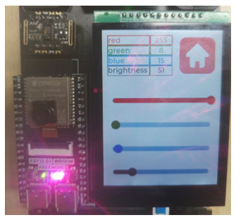

##############################################################################
Chapter LVGL WS2812
##############################################################################

In this chapter, we learn to control the onboard WS2812 RGB LED with the touch screen.

Project 19.1 LVGL WS2812
*********************************

In the code, we use four sliders to control the LED, three of which control the LED's red, green and blue colors, and one controls the brightness.

Component List
===================================

+--------------------------+----------------+----------------+
| ESP32-S3 WROOM x1        | USB cable x1   | 2.8-inch Screen|
|                          |                |                |
| |Chapter02_00|           | |Chapter02_01| | |Chapter07_00| |
+--------------------------+----------------+----------------+
| ESP32-S3 WROOM Shield x1                                   |
|                                                            |
| |Chapter01_01|                                             |
+------------------------------------------------------------+

.. |Chapter01_01| image:: ../_static/imgs/1_ADC_Test/Chapter01_01.png
.. |Chapter02_00| image:: ../_static/imgs/2_WS2812/Chapter02_00.png
.. |Chapter02_01| image:: ../_static/imgs/2_WS2812/Chapter02_01.png
.. |Chapter07_00| image:: ../_static/imgs/7_Drving_Freenove_2.8-Inch_Screen/Chapter07_00.png

Circuit
===================================

Connect Freenove ESP32-S3 to the computer using the USB cable. 

Hardware connection. If you need any support, please feel free to contact us via: support@freenove.com

.. image:: ../_static/imgs/10_LVGL_Lable/Chapter10_00.png
    :align: center

Sketch
======================

Here is an illustration of the example:

By sliding the slider of different colors, the ESP32S3's onboard LED will change color accordingly, and the values of color data are shown at the top of the screen.

The following is the program code:

Sketch_19_Lvgl_WS2812.ino
----------------------------------

.. literalinclude:: ../../../freenove_Kit/Sketches/Sketch_19_Lvgl_WS2812/Sketch_19_Lvgl_WS2812.ino
    :linenos: 
    :language: c
    :lines: 1-27
    :dedent:

ws2812_ui.h
-----------------------------

The declaration file about the the LED's interface and driver is as below:

.. literalinclude:: ../../../freenove_Kit/Sketches/Sketch_19_Lvgl_WS2812/ws2812_ui.h
    :linenos: 
    :language: c
    :lines: 1-40
    :dedent:

Here is the complete code:

ws2812_ui.cpp
-----------------------------

.. literalinclude:: ../../../freenove_Kit/Sketches/Sketch_19_Lvgl_WS2812/ws2812_ui.cpp
    :linenos: 
    :language: c
    :lines: 1-176
    :dedent:

Call the WS2812 library file.

.. literalinclude:: ../../../freenove_Kit/Sketches/Sketch_19_Lvgl_WS2812/ws2812_ui.cpp
    :linenos: 
    :language: c
    :lines: 5-5
    :dedent:
    
Apply for a WS2812 interface object and configure its parameters.

.. literalinclude:: ../../../freenove_Kit/Sketches/Sketch_19_Lvgl_WS2812/ws2812_ui.cpp
    :linenos: 
    :language: c
    :lines: 8-8
    :dedent:

Initialize the WS2812 LED and set its brightness to 1.

.. literalinclude:: ../../../freenove_Kit/Sketches/Sketch_19_Lvgl_WS2812/ws2812_ui.cpp
    :linenos: 
    :language: c
    :lines: 10-14
    :dedent:

WS2812 color setting function, through which the color of the specified WS2812 LED can be set. Parameter num refers to the index number of the specified LED, and the remaining four parameters correspond to the red, green, blue and brightness values respectivey.

.. literalinclude:: ../../../freenove_Kit/Sketches/Sketch_19_Lvgl_WS2812/ws2812_ui.cpp
    :linenos: 
    :language: c
    :lines: 16-24
    :dedent:

Label creation function, which is used to create labels in batches, and the created objects are returned through formal parameters.

.. literalinclude:: ../../../freenove_Kit/Sketches/Sketch_19_Lvgl_WS2812/ws2812_ui.cpp
    :linenos: 
    :language: c
    :lines: 64-72
    :dedent:

Use the label creation function to create two labels and assign values to the actual parameters corresponding to the two formal parameters of the function, and set the position and content of the labels.

.. literalinclude:: ../../../freenove_Kit/Sketches/Sketch_19_Lvgl_WS2812/ws2812_ui.cpp
    :linenos: 
    :language: c
    :lines: 107-111
    :dedent:

The slider creation function specifies the color of the slider through the formal parameter, and returns the created slider through the return value. Each slider has a range of 0-255. The created sliders are associated with the slider_event_cb function.

.. literalinclude:: ../../../freenove_Kit/Sketches/Sketch_19_Lvgl_WS2812/ws2812_ui.cpp
    :linenos: 
    :language: c
    :lines: 74-82
    :dedent:

Call the slider creation function to create four sliders of different colors and assign them to the corresponding slider objects.

.. literalinclude:: ../../../freenove_Kit/Sketches/Sketch_19_Lvgl_WS2812/ws2812_ui.cpp
    :linenos: 
    :language: c
    :lines: 159-162
    :dedent:

Sets the initial value of the slider. LV_OPA_10 means 10%, and the range of the slider is 0-255. Therefore, the value of LV_OPA_10 is 25.

.. literalinclude:: ../../../freenove_Kit/Sketches/Sketch_19_Lvgl_WS2812/ws2812_ui.cpp
    :linenos: 
    :language: c
    :lines: 164-167
    :dedent:

Trigger a slider event and set the callback function of the home button in the interface.

.. literalinclude:: ../../../freenove_Kit/Sketches/Sketch_19_Lvgl_WS2812/ws2812_ui.cpp
    :linenos: 
    :language: c
    :lines: 174-175
    :dedent:

Slider event callback function. Every time this function is triggered, get the values of the four sliders and display them in the value area in the upper left corner, and set the corresponding color and brightness of the onboard WS2812 LED.

.. literalinclude:: ../../../freenove_Kit/Sketches/Sketch_19_Lvgl_WS2812/ws2812_ui.cpp
    :linenos: 
    :language: c
    :lines: 49-62
    :dedent: