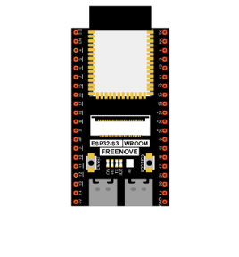

##############################################################################
Chapter ADC Test
##############################################################################

In this chapter, we will learn how to use ESP32-S3 to read analog signals.

Project Read the Voltage of Power
********************************************

In this project, we will use the ADC function of ESP32-S3 to read the voltage value of the power and print it out through the serial monitor.

Component List 
======================================

+----------------------+--------------------------------------------------------------------------+
| ESP32-S3 WROOM x1    | ESP32-S3 WROOM Shield x1                                                 |
|                      |                                                                          |
| |Chapter01_00|       | |Chapter01_01|                                                           |
+----------------------+--------------------------------------------------------+-----------------+
| 9V Battery Cable  x1 | 9V battery x1                                          | Type-C cable x1 |
|                      |                                                        |                 |
|                      | :red:`(Not included in the kit, prepared by yourself)` |                 |
|                      |                                                        |                 |
| |Chapter01_02|       | |Chapter01_03|                                         | |Chapter01_04|  |
+----------------------+--------------------------------------------------------+-----------------+

.. |Chapter01_01| image:: ../_static/imgs/1_ADC_Test/Chapter01_01.png

.. |Chapter01_03| image:: ../_static/imgs/1_ADC_Test/Chapter01_03.png

.. note:: 
    
    Batteries need to be prepared by yourself. We do not provide batteries. ESP32-S3 WROOM Shield features with a DC005 interface, whose size is 5.5x2.1cm. If using an external power supply, ensure that its voltage ranges between 6-12V and that the current is greater than 0.5A.

Related knowledge
=================================

ADC
--------------------------------

An ADC is an electronic integrated circuit used to convert analog signals such as voltages to digital or binary form consisting of 1s and 0s. The range of our ADC on ESP32-S3 is 12 bits, which means it can represent a resolution of up to 2^12=4096, which is the number of discrete values that the ADC can represent within its range (3.3V). The range of analog values corresponds to ADC values. So the more bits the ADC has, the denser the partition of analog will be and the greater the precision of the resulting conversion.

.. image:: ../_static/imgs/1_ADC_Test/Chapter01_05.png
    :align: center

Subsection 1: the analog in rang of 0V---3.3/4095 V corresponds to digital 0;

Subsection 2: the analog in rang of 3.3/4095 V---2*3.3 /4095V corresponds to digital 1;

\......

The following analog will be divided accordingly.

The conversion formula is as follows:

Circuit
===========================

.. list-table::
   :width: 100%
   :header-rows: 1 
   :align: center
   
   * -  Schematic diagram
   * -  |Chapter01_07|
   * -  Hardware connection. 
       
        :red:`If you need any support, please contact us via:` support@freenove.com
   * -  |Chapter01_08|
    

Sketch
============================

Sketch_01_ADC_Battery
----------------------------

Download the code to ESP32-S3 WROOM, open the serial monitor, and set the baud rate to 115200. Turn on the power switch, as shown in the following figure.

When there is no external power supply connected, the voltage measured on GPIO19 pin is around 4V, which is supplied to V-External through the circuitry on the ESP32-S3 WROOM Shield from the USB power supply. This is a normal phenomenon.

The following is the code:

.. literalinclude:: ../../../freenove_Kit/Sketches/Sketch_01_ADC_Battery/Sketch_01_ADC_Battery.ino
    :linenos: 
    :language: c
    :dedent:

In loop(), use the analogRead() function to obtain the input ADC value of the potentiometer, calculate the voltage value of the Power according to the formula in the previous knowledge point, and print it out through the serial port.

.. literalinclude:: ../../../freenove_Kit/Sketches/Sketch_01_ADC_Battery/Sketch_01_ADC_Battery.ino
    :linenos: 
    :language: c
    :lines: 13-16
    :dedent:

Reference
----------------------------

.. py:function:: uint16_t analogRead(uint8_t pin);	

    Reads the value from the specified analog pin. Return the analog reading on the pin. (0-4095 for 12 bits).