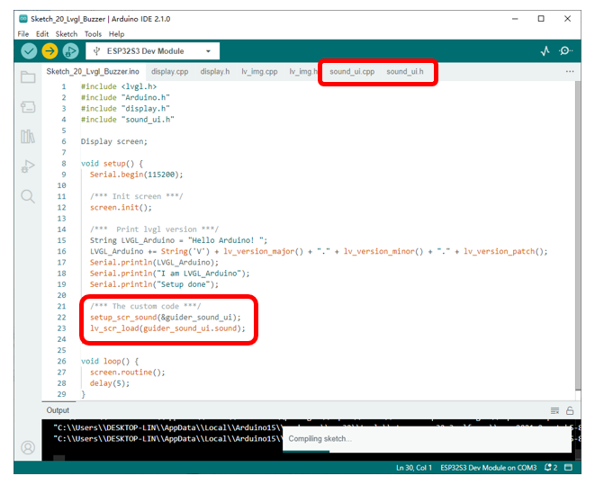
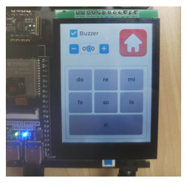

##############################################################################
Chapter LVGL Buzzer
##############################################################################

In this chapter, we will control the buzzer to make different sounds with the touch screen.

Project 20.1 LVGL Buzzer
************************************

In the code, we use matrix buttons, spinners, and checkboxes to interact with the onboard buzzer.

Component List 
================================

+--------------------------+----------------+----------------+
| ESP32-S3 WROOM x1        | USB cable x1   | 2.8-inch Screen|
|                          |                |                |
| |Chapter02_00|           | |Chapter02_01| | |Chapter07_00| |
+--------------------------+----------------+----------------+
| ESP32-S3 WROOM Shield x1                                   |
|                                                            |
| |Chapter01_01|                                             |
+------------------------------------------------------------+

.. |Chapter01_01| image:: ../_static/imgs/1_ADC_Test/Chapter01_01.png
.. |Chapter02_00| image:: ../_static/imgs/2_WS2812/Chapter02_00.png
.. |Chapter02_01| image:: ../_static/imgs/2_WS2812/Chapter02_01.png
.. |Chapter07_00| image:: ../_static/imgs/7_Drving_Freenove_2.8-Inch_Screen/Chapter07_00.png

Circuit
================================

Connect Freenove ESP32-S3 to the computer using the USB cable. 

Hardware connection. If you need any support, please feel free to contact us via: support@freenove.com

.. image:: ../_static/imgs/10_LVGL_Lable/Chapter10_00.png
    :align: center

Sketch
================================

Here is an illustration of the example:

The checkbox controls the buzzer to sound or off. The spinner controls the duration of each sound, in milliseconds. The matrix keyboard controls the buzzer to make different sounds.

The following is the program code:

Sketch_20_Lvgl_Buzzer.ino
---------------------------------

.. literalinclude:: ../../../freenove_Kit/Sketches/Sketch_20_Lvgl_Buzzer/Sketch_20_Lvgl_Buzzer.ino
    :linenos: 
    :language: c
    :lines: 1-27
    :dedent:

sound_ui.h
---------------------------------

The declaration file about the buzzer interface and driver is as beloww:

.. literalinclude:: ../../../freenove_Kit/Sketches/Sketch_20_Lvgl_Buzzer/sound_ui.h
    :linenos: 
    :language: c
    :lines: 1-41
    :dedent:

Here is the complete code:

sound_ui.cpp
----------------------------

.. literalinclude:: ../../../freenove_Kit/Sketches/Sketch_20_Lvgl_Buzzer/sound_ui.cpp
    :linenos: 
    :language: c
    :lines: 1-165
    :dedent:

Buzzer initialization function.

.. literalinclude:: ../../../freenove_Kit/Sketches/Sketch_20_Lvgl_Buzzer/sound_ui.cpp
    :linenos: 
    :language: c
    :lines: 127-132
    :dedent:

Control the buzzer to emit a sound at a specific frequency and last for "time" milliseconds.

.. literalinclude:: ../../../freenove_Kit/Sketches/Sketch_20_Lvgl_Buzzer/sound_ui.cpp
    :linenos: 
    :language: c
    :lines: 134-138
    :dedent:

Control the buzzer to emit sound of specific frequency regularly.

.. literalinclude:: ../../../freenove_Kit/Sketches/Sketch_20_Lvgl_Buzzer/sound_ui.cpp
    :linenos: 
    :language: c
    :lines: 140-150
    :dedent:

Control the buzzer to emit sounds of different frequencies.

.. literalinclude:: ../../../freenove_Kit/Sketches/Sketch_20_Lvgl_Buzzer/sound_ui.cpp
    :linenos: 
    :language: c
    :lines: 152-165
    :dedent:

Create a checkbox and set its position as well as the displayed content.

.. literalinclude:: ../../../freenove_Kit/Sketches/Sketch_20_Lvgl_Buzzer/sound_ui.cpp
    :linenos: 
    :language: c
    :lines: 93-95
    :dedent:

Add 2 buttons on the left and right sides of the spinner to adjust the spinner's value, and associate it with the corresponding callback function.

.. literalinclude:: ../../../freenove_Kit/Sketches/Sketch_20_Lvgl_Buzzer/sound_ui.cpp
    :linenos: 
    :language: c
    :lines: 105-115
    :dedent:

Create a matrix keyboard and set its displayed content, size and position.

.. literalinclude:: ../../../freenove_Kit/Sketches/Sketch_20_Lvgl_Buzzer/sound_ui.cpp
    :linenos: 
    :language: c
    :lines: 117-121
    :dedent:

Checkbox, matrix keyboard, and Home button callback associated functions, which associate these controls with corresponding callback functions.

.. literalinclude:: ../../../freenove_Kit/Sketches/Sketch_20_Lvgl_Buzzer/sound_ui.cpp
    :linenos: 
    :language: c
    :lines: 122-124
    :dedent: