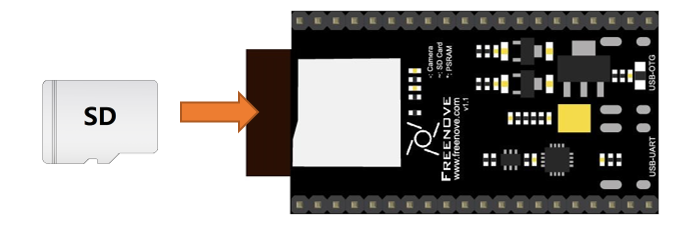
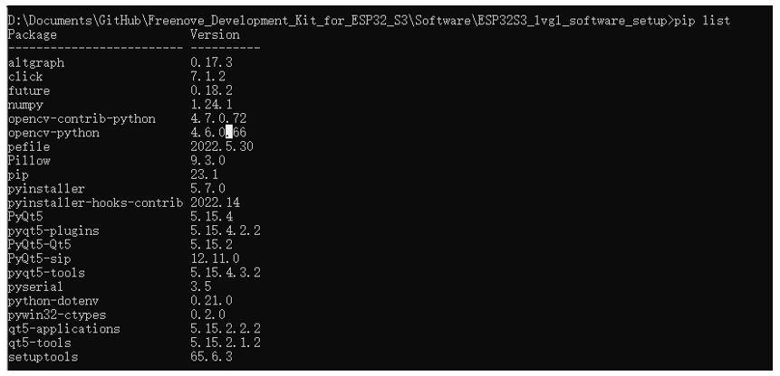

##############################################################################
Chapter LVGL Multifunctionality
##############################################################################

In this chapter, we pull together several of the previous examples as a comprehensive routine.

Project 21.1 LVGL Multifunctionality
***********************************************

Component List 
====================================

+---------------------------------+-----------------------------+------------------------------------------+
| ESP32-S3 WROOM x1               | USB cable x1                | SDcard x1                                |
|                                 |                             |                                          |
| |Chapter02_00|                  | |Chapter02_01|              | |Chapter04_00|                           |
+---------------------------------+-----------------------------+------------------------------------------+
| Card reader x1 (random color)                                 | 2.8-inch screen                          |
|                                                               |                                          |
| :red:`(Not a USB flash drive.)`                               |                                          |
|                                                               |                                          |
| |Chapter04_01|                                                | |Chapter07_00|                           |
+-----------------------------------------------+---------------+------------------------------------------+
| ESP32-S3 WROOM Shield x1                      | 9V battery x1                                            |
|                                               |                                                          |
| :red:`(Not a USB flash drive.)`               | :red:`(Not included in the kit, prepared by yourself)`   |
|                                               |                                                          |
| |Chapter01_01|                                | |Chapter01_03|                                           |
|                                               +----------------------------------------------------------+
|                                               | 9V battery cable x1                                      |
|                                               |                                                          |
|                                               | |Chapter05_02|                                           |
+-----------------------------------------------+----------------------------------------------------------+

.. |Chapter01_01| image:: ../_static/imgs/1_ADC_Test/Chapter01_01.png
.. |Chapter01_03| image:: ../_static/imgs/1_ADC_Test/Chapter01_03.png
.. |Chapter02_00| image:: ../_static/imgs/2_WS2812/Chapter02_00.png
.. |Chapter02_01| image:: ../_static/imgs/2_WS2812/Chapter02_01.png
.. |Chapter04_00| image:: ../_static/imgs/4_Read_and_Write_the_SDcard/Chapter04_00.png
.. |Chapter04_01| image:: ../_static/imgs/4_Read_and_Write_the_SDcard/Chapter04_01.png
.. |Chapter07_00| image:: ../_static/imgs/7_Drving_Freenove_2.8-Inch_Screen/Chapter07_00.png
.. |Chapter05_02| image:: ../_static/imgs/5_Play_SD_card_music/Chapter05_02.png

Circuit
==============================

If you have not yet used the SD card, please refer to Chapter 4. Click :ref:`here <SDcard>` to navigate back to Chapter 4.

Before connecting the USB cable, insert the SD card into the SD card slot on the back of the ESP32-S3.

Connect Freenove ESP32-S3 to the computer using the USB cable. 

.. image:: ../_static/imgs/5_Play_SD_card_music/Chapter05_09.png
    :align: center

Sketch
=================================

Sketch_21_LVGL_Multifunctionality
----------------------------------------

The following is the program code:

.. literalinclude:: ../../../freenove_Kit/Sketches/Sketch_21_Lvgl_Multifunctionality/Sketch_21_Lvgl_Multifunctionality.ino
    :linenos: 
    :language: c
    :dedent:

Scan for I2C devices and initialize the SD card, camera, and I2S interface. Emit 3 beeps from the buzzer and play a test music on the speaker.

.. literalinclude:: ../../../freenove_Kit/Sketches/Sketch_21_Lvgl_Multifunctionality/Sketch_21_Lvgl_Multifunctionality.ino
    :linenos: 
    :language: c
    :lines: 19-25
    :dedent:

Print the initialization information on the screen and return the setup_success value. If the value is 1, it indicates that the device has passed the test. If the value is 0, it means that some device initialization has failed.

.. literalinclude:: ../../../freenove_Kit/Sketches/Sketch_21_Lvgl_Multifunctionality/Sketch_21_Lvgl_Multifunctionality.ino
    :linenos: 
    :language: c
    :lines: 26-26
    :dedent:

If all hardware initialization succeeds, load the lvgl system, set the music volume, initialize the heart rate module, print a prompt message, and then enter the main control interface.

.. literalinclude:: ../../../freenove_Kit/Sketches/Sketch_21_Lvgl_Multifunctionality/Sketch_21_Lvgl_Multifunctionality.ino
    :linenos: 
    :language: c
    :lines: 28-41
    :dedent:

main_ui.h
----------------------------------

Declare the functions so that they can be called in the ino file.

.. literalinclude:: ../../../freenove_Kit/Sketches/Sketch_21_Lvgl_Multifunctionality/main_ui.h
    :linenos: 
    :language: c
    :lines: 1-26
    :dedent:

main_ui.cpp
---------------------------

.. literalinclude:: ../../../freenove_Kit/Sketches/Sketch_21_Lvgl_Multifunctionality/main_ui.cpp
    :linenos: 
    :language: c
    :lines: 1-185
    :dedent:

The callback function for the main interface image buttons, triggered when the corresponding button is clicked, causing the interface to switch to the sub-function interface.

.. code-block:: c

    static void main_imgbtn_logo_event_handler(lv_event_t *e)
    static void main_imgbtn_camera_event_handler(lv_event_t *e)
    static void main_imgbtn_picture_event_handler(lv_event_t *e)
    static void main_imgbtn_music_event_handler(lv_event_t *e)
    static void main_imgbtn_heartrate_event_handler(lv_event_t *e)

Create an interface component and set the background color of the component.

.. literalinclude:: ../../../freenove_Kit/Sketches/Sketch_21_Lvgl_Multifunctionality/main_ui.cpp
    :linenos: 
    :language: c
    :lines: 120-126
    :dedent:

Initialize image data.

.. literalinclude:: ../../../freenove_Kit/Sketches/Sketch_21_Lvgl_Multifunctionality/main_ui.cpp
    :linenos: 
    :language: c
    :lines: 128-132
    :dedent:

Define a component style. When the component is triggered, the component moves down by 5 pixels.

.. literalinclude:: ../../../freenove_Kit/Sketches/Sketch_21_Lvgl_Multifunctionality/main_ui.cpp
    :linenos: 
    :language: c
    :lines: 134-137
    :dedent:

Set the position and size of the main_imgbtn_logo image button, and specify the image to be displayed. Apply a component style that moves the button down by 5 pixels when it is pressed.

.. literalinclude:: ../../../freenove_Kit/Sketches/Sketch_21_Lvgl_Multifunctionality/main_ui.cpp
    :linenos: 
    :language: c
    :lines: 139-144
    :dedent:

Set the callback function when the image button main_imgbtn_logo is pressed.

.. literalinclude:: ../../../freenove_Kit/Sketches/Sketch_21_Lvgl_Multifunctionality/main_ui.cpp
    :linenos: 
    :language: c
    :lines: 174-174
    :dedent:

Configure and load the main interface.

.. literalinclude:: ../../../freenove_Kit/Sketches/Sketch_21_Lvgl_Multifunctionality/main_ui.cpp
    :linenos: 
    :language: c
    :lines: 181-185
    :dedent:

Project 22.1 Computer software
*************************************

This chapter mainly introduces the operation of a PC-side interactive software.

Hardware Preparation
=====================================

Steps:

1.	Tap the Freenove logo on the scree to switch the interface to the second page, and tap the folder icon.

2.	Enter your WiFi name and password in the new interface. After making sure everything is correct, click save, and it will save your WiFi name and password in the SD card, and then click connect. Check the local IP address.

At this point, the hardware preparations are done. Please continue reading below.

Run software on Windows system
=====================================

Install python3 and some related python libraries to run the software. 
-----------------------------------------------------------------------------

If you want to modify the client, please following this section.

Install python3
-------------------------------

Download and install Python3 package.

https://www.python.org/downloads/windows/

Select Python3.8.1.

.. image:: ../_static/imgs/21_LVGL_Multifunctionality/Chapter21_04.png
    :align: center

Click Windows x86 executable installerto download. After downloading, click to install. 

**Please note that "Add Python 3.8 to PATH" MUST be check.**

Check all the options and then click "Next".

.. image:: ../_static/imgs/21_LVGL_Multifunctionality/Chapter21_06.png
    :align: center

Here you can select the installation path of Python. We install it at D drive. If you are a novice, you can select the default path.

Wait for it to finish installing.

Now the installation is finished.

Install PyQt5、opencv、numpy and other libraries.
------------------------------------------------------

Open the folder Freenove_Development_Kit_for_ESP32_S3\\Software\\ESP32S3_lvgl_software_setup. 

The address depends on where you saved Freenove_Development_Kit_for_ESP32_S3. 

Type "CMD" in the file bar and press Enter. 

In the Command Prompt window, type python setup_window.py and press the Enter key.

Wait for the installation to finish. 

If not all libraries are installed successfully, it will prompt "Some libraries have not been installed. Please run Python3 setup_windows.py again', and then you need to enter and execute the command again. Most installation failures are caused by poor networks. You can check your network before installation. 

Run main.py
---------------------------------

In the same way, open the Freenove_Development_Kit_for_ESP32_S3\\Software\\ESP32S3_lvgl_software_code folder, and enter CMD in the file bar and press the Enter key.

Input "Python main.py" and press enter. If it fails, you can input "Python3 main.py" to try again.

If you want to modify the code, you can modify the files in ESP32S3_lvgl_software_code folder.

Run client on macOS system
===================================

Here we take MacOS 10.13 as an example. To run client on MacOS, you need to install some software and libraries. MacOS 10.13 comes with python2 but not python3. However, the projects in this program need to be run with python3, so you need to install it first. 

Install python3
---------------------------------

Download installation package, link: https://www.python.org/downloads/

Click Python 3.8.2.

At the bottom of the page, click macOS 64-bit installer and download installation package.

Click Continue.

Click Continue

.. image:: ../_static/imgs/21_LVGL_Multifunctionality/Chapter21_19.png
    :align: center

Click Agree.

Click Install. If your computer has a password, enter the password and Install Software.

Now the installation succeeds.

You can find it in Applications.

Install PyQt5、opencv、numpy and other libraries
-----------------------------------------------------------

If you have not yet download the code of ESP32 car to your macOS, you can download it from the following 

link: https://github.com/Freenove/Freenove_Development_Kit_for_ESP32_S3.git

After downloading, you can find it in **Downloads** of Macintosh HD. 

Open **Terminal** .

Enter the following commands in Terminal

1.	Enter "Downloads"(where the code locates). If your code locates in a different path, you need to enter the location of your code. 

.. code-block:: console
    
    $ cd Downloads

2.	Enter the directory where setup_mac.py locates 

.. code-block:: console
    
    $ cd Freenove_Development_Kit_for_ESP32_S3/Software/ESP32S3_lvgl_software_setup

3.	Run setup_macos.py:

.. code-block:: console
    
    $ python3 setup_mac.py

The installation takes some time. Please wait with patience. When installs successfully, it will print "All libraries installed successfully": 

.. note::
    
    If not all libraries are installed successfully, it will prompt “Some libraries have not been installed”. Please input and run Python3 setup_macos.py again. Most installation failures are caused by poor networks. You can Check your network before installation

Run main.py
----------------------

Following the previous steps, after the installation completes, you are now in the directory where setup_mac.py is located. (Freenove_Development_Kit_for_ESP32_S3/Software/ESP32S3_lvgl_software_code)

Enter the following command to run main.py.

.. code-block:: console
    
    $ python3 main.py

Software Operation
******************************************

1.	Make sure the esp32s3 and your computer are at the same LAN, that is, they are connected to the same router.

2.	Open the software, type in the IP address gained at the hardware preparation. For example, the IP address we got is 192.168.1.124.

3.	Click on “Connect”. If it connects to the hardware successfully, the computer's IP address will also show in the hardware screen.

At this point, the computer has established a WiFi connection with the hardware.

4.	Click “Open Video” to view the video from the hardware camera in real time. You can also rotate the real-time transmission screen of the camera by pressing the button.

5.	Click the Scan button to scan the local directory and the directory files of the SD card in the hardware, and display them in the tree list.

.. image:: ../_static/imgs/21_LVGL_Multifunctionality/Chapter21_29.png
    :align: center

6.	Click the file tree list under Scan Remote, and the files in this folder will be refreshed.

7.	First, select the files in the directory, by clicking the “receive” or “send” button, you can transfer the files from the hardware to the computer through WiFi, or send the files from the computer to the hardware. Similarly, clicking the delete button will directly delete the corresponding file.

.. note::
    
    Only files can be selected, not folders.

8.	The receiving and sending information of the file is printed in the black interface.

.. note::
    
    Sometimes due to the poor WiFi signal transmission, the file may receive missing bytes. Please delete the file and receive it again until the number of received bytes is normal.