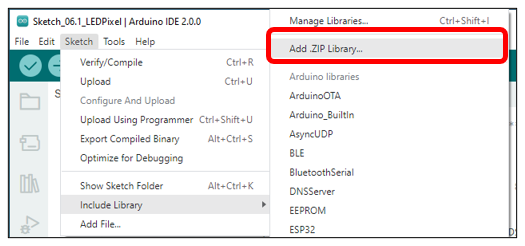
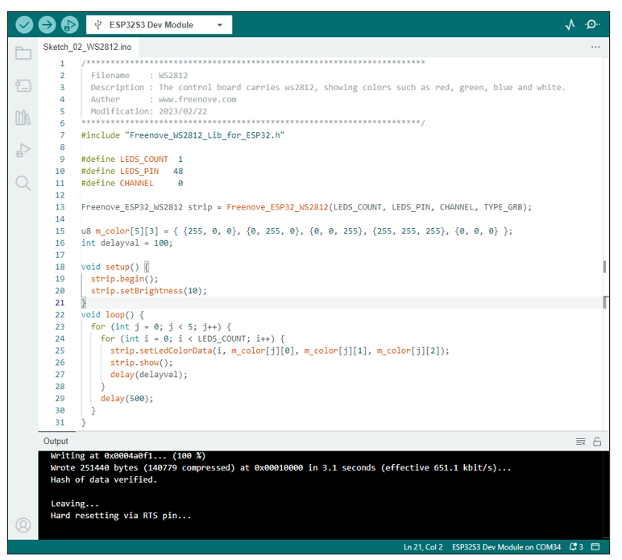

##############################################################################
Chapter WS2812
##############################################################################

In this chapter, we will learn to use the onboard WS2812. Make the RGB LEDs to emit various color via a pin.

Project WS2812
**************************

Learn the basic usage of WS2812 and use it to flash red, green, blue and white.

Component List 
=================================

.. list-table::
   :width: 100%
   :header-rows: 1 
   :align: center
   
   * -  ESP32-S3 WROOM x1
     -  USB cable x1
   * -  |Chapter02_00|
     -  |Chapter02_01|
    
.. |Chapter02_00| image:: ../_static/imgs/2_WS2812/Chapter02_00.png
.. |Chapter02_01| image:: ../_static/imgs/2_WS2812/Chapter02_01.png

Related knowledge
==================================

A WS2812 integrates 3 LEDs of red, green and blue colors, and each LED supports 256 levels of brightness adjustment, which means WS2812 can emit 2^24=16,777,216 different colors.

Circuit
=============================

Connect Freenove ESP32-S3 to your computer using the USB cable. 

.. image:: ../_static/imgs/2_WS2812/Chapter02_02.png
    :align: center

Sketch
==============================

This code uses a library named "Freenove_WS2812_Lib_for_ESP32". If you have not yet installed it, please do so first.

How to install the library
------------------------------

Open Arduino IDE, click Sketch -> Include Library -> Add .ZIP Library. In the pop-up window, find the file named "./Libraries/Freenove_WS2812_Lib_for_ESP32.Zip" which locates in this directory, and click OPEN.

Sketch_02_WS2812
------------------------------

Download the code to ESP32-S3 WROOM and LED WS2812 begins to light up in red, green, blue, white and bla

The following is the program code:

.. literalinclude:: ../../../freenove_Kit/Sketches/Sketch_02_WS2812/Sketch_02_WS2812.ino
    :linenos: 
    :language: c
    :dedent:

To use some libraries, first you need to include their header file.

.. literalinclude:: ../../../freenove_Kit/Sketches/Sketch_02_WS2812/Sketch_02_WS2812.ino
    :linenos: 
    :language: c
    :lines: 7-7
    :dedent:

Define the pins connected to the ws2812, the number of LED,s and RMT channel values.

.. literalinclude:: ../../../freenove_Kit/Sketches/Sketch_02_WS2812/Sketch_02_WS2812.ino
    :linenos: 
    :language: c
    :lines: 9-11
    :dedent:

Use the above parameters to create a WS2812 object strip.

.. literalinclude:: ../../../freenove_Kit/Sketches/Sketch_02_WS2812/Sketch_02_WS2812.ino
    :linenos: 
    :language: c
    :lines: 13-13
    :dedent:

Define the color values to be used, such as red, green, blue, white, and black.

.. literalinclude:: ../../../freenove_Kit/Sketches/Sketch_02_WS2812/Sketch_02_WS2812.ino
    :linenos: 
    :language: c
    :lines: 15-15
    :dedent:

Define a variable to set the time interval for each led to light up. The smaller the value is, the faster it will light up.

.. literalinclude:: ../../../freenove_Kit/Sketches/Sketch_02_WS2812/Sketch_02_WS2812.ino
    :linenos: 
    :language: c
    :lines: 16-16
    :dedent:

Initialize strip() in setup() and set the brightness.

.. literalinclude:: ../../../freenove_Kit/Sketches/Sketch_02_WS2812/Sketch_02_WS2812.ino
    :linenos: 
    :language: c
    :lines: 19-20
    :dedent:

In the loop(), there are two "for" loops, the internal for loop is to light the LED one by one, and the external one to switch colors. strip.setLedColorData() is used to set the color, but it does not change immediately. Only when strip.show() is called will the color data be sent to the LED to change the color.

.. literalinclude:: ../../../freenove_Kit/Sketches/Sketch_02_WS2812/Sketch_02_WS2812.ino
    :linenos: 
    :language: c
    :lines: 23-30
    :dedent:

Reference
----------------------------------

.. py:function:: Freenove_ESP32_WS2812(u16 n = 8, u8 pin_gpio = 2, u8 chn = 0, LED_TYPE t = TYPE_GRB)	

    Constructor to create a ws2812 object.

    Before each use of the constructor, please add "#include "Freenove_WS2812_Lib_for_ESP32.h"

    **Parameters**

    **n:** The number of led.

    **pin_gpio:** A pin connected to an led.

    **Chn:** RMT channel, which has eight channels, 0-7, and uses channel by default. This means that you can use eight ws2812 modules for the display at the same time, and these modules do not interfere with each other 

    **t:** Types of LED.

        :red:`YPE_RGB:` The sequence of ws2812 module loading color is red, green and blue.

        :red:`TYPE_RBG:` The sequence of ws2812 module loading color is red, blue and green.

        :red:`TYPE_GRB:` The sequence of ws2812 module loading color is green, red and blue.

        :red:`TYPE_GBR:` The sequence of ws2812 module loading color is green, blue and red.

        :red:`TYPE_BRG:` The sequence of ws2812 module loading color is blue, red and green. 

        :red:`TYPE_BGR:` The sequence of ws2812 module loading color is blue, green and red. 

.. py:function:: void begin(void);	

    Initialize the LEDPixel object

.. py:function:: void setLedColorData (u8 index, u8 r, u8 g, u8 b);
.. py:function:: void setLedColorData (u8 index, u32 rgb);
.. py:function:: void setLedColor (u8 index, u8 r, u8 g, u8 b);
.. py:function:: void setLedColor (u8 index, u32 rgb);	

    Set the color of led with order number n.

.. py:function:: void show(void);	

    Send the color data to the led and display the set color immediately.

.. py:function:: void setBrightness(uint8_t);	

    Set the brightness of the LED.

If you want to learn more about this library, you can visit the following website: https://github.com/Freenove/Freenove_WS2812_Lib_for_ESP32