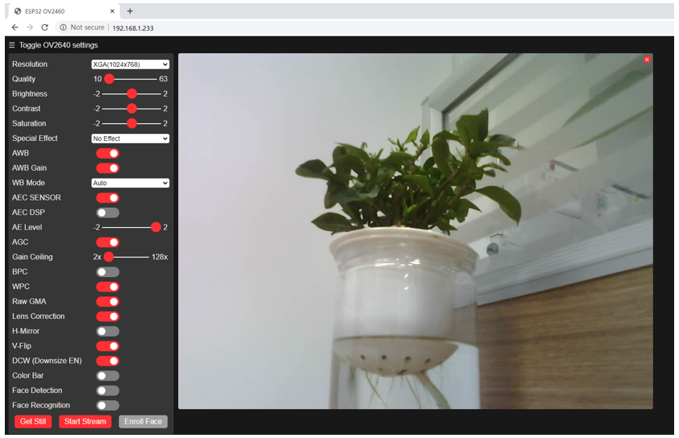

##############################################################################
Chapter Camera Web Server
##############################################################################

In this section, we take ESP32-S3's video function as an example to study.

Project 3.1 Camera Web Server
*************************************

Connect ESP32-S3 using USB and check its IP address through serial monitor. Use web page to access IP address to obtain video and image data.

Component List 
=============================

.. list-table::
   :width: 100%
   :header-rows: 1 
   :align: center
   
   * -  ESP32-S3 WROOM x1
     -  USB cable x1
   * -  |Chapter02_00|
     -  |Chapter02_01|
    
.. |Chapter02_00| image:: ../_static/imgs/2_WS2812/Chapter02_00.png
.. |Chapter02_01| image:: ../_static/imgs/2_WS2812/Chapter02_01.png

Circuit
=============================

Connect Freenove ESP32-S3 to your computer using the USB cable. 

.. image:: ../_static/imgs/2_WS2812/Chapter02_02.png
    :align: center

Sketch
==============================

Sketch_03_CameraWebServer
-------------------------------

Before running the program, please modify your router's name and password marked in the illustration above to make sure that your Sketch can compile and work successfully. 

Compile and upload codes to ESP32-S3, open the serial monitor and set the baud rate to 115200, and the serial monitor will print out a network address.

If your ESP32-S3 is in the process of connecting to router (dots are printed continuousl), but the IP address does not show up, please re-check whether the router name and password have been entered correctly and press the reset key on ESP32-S3 WROOM to wait for a successful connection prompt. 

Open a web browser, enter the IP address printed by the serial monitor in the address bar, and access it. 

Taking the Google browser as an example, here is what the browser prints out after successful access to ESP32-S3's IP.

Click on Start Stream. The result is as shown below.

.. note::
    
    **If sketch compilation fails due to ESP32-S3 support package, try to run the example sketch as per the image below. This sketch is the same as the one described in the tutorial above.**

The following is the main program code. You need include other code files in the same folder when write your own code.

.. literalinclude:: ../../../freenove_Kit/Sketches/Sketch_03_CameraWebServer/Sketch_03_CameraWebServer.ino
    :linenos: 
    :language: c
    :dedent:

Add procedure files and API interface files related to ESP32-S3 camera.

.. code-block:: c

    #include "esp_camera.h"
    #include <WiFi.h>

    #define CAMERA_MODEL_ESP32S3_EYE // Has PSRAM

    #include "camera_pins.h"

Enter the name and password of your router. 

.. code-block:: c

    const char *ssid     = "********";  //input your wifi name
    const char *password = "********";  //input your wifi passwords

Initialize serial port, set baud rate to 115200; open the debug and output function of the serial.

.. literalinclude:: ../../../freenove_Kit/Sketches/Sketch_03_CameraWebServer/Sketch_03_CameraWebServer.ino
    :linenos: 
    :language: c
    :lines: 33-35
    :dedent:

Configure parameters including interface pins of the camera. Note: It is not recommend changing them.

.. literalinclude:: ../../../freenove_Kit/Sketches/Sketch_03_CameraWebServer/Sketch_03_CameraWebServer.ino
    :linenos: 
    :language: c
    :lines: 37-62
    :dedent:

ESP32-S3 connects to the router and prints a successful connection prompt. If it does not connect succssfully, press the reset key on the ESP32-S3 WROOM.

.. literalinclude:: ../../../freenove_Kit/Sketches/Sketch_03_CameraWebServer/Sketch_03_CameraWebServer.ino
    :linenos: 
    :language: c
    :lines: 89-97
    :dedent:

Open the video streams server function of the camera and print its IP address via serial port.

.. literalinclude:: ../../../freenove_Kit/Sketches/Sketch_03_CameraWebServer/Sketch_03_CameraWebServer.ino
    :linenos: 
    :language: c
    :lines: 99-103
    :dedent:

Configure the display image information of the camera.

The set_vflip() function sets whether the image is flipped 180°, with 0 for no flip and 1 for flip 180°.

The set_brightness() function sets the brightness of the image, with values ranging from -2 to 2.

The set_saturation() function sets the color saturation of the image, with values ranging from -2 to 2.

.. literalinclude:: ../../../freenove_Kit/Sketches/Sketch_03_CameraWebServer/Sketch_03_CameraWebServer.ino
    :linenos: 
    :language: c
    :lines: 83-87
    :dedent:

Modify the resolution and sharpness of the images captured by the camera. The sharpness ranges from 10 to 63, and the smaller the number, the sharper the picture. The larger the number, the blurrier the picture. Please refer to the table below.

.. literalinclude:: ../../../freenove_Kit/Sketches/Sketch_03_CameraWebServer/Sketch_03_CameraWebServer.ino
    :linenos: 
    :language: c
    :lines: 57,61
    :dedent:

Reference
-----------------------------------

+-------------------+-----------+------------------+-----------+
| Image resolution  | Sharpness | Image resolution | Sharpness |
+===================+===========+==================+===========+
| FRAMESIZE_96X96   | 96x96     | FRAMESIZE_HVGA   | 480x320   |
+-------------------+-----------+------------------+-----------+
| FRAMESIZE_QQVGA   | 160x120   | FRAMESIZE_VGA    | 640x480   |
+-------------------+-----------+------------------+-----------+
| FRAMESIZE_QCIF    | 176x144   | FRAMESIZE_SVGA   | 800x600   |
+-------------------+-----------+------------------+-----------+
| FRAMESIZE_HQVGA   | 240x176   | FRAMESIZE_XGA    | 1024x768  |
+-------------------+-----------+------------------+-----------+
| FRAMESIZE_240X240 | 240x240   | FRAMESIZE_HD     | 1280x720  |
+-------------------+-----------+------------------+-----------+
| FRAMESIZE_QVGA    | 320x240   | FRAMESIZE_SXGA   | 1280x1024 |
+-------------------+-----------+------------------+-----------+
| FRAMESIZE_CIF     | 400x296   | FRAMESIZE_UXGA   | 1600x1200 |
+-------------------+-----------+------------------+-----------+