.. _SDcard:

##############################################################################
Chapter Read and Write the SDcard
##############################################################################

An SDcard slot is integrated on the back of the ESP32-S3 WROOM. In this chapter, we learn how to use ESP32-S3 to read and write SDcard.

Project 4.1 SDMMC Test
***********************************

Component List 
===================================

.. list-table::
   :width: 100%
   :header-rows: 1 
   :align: center
   
   * -  ESP32-S3 WROOM x1
     -  USB cable x1
   * -  |Chapter02_00|
     -  |Chapter02_01|
   * -  SD card x1
     -  Card reader x1 (random color)
   * -  |Chapter04_00|
     -  |Chapter04_01|
    
.. |Chapter02_00| image:: ../_static/imgs/2_WS2812/Chapter02_00.png
.. |Chapter02_01| image:: ../_static/imgs/2_WS2812/Chapter02_01.png
.. |Chapter04_00| image:: ../_static/imgs/4_Read_and_Write_the_SDcard/Chapter04_00.png
.. |Chapter04_01| image:: ../_static/imgs/4_Read_and_Write_the_SDcard/Chapter04_01.png

Component knowledge
================================

SD card read and write method
---------------------------------

The ESP32-S3 offers two methods for accessing the SD card: SPI interface and SDMMC interface. The SPI mode requires 4 IOs to access the SD card, while the SDMMC interface supports both one-bit and four-bit bus modes. In the one-bit bus mode of SDMMC, only 3 IOs are required to access the SD card; while, the four-bit bus mode of SDMMC requires 6 IOs to access the SD card.

The above three methods can all be used to access the SD card, the difference of which lies in the speed.

When accessing an SD card, the fastest reading and writing speed is achieved under the four-bit bus mode of SDMMC. The one-bit bus mode of SDMMC offers a slightly slower access speed of around 80% compared to the four-bit bus mode. The slowest access speed is observed with the SPI mode, which offers only around 50% of the speed of the four-bit bus mode of SDMMC.

For most applications, we recommend using the one-bit bus mode because it requires the least number of IO pins while still providing good performance and speed. 

Component knowledge
=============================

SD card read and write method
----------------------------------

The ESP32-S3 offers two methods for accessing the SD card: SPI interface and SDMMC interface. The SPI mode requires 4 IOs to access the SD card, while the SDMMC interface supports both one-bit and four-bit bus modes. In the one-bit bus mode of SDMMC, only 3 IOs are required to access the SD card; while, the four-bit bus mode of SDMMC requires 6 IOs to access the SD card.

The above three methods can all be used to access the SD card, the difference of which lies in the speed.

When accessing an SD card, the fastest reading and writing speed is achieved under the four-bit bus mode of SDMMC. The one-bit bus mode of SDMMC offers a slightly slower access speed of around 80% compared to the four-bit bus mode. The slowest access speed is observed with the SPI mode, which offers only around 50% of the speed of the four-bit bus mode of SDMMC.

For most applications, we recommend using the one-bit bus mode because it requires the least number of IO pins while still providing good performance and speed. 

Format SD card
----------------------------------

To begin the project, it is essential to prepare a blank SD card and a card reader. Before proceeding, we need to create a drive letter for the SD card and format it. The following steps provide a guide on how to accomplish this on different computer systems. Please follow the guide that corresponds to your computer.

Note that this step requires a card reader and a blank SD card. Please ensure that you have these components available before proceeding.

Windows
----------------------------------

Insert the SD card into the card reader, and then insert the card reader into the computer.

In the Windows search box, enter "Disk Management" and select "Create and format hard disk partitions".

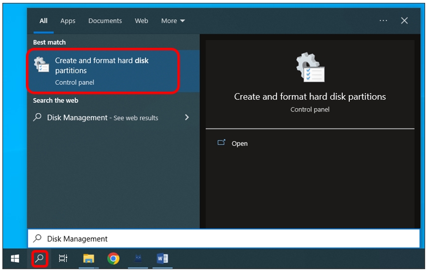

In the newly opened window, locate an unallocated volume with a size close to 1GB.

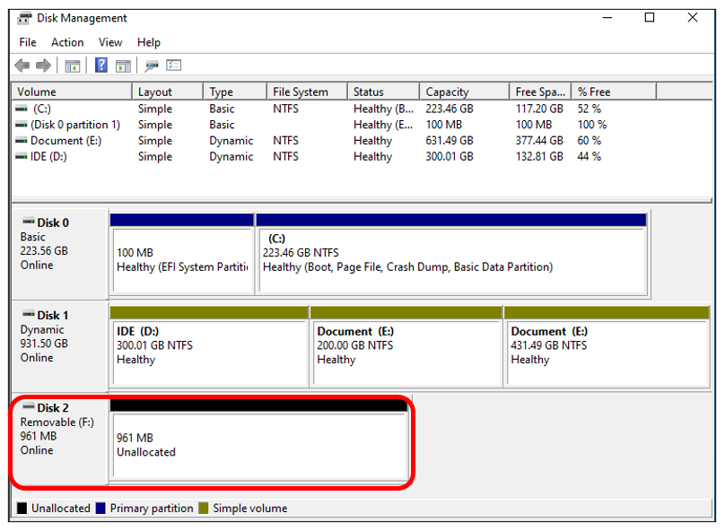

Click to select the volume, right-click and select "New Simple Volume".

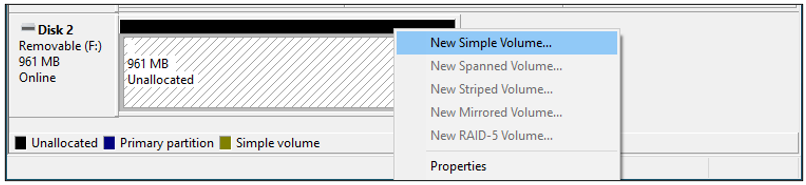

Click Next.

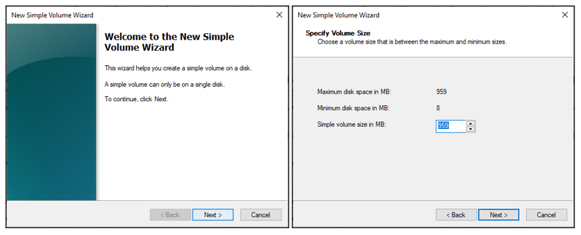

On the right-hand side, you can select a preferred drive letter for the SD card or simply proceed with the default setting by clicking on the "Next" button.

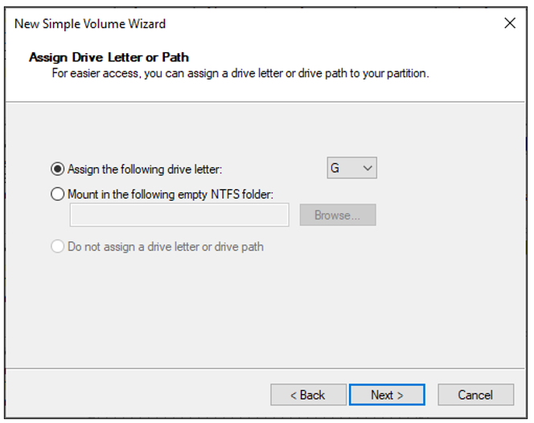
    
When formatting the SD card, select the file system as FAT (or FAT32) and set the allocation unit size to 16K. You can set the volume label to any name of your choice. Once you have made these selections, click on the "Next" button to proceed.

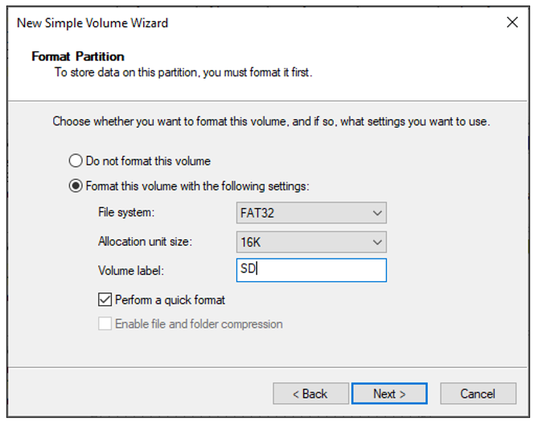

Click Finish. Wait for the SD card initialization to complete.

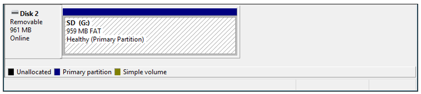

After completing the formatting process, you should be able to see the SD card in the "This PC" section of your computer.

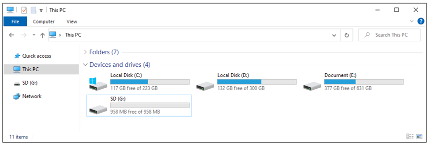

MAC
-----------------------

Insert the SD card into the card reader and then insert the card reader into your computer. Some computers may display a prompt with the following message. In this case, please click on the "Ignore" option to proceed.

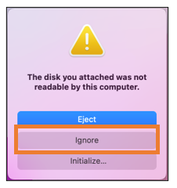

Find "Disk Utility" in the MAC system and click to open it.

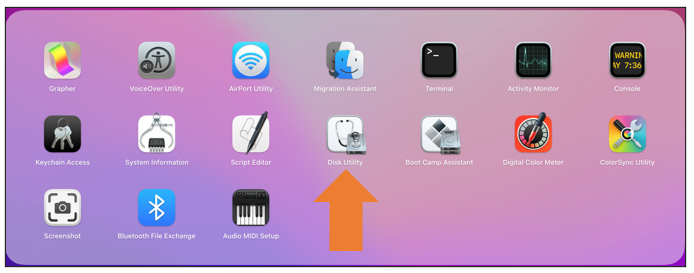

Select "Generic MassStorageClass Media", note that its size is about 1G. It is important to select the correct item to avoid accidentally erasing the wrong device. Once you have verified that you have selected the correct device, click on the "Erase" button to proceed with erasing the SD card.

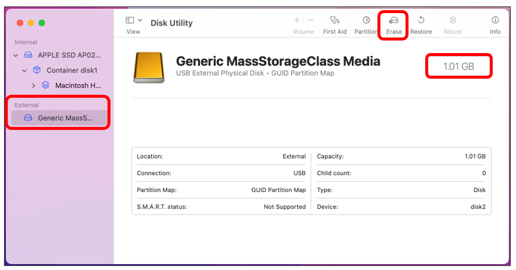

Select the configuration as shown in the figure below, and then click "Erase".

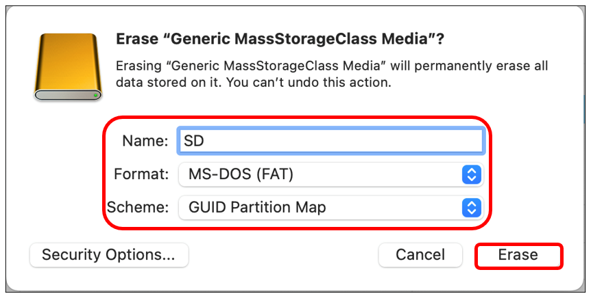

Please wait for the formatting process to complete. Once it is finished, the interface should resemble the image below. You should now be able to see a new disk named "SD" on your desktop.

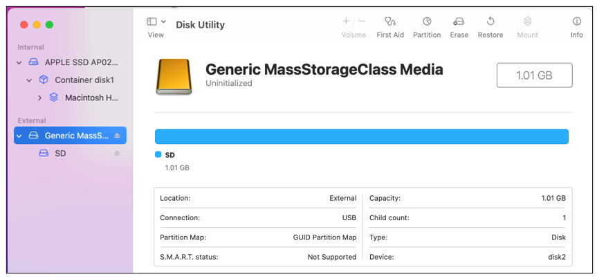

Circuit
============================

Before connecting the USB cable, insert the SD card into the SD card slot on the back of the ESP32-S3.

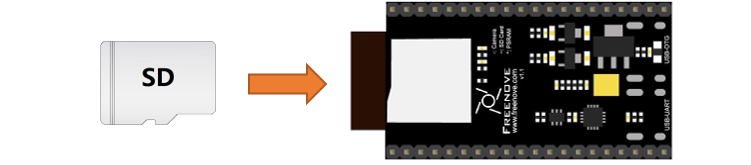

Connect Freenove ESP32-S3 to the computer using the USB cable. 

.. image:: ../_static/imgs/4_Read_and_Write_the_SDcard/Chapter04_16.png
    :align: center

Sketch
============================

Sketch_04_SDMMC
----------------------------

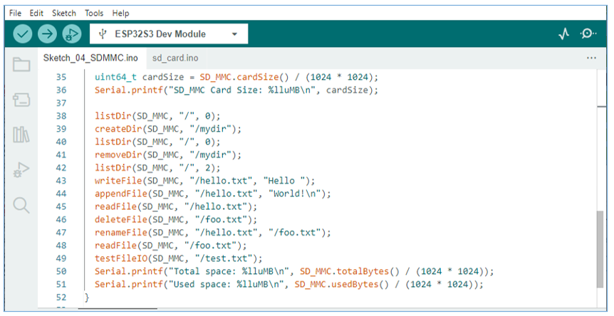

Compile and upload the code to ESP32-S3-WROOM, open the serial monitor, and press the RST button on the board.

You can see the printout as shown below.

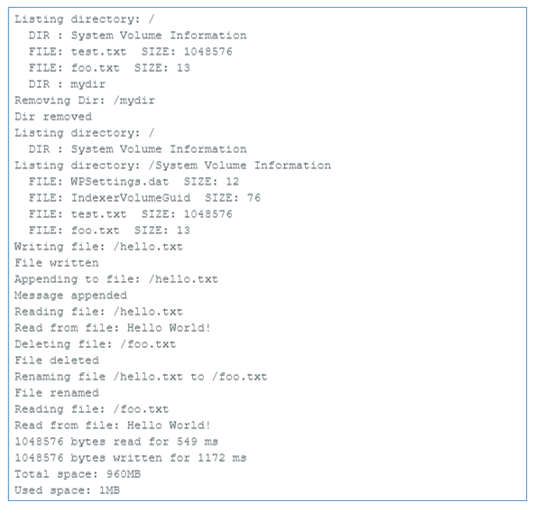

The following is the program code:

.. literalinclude:: ../../../freenove_Kit/Sketches/Sketch_04_SDMMC/Sketch_04_SDMMC.ino
    :linenos: 
    :language: c
    :dedent:

Add the SD card drive header file.

.. literalinclude:: ../../../freenove_Kit/Sketches/Sketch_04_SDMMC/Sketch_04_SDMMC.ino
    :linenos: 
    :language: c
    :lines: 1-2
    :dedent:

The drive pins of the SD card are pre-defined and should not be modified as they are fixed. Altering the pins may result in errors or malfunctions while accessing the SD card.

.. literalinclude:: ../../../freenove_Kit/Sketches/Sketch_04_SDMMC/Sketch_04_SDMMC.ino
    :linenos: 
    :language: c
    :lines: 4-6
    :dedent:

Initialize the serial port function. Sets the drive pin for SDMMC one-bit bus mode.

.. literalinclude:: ../../../freenove_Kit/Sketches/Sketch_04_SDMMC/Sketch_04_SDMMC.ino
    :linenos: 
    :language: c
    :lines: 9-10
    :dedent:

Set the mount point of the SD card, set SDMMC to one-bit bus mode, and set the read and write speed to 20MHz.

.. literalinclude:: ../../../freenove_Kit/Sketches/Sketch_04_SDMMC/Sketch_04_SDMMC.ino
    :linenos: 
    :language: c
    :lines: 11-15
    :dedent:

Get the type of SD card and print it out through the serial port.

.. literalinclude:: ../../../freenove_Kit/Sketches/Sketch_04_SDMMC/Sketch_04_SDMMC.ino
    :linenos: 
    :language: c
    :lines: 18-33
    :dedent:

Call the listDir() function to read the folder and file names in the SD card, and print them out through the serial port. This function can be found in "sd_read_write.cpp".

.. literalinclude:: ../../../freenove_Kit/Sketches/Sketch_04_SDMMC/Sketch_04_SDMMC.ino
    :linenos: 
    :language: c
    :lines: 38-38
    :dedent:

Call createDir() to create a folder, and call removeDir() to delete a folder.

.. code-block:: c

    createDir(SD_MMC, "/mydir");
    removeDir(SD_MMC, "/mydir");

Call writeFile() to write any content to the txt file. If there is no such file, create this file first.

Call appendFile() to append any content to txt.

Call readFile() to read the content in txt and print it via the serial port.

.. literalinclude:: ../../../freenove_Kit/Sketches/Sketch_04_SDMMC/Sketch_04_SDMMC.ino
    :linenos: 
    :language: c
    :lines: 43-45
    :dedent:

Call deleteFile() to delete a specified file.

Call renameFile() to copy a file and rename it.

.. literalinclude:: ../../../freenove_Kit/Sketches/Sketch_04_SDMMC/Sketch_04_SDMMC.ino
    :linenos: 
    :language: c
    :lines: 46-47
    :dedent:

Call the testFileIO() function to test the time it takes to read 512 bytes and the time it takes to write 2048*512 bytes of data.

.. literalinclude:: ../../../freenove_Kit/Sketches/Sketch_04_SDMMC/Sketch_04_SDMMC.ino
    :linenos: 
    :language: c
    :lines: 49-49
    :dedent:

Print the total size and used size of the SD card via the serial port.

.. literalinclude:: ../../../freenove_Kit/Sketches/Sketch_04_SDMMC/Sketch_04_SDMMC.ino
    :linenos: 
    :language: c
    :lines: 50-51
    :dedent:

If you are interesting in the implementation of functions, you can check them out here.

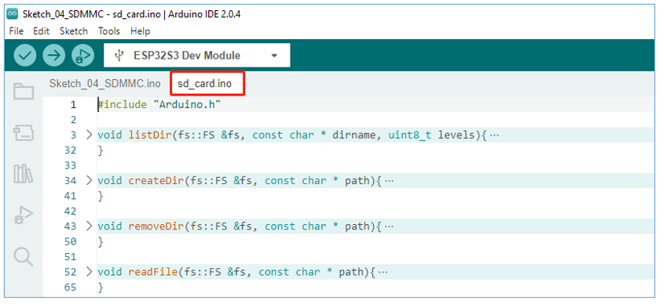