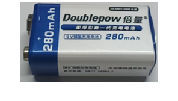

##############################################################################
Chapter Play SD card music
##############################################################################

In the previous study, we have learned how to use the SD card. Now we are going to learn to play the music in the SD card.

Project 5.1 SDMMC Music
*******************************

In this project, we will read files in mp3 format from SD card, decode them through ESP32-S3, and use Audio Converter & Amplifier module to transcode into stereo output.

Component List 
===============================

+---------------------------------+-----------------------------+------------------------------------------+
| ESP32-S3 WROOM x1               | USB cable x1                | SDcard x1                                |
|                                 |                             |                                          |
| |Chapter02_00|                  | |Chapter02_01|              | |Chapter04_00|                           |
+---------------------------------+-----------------------------+------------------------------------------+
| Card reader x1 (random color)   | Audio Converter & Amplifier | Speaker                                  |
|                                 |                             |                                          |
| :red:`(Not a USB flash drive.)` |                             |                                          |
|                                 |                             |                                          |
| |Chapter04_01|                  | |Chapter05_00|              | |Chapter05_01|                           |
+---------------------------------+-------------+---------------+------------------------------------------+
| ESP32-S3 WROOM Shield x1                      | 9V battery x1                                            |
|                                               |                                                          |
| :red:`(Not a USB flash drive.)`               | :red:`(Not included in the kit, prepared by yourself)`   |
|                                               |                                                          |
| |Chapter01_01|                                | |Chapter01_03|                                           |
|                                               +----------------------------------------------------------+
|                                               | 9V battery cable x1                                      |
|                                               |                                                          |
|                                               | |Chapter05_02|                                           |
+-----------------------------------------------+----------------------------------------------------------+

.. |Chapter01_01| image:: ../_static/imgs/1_ADC_Test/Chapter01_01.png

.. |Chapter02_00| image:: ../_static/imgs/2_WS2812/Chapter02_00.png
.. |Chapter02_01| image:: ../_static/imgs/2_WS2812/Chapter02_01.png
.. |Chapter04_00| image:: ../_static/imgs/4_Read_and_Write_the_SDcard/Chapter04_00.png
.. |Chapter04_01| image:: ../_static/imgs/4_Read_and_Write_the_SDcard/Chapter04_01.png
.. |Chapter05_00| image:: ../_static/imgs/5_Play_SD_card_music/Chapter05_00.png
.. |Chapter05_01| image:: ../_static/imgs/5_Play_SD_card_music/Chapter05_01.png
.. |Chapter05_02| image:: ../_static/imgs/5_Play_SD_card_music/Chapter05_02.png

Component knowledge
===============================

Here are the front and back of Audio Converter & Amplifier module.

.. list-table::
   :width: 100%
   :header-rows: 1 
   :align: center
   
   * -  front view
     -  reverse view
     -  schematic diagram
 
   * -  |Chapter05_03|
     -  |Chapter05_04|
     -  |Chapter05_05|

Interface description for Audio Converter & Amplifier module

+-----+------+-------------------------------------+
| Pin | Name |            Introductions            |
+=====+======+=====================================+
| 1   | SCK  | System clock input                  |
+-----+------+-------------------------------------+
| 2   | BCK  | Audio data bit clock input          |
+-----+------+-------------------------------------+
| 3   | DIN  | Audio data input                    |
+-----+------+-------------------------------------+
| 4   | LCK  | Audio data word clock input         |
+-----+------+-------------------------------------+
| 5   | VCC  | Power input, 3.3V~5.0V              |
+-----+------+-------------------------------------+
| 6   | GND  | Power Ground                        |
+-----+------+-------------------------------------+
| 7   | L    | External audio left channel input   |
+-----+------+-------------------------------------+
| 8   | G    | Power Ground                        |
+-----+------+-------------------------------------+
| 9   | R    | External audio right channel input  |
+-----+------+-------------------------------------+
| 10  | G    | Power Ground                        |
+-----+------+-------------------------------------+
| 11  | R+   | Positive pole of right channel horn |
+-----+------+-------------------------------------+
| 12  | R-   | Negative pole of right channel horn |
+-----+------+-------------------------------------+
| 13  | L+   | Positive pole of left channel horn  |
+-----+------+-------------------------------------+
| 14  | L-   | Negative pole of left channel horn  |
+-----+------+-------------------------------------+

Speaker interface: The board features two speaker groups, namely Group L (L+ & L-) and Group R (R+ & R-), for connecting the left and right channel speakers. Each speaker interface can be connected to either Group L or Group R. However, it is important to note that connecting one interface to Group L will render the other interface incompatible with Group R. This could cause the module to malfunction, and therefore should be avoided.

Headphone interface: the interface to connect the headphones.

I2S input interface: connect to a device with I2S, transcoding audio data into DAC audio signals.

External audio input interface: connect to external audio equipment. amplifying externally input audio signals.

Power interface: connect to external power supply. The external power supply selected should fall within the range of 3.3V-5.0V.

Circuit
==========================

Before compling code, we should copy music to SD card first, as illustrated below.

We have placed a folder called "music" in:

**Freenove-Development-Kit-for-ESP32-S3\Sketch\Sketch_05_I2S_Audio,**

please copy this folder to the SD card.

Before connecting the USB cable, insert the SD card into the SD card slot on the back of the ESP32-S3.

.. image:: ../_static/imgs/5_Play_SD_card_music/Chapter05_08.png
    :align: center

Plug the audio module to the board. Connect Freenove ESP32-S3 to the computer with the USB cable. 

Hardware connection. If you need any support, please feel free to contact us via: support@freenove.com

.. image:: ../_static/imgs/5_Play_SD_card_music/Chapter05_09.png
    :align: center

Sketch
=========================

How to install the library
------------------------------

In this project, we will use the ESP32-audioI2S.zip library to decode the audio files in the SD card, and then output the audio signal through IIS. If you have not installed this library, please follow the steps below to install it.

Open arduino->Sketch->Include library-> Add .ZIP Library. 

In the newly opened window, select "Freenove-Development-Kit-for-ESP32-S3Libraries\ESP32-audioI2S.zip" and click "Open".

.. image:: ../_static/imgs/5_Play_SD_card_music/Chapter05_11.png
    :align: center

Sketch_05_I2S_Audio
---------------------------------

Click the upload button to upload the code to ESP32-S3.

.. note::
    
    If the music fails to play, please check whether the name and path of the music is correct.

Compile and upload the code to the ESP32-S3 WROOM and open the serial monitor. It takes a few seconds to initialize the program. When you see the messages as below, it means that ESP32-S3 has started parsing the mp3 in sd card and started playing music through iis.

The following is the program code:

.. literalinclude:: ../../../freenove_Kit/Sketches/Sketch_05_I2S_Audio/Sketch_05_I2S_Audio.ino
    :linenos: 
    :language: c
    :dedent:

Add music decoding header files and SD card drive files.

.. literalinclude:: ../../../freenove_Kit/Sketches/Sketch_05_I2S_Audio/Sketch_05_I2S_Audio.ino
    :linenos: 
    :language: c
    :lines: 16-19
    :dedent:

Define the drive pins for SD card and IIS. Note that the SD card driver pins cannot be modified, but the IIS drive pins can be modified.

.. literalinclude:: ../../../freenove_Kit/Sketches/Sketch_05_I2S_Audio/Sketch_05_I2S_Audio.ino
    :linenos: 
    :language: c
    :lines: 21-27
    :dedent:

Declare an audio decoding object, associate it with the pin, set the volume, and set the decoding object.

.. code-block:: c
    :linenos:
    
    Audio audio;
    ......
    audio.setPinout(I2S_BCLK, I2S_LRC, I2S_DOUT);
    audio.setVolume(12);  // 0...21
    audio.connecttoFS(SD_MMC, "/music/Good Time.mp3");

Continuously play music until the current track finishes. Upon receiving data through the serial port, remove any leading or trailing spaces and use the audio object to decode the data.

.. literalinclude:: ../../../freenove_Kit/Sketches/Sketch_05_I2S_Audio/Sketch_05_I2S_Audio.ino
    :linenos: 
    :language: c
    :lines: 46-53
    :dedent:

In other words, if you want to switch the music in the SD card, you can directly input the song through the serial port.

These functions are used to print information about audio decoding. If you don't want to see this information in the serial port, you can simply comment out these functions."

.. code-block:: c
    :linenos:
    
    void audio_info(const char *info);
    void audio_id3data(const char *info);
    void audio_eof_mp3(const char *info);
    void audio_showstation(const char *info);
    void audio_showstreamtitle(const char *info);
    void audio_bitrate(const char *info);
    void audio_commercial(const char *info);
    void audio_icyurl(const char *info);
    void audio_lasthost(const char *info);