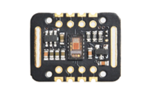
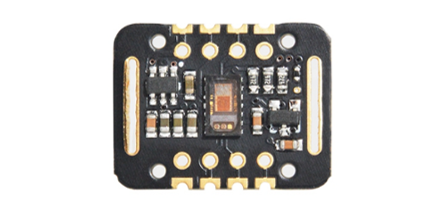
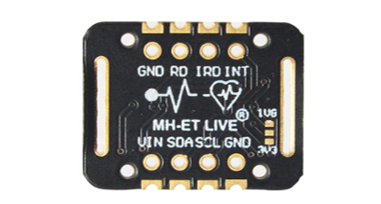
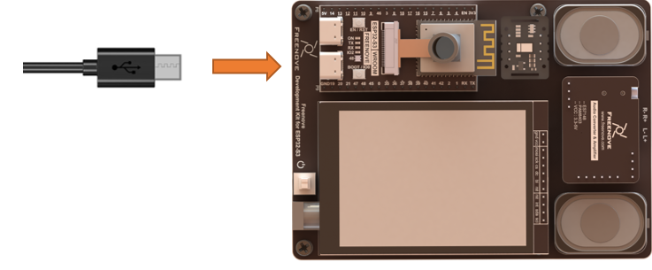
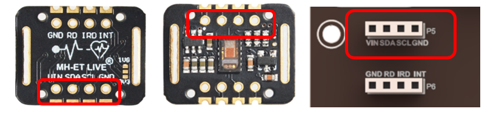
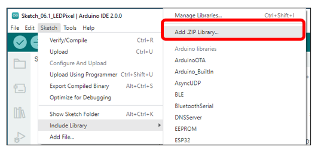
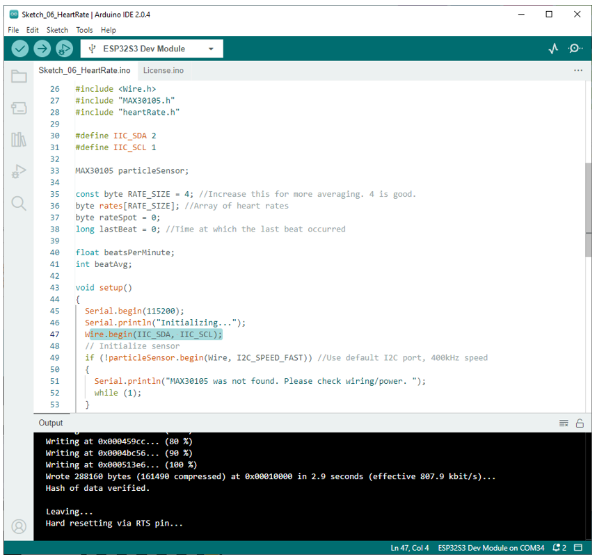
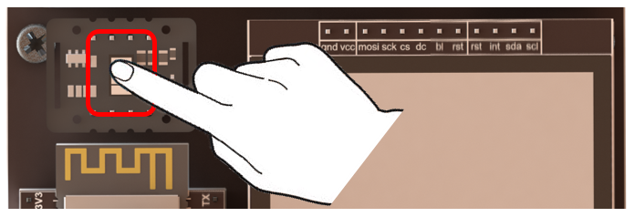
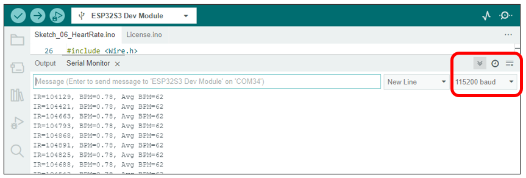

##############################################################################
Chapter MAX30102
##############################################################################

In this section, we will explore how to utilize the MAX30102 module to measure human heart rate and blood oxygen saturation.

Project 6.1 MAX30102
********************************

In this project, we will read data from MAX30102, process the data, and print it out via serial communication.

Component List 
===============================

+--------------------------+----------------+----------------+
| ESP32-S3 WROOM x1        | USB cable x1   | Max30102       |
|                          |                |                |
| |Chapter02_00|           | |Chapter02_01| | |Chapter06_00| |
+--------------------------+----------------+----------------+
| ESP32-S3 WROOM Shield x1                                   |
|                                                            |
| |Chapter01_01|                                             |
+------------------------------------------------------------+

.. |Chapter01_01| image:: ../_static/imgs/1_ADC_Test/Chapter01_01.png
.. |Chapter02_00| image:: ../_static/imgs/2_WS2812/Chapter02_00.png
.. |Chapter02_01| image:: ../_static/imgs/2_WS2812/Chapter02_01.png

Component knowledge
==================================

MAX30102 is a module that integrates a pulse oximeter and biometric sensor for monitoring. It includes a red LED and an infrared LED, a photodetector, optical components, and low-noise electronic circuitry with ambient light suppression. It is typically used for heart rate and blood oxygen sensing in wearable devices, and can be worn on the fingertip, earlobe, and wrist.

The MAX30102 module uses the I2C communication interface to transmit the collected data to devices such as Arduino and ESP32 for heart rate and blood oxygen calculations.

.. list-table::
   :width: 100%
   :header-rows: 1 
   :align: center
   
   * -  front view
     -  reverse view

   * -  |Chapter06_01|
     -  |Chapter06_02|

When the MAX30102 is operating, it emits red and infrared light. As these lights pass through human tissue, the varying levels of light transmission caused by pulsating blood vessels can be detected by the module's photodetectors. These signals are then converted into electrical signals, amplified, and output to the main control chip.

To obtain the data, we only need to access the I2C address of the blood oxygen module using the I2C protocol. The default I2C address for MAX30102 is 0x57.

Introduction to the pins of Max30102 module

.. table::
    :align: center
    :class: zebra
    
    +-----+------+---------------------------------------------+
    | Pin | Name |                Introductions                |
    +=====+======+=============================================+
    | 1   | Vin  | Power input, 3.3V~5.0V                      |
    +-----+------+---------------------------------------------+
    | 2   | SDA  | I2C data pin, connect to I2C data line      |
    +-----+------+---------------------------------------------+
    | 3   | SCL  | I2C clock pin, connect to I2C clock line    |
    +-----+------+---------------------------------------------+
    | 4   | GND  | Power Ground                                |
    +-----+------+---------------------------------------------+
    | 5   | INT  | Interrupt signal pin of MAX30102 chip       |
    +-----+------+---------------------------------------------+
    | 6   | IRD  | Ground of RED LED, not connected be default |
    +-----+------+---------------------------------------------+
    | 7   | RD   | Ground of IR LED, not connected be default  |
    +-----+------+---------------------------------------------+
    | 8   | GND  | Power Ground                                |
    +-----+------+---------------------------------------------+

Circuit
============================

Connect Freenove ESP32-S3 to the computer using the USB cable. 

Please note that when installing the MAX30102 module, it is crucial not to connect it reversely. Doing so may cause adverse effects on the circuit or even damage it. Please follow the marks on the board strictly and make sure that the pins are installed PIN to PIN.

Sketch
============================

This code uses a library named "SparkFun_MAX3010x_Pulse_and_Proximity_Sensor_Library". If you have not installed it, please do so first.

How to install the library
--------------------------------

Open Arduino IDE, click Sketch -> Include Library -> Add .ZIP Library. In the pop-up window, find the file named " **Freenove-Development-Kit-for-ESP32-S3\\Libraries\\SparkFun_MAX3010x_Pulse_and_Proximity_Sensor_Library.Zip** " which locates in this directory, and click OPEN.

Sketch_06_HeartRate
--------------------------

Click Upload to upload the code to ESP32-S3, and then open the serial port monitor. Set the baud rate to 115200 and gently place the tip of your finger on the Max30102 chip. As shown in the picture below.

The following is the program code:

.. literalinclude:: ../../../freenove_Kit/Sketches/Sketch_06_HeartRate/Sketch_06_HeartRate.ino
    :linenos: 
    :language: c
    :dedent:

To use some libraries, first you need to include their header file.

.. literalinclude:: ../../../freenove_Kit/Sketches/Sketch_06_HeartRate/Sketch_06_HeartRate.ino
    :linenos: 
    :language: c
    :lines: 26-28
    :dedent:

Define I2C pins to communicate with MAX30102 module.

.. literalinclude:: ../../../freenove_Kit/Sketches/Sketch_06_HeartRate/Sketch_06_HeartRate.ino
    :linenos: 
    :language: c
    :lines: 30-31
    :dedent:

Declare an object to manipulate the data that I2C reads and writes to Max30102.

.. literalinclude:: ../../../freenove_Kit/Sketches/Sketch_06_HeartRate/Sketch_06_HeartRate.ino
    :linenos: 
    :language: c
    :lines: 33-33
    :dedent:

Initialize I2C and call I2C to initialize the Max30102 module.

.. literalinclude:: ../../../freenove_Kit/Sketches/Sketch_06_HeartRate/Sketch_06_HeartRate.ino
    :linenos: 
    :language: c
    :lines: 46-51
    :dedent:

Configure Max30102 module.

.. literalinclude:: ../../../freenove_Kit/Sketches/Sketch_06_HeartRate/Sketch_06_HeartRate.ino
    :linenos: 
    :language: c
    :lines: 54-56
    :dedent:

Obtain the infrared raw data of Max30102 module.

.. literalinclude:: ../../../freenove_Kit/Sketches/Sketch_06_HeartRate/Sketch_06_HeartRate.ino
    :linenos: 
    :language: c
    :lines: 60-60
    :dedent:

Calculate the number of heartbeats per minute and the average number of heartbeats.

We need to consider the fluctuation of data caused by factors such as the location and area of our finger that is in contact with the MAX30102 during each measurement. Therefore, it is more accurate to use the method of summing up and averaging the data to obtain a person's heart rate

.. literalinclude:: ../../../freenove_Kit/Sketches/Sketch_06_HeartRate/Sketch_06_HeartRate.ino
    :linenos: 
    :language: c
    :lines: 61-75
    :dedent:

Print out the processed data via serial port.

.. literalinclude:: ../../../freenove_Kit/Sketches/Sketch_06_HeartRate/Sketch_06_HeartRate.ino
    :linenos: 
    :language: c
    :lines: 76-81
    :dedent:

When the raw data value is smaller than 50,000, it is generally considered that the finger has been removed from the MAX30102 module.

.. literalinclude:: ../../../freenove_Kit/Sketches/Sketch_06_HeartRate/Sketch_06_HeartRate.ino
    :linenos: 
    :language: c
    :lines: 83-84
    :dedent: