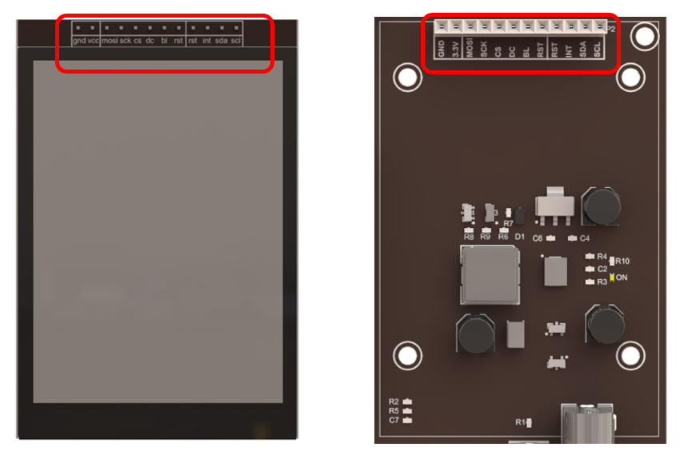
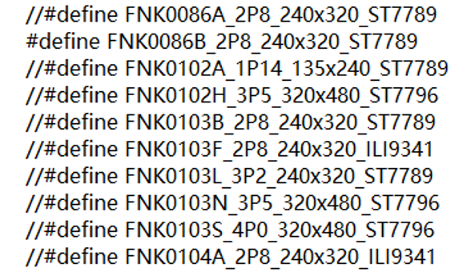

##############################################################################
Chapter Drving Freenove 2.8-Inch Screen 
##############################################################################

From this chapter, we start to learn the use of screens.

Project 7.1 Screen Display Function
******************************************

In this project, we will learn how to drive a screen and display information on it.

Component List 
=================================

+--------------------------+----------------+----------------+
| ESP32-S3 WROOM x1        | USB cable x1   | 2.8-inch Screen|
|                          |                |                |
| |Chapter02_00|           | |Chapter02_01| | |Chapter07_00| |
+--------------------------+----------------+----------------+
| ESP32-S3 WROOM Shield x1                                   |
|                                                            |
| |Chapter01_01|                                             |
+------------------------------------------------------------+

.. |Chapter01_01| image:: ../_static/imgs/1_ADC_Test/Chapter01_01.png
.. |Chapter02_00| image:: ../_static/imgs/2_WS2812/Chapter02_00.png
.. |Chapter02_01| image:: ../_static/imgs/2_WS2812/Chapter02_01.png
.. |Chapter07_00| image:: ../_static/imgs/7_Drving_Freenove_2.8-Inch_Screen/Chapter07_00.png

Component knowledge
=============================

Below are the front and back photos of the Freenove 2.8-inch screen.

.. list-table::
   :width: 100%
   :header-rows: 1 
   :align: center
   
   * -  Front view
     -  Back view

   * -  |Chapter07_01|
     -  |Chapter07_02|

.. |Chapter07_01| image:: ../_static/imgs/7_Drving_Freenove_2.8-Inch_Screen/Chapter07_01.png
.. |Chapter07_02| image:: ../_static/imgs/7_Drving_Freenove_2.8-Inch_Screen/Chapter07_02.png

Introduction to the pins of Freenove 2.8-inch screen

.. table::
    :align: center
    :class: zebra
    
    +-----+------+--------------------------------------------------------------------------+
    | Pin | Name |                                     Introductions                        |
    +=====+======+==========================================================================+
    | 1   | GND  | Power   Ground                                                           |
    +-----+------+--------------------------------------------------------------------------+
    | 2   | VCC  | Power   input, 3.3V~5.0V                                                 |
    +-----+------+--------------------------------------------------------------------------+
    | 3   | MOSI | Connecting to MOSI of SPI line, used to receive data of mcu.             |
    +-----+------+--------------------------------------------------------------------------+
    | 4   | SCK  | Connecting to SCK of SPI line, used to receive clock signal of mcu.      |
    +-----+------+--------------------------------------------------------------------------+
    | 5   | CS   | Connecting to CS of SPI line, used to enable/disable SPI communication.  |
    +-----+------+--------------------------------------------------------------------------+
    |     |      | Command and data control pin, differentiate commands and data via        |
    | 6   | DC   |                                                                          |
    |     |      | high and low levels.                                                     |
    +-----+------+--------------------------------------------------------------------------+
    | 7   | BL   | Screen backlight control pin, enabled with low level by default          |
    +-----+------+--------------------------------------------------------------------------+
    | 8   | RST  | Screen driver reset pin                                                  |
    +-----+------+--------------------------------------------------------------------------+
    | 9   | RST  | Touch driver reset pin                                                   |
    +-----+------+--------------------------------------------------------------------------+
    | 10  | INT  | Touch interrupt pin                                                      |
    +-----+------+--------------------------------------------------------------------------+
    | 11  | SDA  | Connect to I2C data line                                                 |
    +-----+------+--------------------------------------------------------------------------+
    | 12  | SCL  | Connect to I2C clock line                                                |
    +-----+------+--------------------------------------------------------------------------+

Freenove screen uses SPI protocol to drive screen display content and uses I2C protocol to obtain touch information from the screen.。

For more details, please refer to

Freenove-Development-Kit-for-ESP32-S3\\Datasheet\\ST7789V_SPEC_V1.0.pdf

Freenove-Development-Kit-for-ESP32-S3\\Datasheet\\FocalTech-FT6336U.pdf

Circuit
===========================

Connect Freenove ESP32-S3 to the computer using the USB cable. 

.. image:: ../_static/imgs/7_Drving_Freenove_2.8-Inch_Screen/Chapter07_03.png
    :align: center

.. note::
    
    When connecting the screen to the ESP32-S3 WROOM Shield, please ensure that the pins are aligned with the marks before applying power to avoid damaging the screen.

Sketch
===========================

This code uses a library named "TFT_eSPI". If you have not installed it, please do so first.

How to install the library
----------------------------

Click Sketch -> Include Library -> Add .ZIP Library...

Install **TFT_eSPI_v2.5.43.zip** and **TFT_eSPI_Setups_v1.1.zip**

How to configure (Important)
-----------------------------------

Open This PC, input %USERPROFILE%\\Documents\\Arduino\\libraries\\TFT_eSPI_Setups and press the Enter key.

Right click **User_Setup_Select.h**, click **Edit**.

Uncomment the corresponding macro definition based on the model purchased.

If the screen displays inverted colors after burning the code (areas that should be white appear black, and areas that should be black appear white), please enable the configuration item #define FNK0086B_2P8_240x320_ST7789 and comment out the macro definition #define FNK0086A_2P8_240x320_ST7789.

:combo:`red font-bolder:Important Note: Only one macro definition should be uncommented.`

Save the change and exit the file.

Sketch_07_TFT_Clock
------------------------------

Click "Upload" to upload the code to the ESP32-S3. Wait for the code to finish uploading, and the screen will display a clock as shown in the following figure.

The following is the program code:

.. literalinclude:: ../../../freenove_Kit/Sketches/Sketch_07_TFT_Clock/Sketch_07_TFT_Clock.ino
    :linenos: 
    :language: c
    :dedent:

To use some libraries, first you need to include their header files.

.. literalinclude:: ../../../freenove_Kit/Sketches/Sketch_07_TFT_Clock/Sketch_07_TFT_Clock.ino
    :linenos: 
    :language: c
    :lines: 1-2
    :dedent:

Declare a tft object for operating the screen.

.. literalinclude:: ../../../freenove_Kit/Sketches/Sketch_07_TFT_Clock/Sketch_07_TFT_Clock.ino
    :linenos: 
    :language: c
    :lines: 6-6
    :dedent:

TIME represents the current time at which the code was uploaded. The function conv2d is used to convert a string to a number.

.. literalinclude:: ../../../freenove_Kit/Sketches/Sketch_07_TFT_Clock/Sketch_07_TFT_Clock.ino
    :linenos: 
    :language: c
    :lines: 14-15
    :dedent:

Initialize the screen and set not to rotate. The values 0-3 represent screen rotations of 0, 90, 180, and 270 degrees, respectively.

.. literalinclude:: ../../../freenove_Kit/Sketches/Sketch_07_TFT_Clock/Sketch_07_TFT_Clock.ino
    :linenos: 
    :language: c
    :lines: 20-21
    :dedent:

Screen filling function. It can be used to set the background color of the screen.

.. literalinclude:: ../../../freenove_Kit/Sketches/Sketch_07_TFT_Clock/Sketch_07_TFT_Clock.ino
    :linenos: 
    :language: c
    :lines: 28-28
    :dedent:

Before using a font, first use the setTextColor function to set the font and its background color.

.. literalinclude:: ../../../freenove_Kit/Sketches/Sketch_07_TFT_Clock/Sketch_07_TFT_Clock.ino
    :linenos: 
    :language: c
    :lines: 30-30
    :dedent:

Draw a circle and fill it with color. Use two circles of different sizes to overlap and create the framework for the clock.

.. literalinclude:: ../../../freenove_Kit/Sketches/Sketch_07_TFT_Clock/Sketch_07_TFT_Clock.ino
    :linenos: 
    :language: c
    :lines: 45-45
    :dedent:

Draw a dot, the coordinate and color of which need to be input.

.. literalinclude:: ../../../freenove_Kit/Sketches/Sketch_07_TFT_Clock/Sketch_07_TFT_Clock.ino
    :linenos: 
    :language: c
    :lines: 55-55
    :dedent:

Display strings on the screen. The size of text can be set to 2 or 4.

.. literalinclude:: ../../../freenove_Kit/Sketches/Sketch_07_TFT_Clock/Sketch_07_TFT_Clock.ino
    :linenos: 
    :language: c
    :lines: 64-64
    :dedent:

For more detailed usage, please refer to: https://github.com/Bodmer/TFT_eSPI