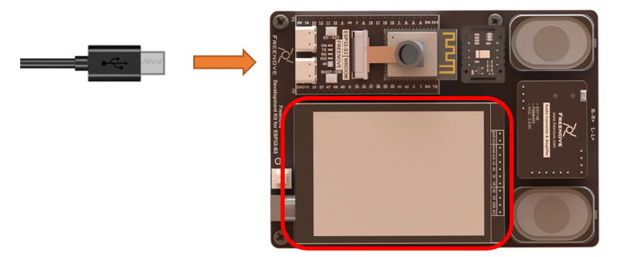
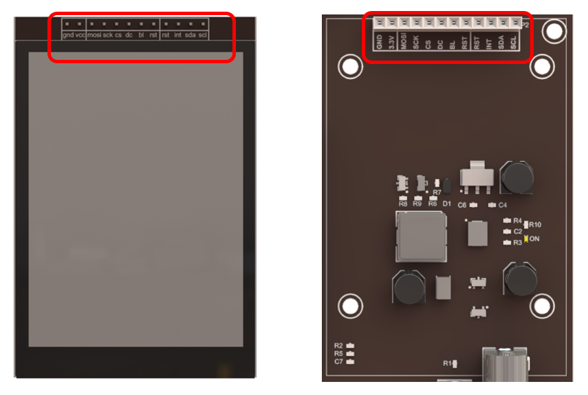
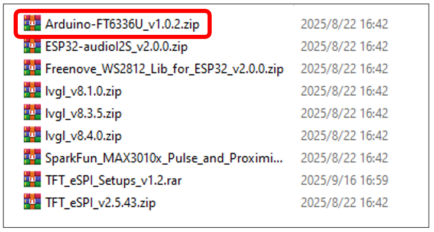
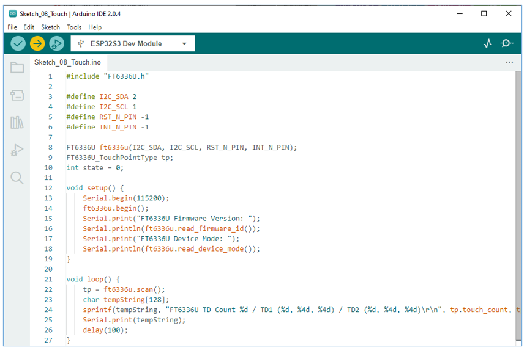
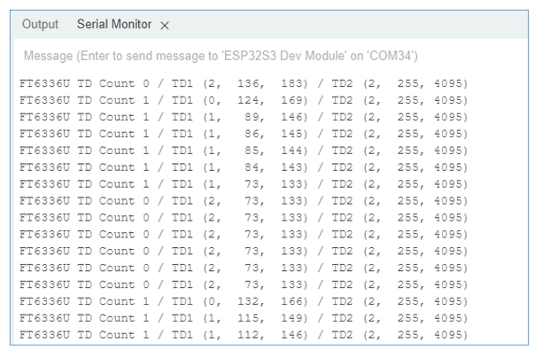

##############################################################################
Chapter Touch of Freenove 2.8-Inch Screen
##############################################################################

In this chapter, we will learn the usage of screen touch function.

Project 8.1 Touch Function of the Screen
*****************************************************
In this project, we will learn to obtain touch data from a screen and print them out through serial port.

Component List 
=================================

+--------------------------+----------------+----------------+
| ESP32-S3 WROOM x1        | USB cable x1   | 2.8-inch Screen|
|                          |                |                |
| |Chapter02_00|           | |Chapter02_01| | |Chapter07_00| |
+--------------------------+----------------+----------------+
| ESP32-S3 WROOM Shield x1                                   |
|                                                            |
| |Chapter01_01|                                             |
+------------------------------------------------------------+

.. |Chapter01_01| image:: ../_static/imgs/1_ADC_Test/Chapter01_01.png
.. |Chapter02_00| image:: ../_static/imgs/2_WS2812/Chapter02_00.png
.. |Chapter02_01| image:: ../_static/imgs/2_WS2812/Chapter02_01.png
.. |Chapter07_00| image:: ../_static/imgs/7_Drving_Freenove_2.8-Inch_Screen/Chapter07_00.png

Circuit
===========================

Connect Freenove ESP32-S3 to the computer using the USB cable. 

.. note::
    
    When connecting the screen to the ESP32-S3 WROOM Shield, please ensure that the pins are aligned with the marks before applying power to avoid damaging the screen.

Sketch
===========================

This code uses a library named "Arduino-FT6336U". If you have not installed it, please do so first.

How to install the library
---------------------------------

Open Arduino IDE, click Sketch -> Include Library -> Add .ZIP Library. In the pop-up window, find the file named " **Freenove-Development-Kit-for-ESP32-S3\\Libraries\\Arduino-FT6336U.Zip** ", which locates in this directory, and click OPEN.

Select Arduino-FT6336U.zip and click Open.

Sketch_08_Touch
-------------------------------

Click Upload to upload the code to ESP32-S3. After code completes uploading, open the serial monitor, long press or tap the screen, and you can see the messages as below:

The following is the program code:

.. literalinclude:: ../../../freenove_Kit/Sketches/Sketch_08_Touch/Sketch_08_Touch.ino
    :linenos: 
    :language: c
    :dedent:

To use some libraries, first you need to include their header files.

.. literalinclude:: ../../../freenove_Kit/Sketches/Sketch_08_Touch/Sketch_08_Touch.ino
    :linenos: 
    :language: c
    :lines: 1-1
    :dedent:

Declare an ft6336u object to read the touch chip data. Define a touch data type to receive data.

.. literalinclude:: ../../../freenove_Kit/Sketches/Sketch_08_Touch/Sketch_08_Touch.ino
    :linenos: 
    :language: c
    :lines: 8-9
    :dedent:

Initialize the touch chip.

.. literalinclude:: ../../../freenove_Kit/Sketches/Sketch_08_Touch/Sketch_08_Touch.ino
    :linenos: 
    :language: c
    :lines: 14-14
    :dedent:

Non-blocking scan function, store scan results in tp.

.. literalinclude:: ../../../freenove_Kit/Sketches/Sketch_08_Touch/Sketch_08_Touch.ino
    :linenos: 
    :language: c
    :lines: 22-22
    :dedent:

Combine and print the captured touchdata.

.. literalinclude:: ../../../freenove_Kit/Sketches/Sketch_08_Touch/Sketch_08_Touch.ino
    :linenos: 
    :language: c
    :lines: 24-25
    :dedent: