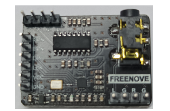
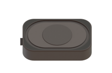
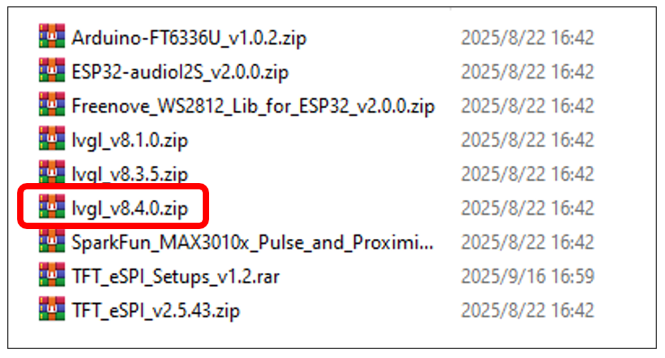

##############################################################################
LVGL
##############################################################################

In this section, we will learn how to use the lvgl library.

Project 9.1 LVGL Test
*********************************

+---------------------------------+-----------------------------+------------------------------------------+
| ESP32-S3 WROOM x1               | USB cable x1                | SDcard x1                                |
|                                 |                             |                                          |
| |Chapter02_00|                  | |Chapter02_01|              | |Chapter04_00|                           |
+---------------------------------+-----------------------------+------------------------------------------+
| Card reader x1 (random color)   | Audio Converter & Amplifier | Speaker                                  |
|                                 |                             |                                          |
| :red:`(Not a USB flash drive.)` |                             |                                          |
|                                 |                             |                                          |
| |Chapter04_01|                  | |Chapter05_00|              | |Chapter05_01|                           |
+---------------------------------+-------------+---------------+------------------------------------------+
| ESP32-S3 WROOM Shield x1                      | 9V battery x1                                            |
|                                               |                                                          |
| :red:`(Not a USB flash drive.)`               | :red:`(Not included in the kit, prepared by yourself)`   |
|                                               |                                                          |
| |Chapter01_01|                                | |Chapter01_03|                                           |
|                                               +----------------------------------------------------------+
|                                               | 9V battery cable x1                                      |
|                                               |                                                          |
|                                               | |Chapter05_02|                                           |
+-----------------------------------------------+----------------------------------------------------------+

.. |Chapter01_01| image:: ../_static/imgs/1_ADC_Test/Chapter01_01.png
.. |Chapter01_03| image:: ../_static/imgs/1_ADC_Test/Chapter01_03.png
.. |Chapter02_00| image:: ../_static/imgs/2_WS2812/Chapter02_00.png
.. |Chapter02_01| image:: ../_static/imgs/2_WS2812/Chapter02_01.png
.. |Chapter04_00| image:: ../_static/imgs/4_Read_and_Write_the_SDcard/Chapter04_00.png
.. |Chapter04_01| image:: ../_static/imgs/4_Read_and_Write_the_SDcard/Chapter04_01.png

.. |Chapter05_02| image:: ../_static/imgs/5_Play_SD_card_music/Chapter05_02.png

Component knowledge
=================================

LVGL is a widely-used embedded GUI library that is implemented in pure C, making it highly portable and performant. It offers rich features and content, supporting both display and input devices such as touchscreens and keyboards.

+-----+-----------------------------------------------------------------------------------------------------------------+
|     |                                           Features supported by LVGL                                            |
+=====+=================================================================================================================+
| 1   | Powerful building blocks such as buttons, charts, lists, sliders, images, and more.                             |
+-----+-----------------------------------------------------------------------------------------------------------------+
| 2   | Advanced graphics with animation, anti-aliasing, opacity, and smooth scrolling.                                 |
+-----+-----------------------------------------------------------------------------------------------------------------+
| 3   | Various input devices, such as touchpads, mice, keyboards, encoders, and more.                                  |
+-----+-----------------------------------------------------------------------------------------------------------------+
| 4   | Multiple languages with UTF-8 encoding.                                                                         |
+-----+-----------------------------------------------------------------------------------------------------------------+
| 5   | Multiple display types, including TFT and monochrome displays.                                                  |
+-----+-----------------------------------------------------------------------------------------------------------------+
| 6   | Fully customizable graphical elements.                                                                          |
+-----+-----------------------------------------------------------------------------------------------------------------+
| 7   | LVGL can be used independently of any microcontroller or display hardware.                                      |
+-----+-----------------------------------------------------------------------------------------------------------------+
| 8   | Highly extensible and can be configured to use very little memory (e.g. 64 kB of flash and 16 kB of RAM)        |
+-----+-----------------------------------------------------------------------------------------------------------------+
| 9   | It can be used with or without an operating system, and supports external memory and GPUs as optional features. |
+-----+-----------------------------------------------------------------------------------------------------------------+
| 10  | Single-frame buffer operation, even with advanced graphics effects.                                             |
+-----+-----------------------------------------------------------------------------------------------------------------+
| 11  | Written in C language to achieve maximum compatibility (compatible with C++ as well).                           |
+-----+-----------------------------------------------------------------------------------------------------------------+
| 12  | LVGL has a simulator that allows for embedded GUI design on a PC without any embedded hardware.                 |
+-----+-----------------------------------------------------------------------------------------------------------------+
| 13  | Resources to help developers quickly get started with the library, including tutorials, examples, and themes.   |
+-----+-----------------------------------------------------------------------------------------------------------------+
| 14  | A wide range of resources.                                                                                      |
+-----+-----------------------------------------------------------------------------------------------------------------+

Circuit
==========================

Connect Freenove ESP32-S3 to the computer using the USB cable. 

Hardware connection. If you need any support, please feel free to contact us via: support@freenove.com

Sketch
==========================

This code uses a library named "lvgl". If you have not installed it, please do so first.

How to install the library
----------------------------------

Open Arduino IDE, click Sketch -> Include Library -> Add .ZIP Library. In the pop-up window, find the file named " **Freenove-Development-Kit-for-ESP32-S3\\Libraries\\lvgl.Zip** ", which locates in this directory, and click OPEN.

Select lvgl.zip and click Open.

Please be aware that the lvgl.zip file is a pre-configured file library that is specifically designed for our product. Using the online "add library" function to add the lvgl library may cause compilation errors and render our product unusable. 

Sketch_09_LVGL
---------------------------------

Click on Upload to upload the code to the ESP32-S3. Once the code has completed uploading, if you can see the screen displaying as shown below, it means that you have successfully configured the library and can now begin learning LVGL.

The following is the program code:

.. literalinclude:: ../../../freenove_Kit/Sketches/Sketch_09_LVGL/Sketch_09_LVGL.ino
    :linenos: 
    :language: c
    :dedent:

To use some libraries, first you need to include their header files.

.. literalinclude:: ../../../freenove_Kit/Sketches/Sketch_09_LVGL/Sketch_09_LVGL.ino
    :linenos: 
    :language: c
    :lines: 1-4
    :dedent:

Request a screen operation object to operate the screen.

.. literalinclude:: ../../../freenove_Kit/Sketches/Sketch_09_LVGL/Sketch_09_LVGL.ino
    :linenos: 
    :language: c
    :lines: 6-6
    :dedent:

Initialize and configure the screen.

.. literalinclude:: ../../../freenove_Kit/Sketches/Sketch_09_LVGL/Sketch_09_LVGL.ino
    :linenos: 
    :language: c
    :lines: 14-14
    :dedent:

Screen refresh function, by continuously calling this function, the interface can work properly.

.. literalinclude:: ../../../freenove_Kit/Sketches/Sketch_09_LVGL/Sketch_09_LVGL.ino
    :linenos: 
    :language: c
    :lines: 32-32
    :dedent:

Place a label in the screen, centered and showing LVGL information.

.. literalinclude:: ../../../freenove_Kit/Sketches/Sketch_09_LVGL/Sketch_09_LVGL.ino
    :linenos: 
    :language: c
    :lines: 22-25
    :dedent:

We placed the LVGL configuration code for the screen in the display file. Below is an introduction to the display file.

Add header files.

.. literalinclude:: ../../../freenove_Kit/Sketches/Sketch_09_LVGL/display.cpp
    :linenos: 
    :language: c
    :lines: 1-3
    :dedent:

Define two variables to record the resolution of the screen.

.. literalinclude:: ../../../freenove_Kit/Sketches/Sketch_09_LVGL/display.cpp
    :linenos: 
    :language: c
    :lines: 5-6
    :dedent:

Create a screen display object tft, a touch screen object ft6336u, and a touch screen data type variable tp.

.. literalinclude:: ../../../freenove_Kit/Sketches/Sketch_09_LVGL/display.cpp
    :linenos: 
    :language: c
    :lines: 11-13
    :dedent:

Every once in a while, lvgl will check for any changes in the displayed content. If changes are detected, the function will be called to refresh the screen.

.. literalinclude:: ../../../freenove_Kit/Sketches/Sketch_09_LVGL/display.cpp
    :linenos: 
    :language: c
    :lines: 26-37
    :dedent:

Every so often, LVGL will call this function to check if there have been any touch events on the screen.

.. literalinclude:: ../../../freenove_Kit/Sketches/Sketch_09_LVGL/display.cpp
    :linenos: 
    :language: c
    :lines: 40-63
    :dedent:

Every so often, LVGL will call this function to check if there have been any touch events on the screen.

.. literalinclude:: ../../../freenove_Kit/Sketches/Sketch_09_LVGL/display.cpp
    :linenos: 
    :language: c
    :lines: 40-63
    :dedent:

Configuration function of LVGL adapted to the screen. With the following function, we can write any content based on LVGL and display it on the screen. We can also execute corresponding events based on touch events.

.. literalinclude:: ../../../freenove_Kit/Sketches/Sketch_09_LVGL/display.cpp
    :linenos: 
    :language: c
    :lines: 65-92
    :dedent:

Call the following function to keep refreshing the screen, and to get the state and data of the touch screen.

.. literalinclude:: ../../../freenove_Kit/Sketches/Sketch_09_LVGL/display.cpp
    :linenos: 
    :language: c
    :lines: 94-97
    :dedent:

For more information about LVGL, you can click on the link below to check it out.

https://docs.lvgl.io/8.1/

https://github.com/lvgl/lvgl/tree/release/v8.1