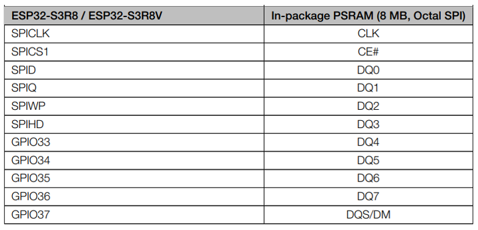
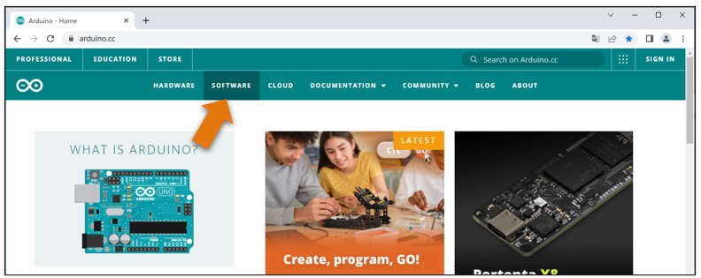
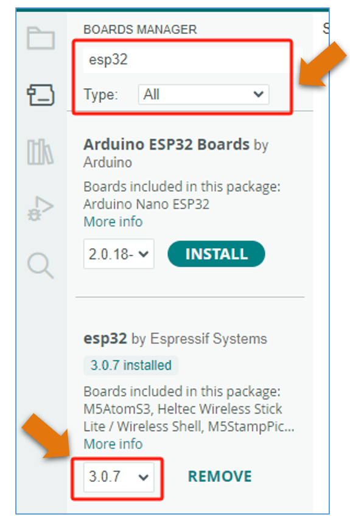

.. _Preface:

##############################################################################
Preface
##############################################################################

ESP32-S3 WROOM
*****************************

ESP32-S3-WROOM-1 has launched a total of two antenna packages, PCB on-board antenna and IPEX antenna respectively. The PCB on-board antenna is an integrated antenna in the chip module itself, so it is convenient to carry and design. The IPEX antenna is a metal antenna derived from the integrated antenna of the chip module itself, which is used to enhance the signal of the module.

.. list-table:: 
   :width: 100%
   :header-rows: 1 
   :align: center
   
   * -  PCB on-board antenna
     -  IPEX antenna

   * -  |Preface00|
     -  |Preface01|

In this tutorial, the ESP32-S3 WROOM is designed based on the PCB on-board antenna-packaged ESP32-S3-WROOM-1 module. 

ESP32-S3 WROOM

.. image:: ../_static/imgs/Preface/Preface02.png
    :align: center

The hardware interfaces of ESP32-S3 WROOM are distributed as follows:

Compare the left and right images. We've boxed off the resources on the ESP32-S3 WROOM in different colors to facilitate your understanding of the ESP32-S3 WROOM.

.. list-table:: 
   :width: 100%
   :header-rows: 1 
   :align: center
   
   * -  Box color 
     -  Corresponding resources introduction

   * -  |Preface04|
     -  GPIO pins
     
   * -  |Preface05|
     -  LED indicators

   * -  |Preface06|
     -  Camera interface

   * -  |Preface07|
     -  Reset button, Boot mode selection button 

   * -  |Preface08|
     -  USB ports

For more information, please visit: https://www.espressif.com.cn/sites/default/files/documentation/esp32-s3-wroom-1_wroom-1u_datasheet_en.pdf. 

**GPIO pins of ESP32-S3 WROOM can be used to interface with external devices and control peripheral circuits.**

**In the following projects, we only use USB cable to power ESP32-S3 WROOM by default. But you can still power the ESP3-S3 WROOM Shield with external power supply, with a voltage range of 6-12V and current of over 0.5A.**

Notes for GPIO
**************************

PSRAM Pin
=======================

The module on the ESP32-S3-WROOM board utilizes the ESP32-S3R8 chip, which comes with 8MB of external Flash. When using the OPI PSRAM, it should be noted that GPIO35-GPIO37 on the ESP32-S3-WROOM board will not be available for other purposes. However, when OPI PSRAM is not used, GPIO35-GPIO37 on the board can be used as normal GPIO.

SDcard Pin
========================

An SDcard slot is integrated on the back of the ESP32-S3-WROOM board, and we can use GPIO38-GPIO40 of ESP32-S3-WROOM to drive SD card.

The SDcard of ESP32-S3-WROOM uses SDMMC, a 1-bit bus driving method, which is integrated in the Arduino IDE, and we can call the "SD_MMC.h" library to drive it. For more details, please refer to the SDcard chapter in this tutorial.

USB Pin
=======================

In Micropython, GPIO19 and GPIO20 are dedicated to the USB function of the ESP32S3 and cannot be used for other functions. 

Please note that in this product, GPIO19 is used to read the ADC value of the external power supply, and therefore should not be used for USB functions to avoid conflicts.

Cam Pin
=======================

When using the camera of our ESP32-S3 WROOM, please check the pins of it. Pins with underlined numbers are used by the camera function, if you want to use other functions besides it, please avoid using them.

.. image:: ../_static/imgs/Preface/Preface10.png
    :align: center

+-----------+----------+
|  CAM_Pin  | GPIO_pin |
+===========+==========+
| SIOD      | GPIO4    |
+-----------+----------+
| SIOC      | GPIO5    |
+-----------+----------+
| CSI_VYSNC | GPIO6    |
+-----------+----------+
| CSI_HREF  | GPIO7    |
+-----------+----------+
| CSI_Y9    | GPIO16   |
+-----------+----------+
| XCLK      | GPIO15   |
+-----------+----------+
| CSI_Y8    | GPIO17   |
+-----------+----------+
| CSI_Y7    | GPIO18   |
+-----------+----------+
| CSI_PCLK  | GPIO13   |
+-----------+----------+
| CSI_Y6    | GPIO12   |
+-----------+----------+
| CSI_Y2    | GPIO11   |
+-----------+----------+
| CSI_Y5    | GPIO10   |
+-----------+----------+
| CSI_Y3    | GPIO9    |
+-----------+----------+
| CSI_Y4    | GPIO8    |
+-----------+----------+

If you have any questions regarding GPIO information, you can click :ref:`here <Preface>` to navigate back to the ESP32-S3 WROOM and view specific GPIO details.

Or check: https://www.espressif.com/sites/default/files/documentation/esp32-s3_datasheet_en.pdf.

CH343 (Importance)
***********************************

ESP32-S3 WROOM uses CH343 to download code. Therefore, before using the device, it is necessary to install the CH343 driver on your computer.

Windows
====================================

Check whether CH343 has been installed
-----------------------------------------------

1.	Connect your computer and ESP32-S3 WROOM with a USB cable.

2.	Turn to the main interface of your computer, select "This PC" and right-click to select "Manage".

3.	Click "Device Manager". If your computer has installed CH343, you can see"USB-Enhances-SERIAL CH343 (COMx)". And you can click :ref:`here <Programming>` to move to the next step.

Installing CH343
--------------------------

1.	First, download CH343 driver, click http://www.wch-ic.com/search?t=all&q=ch343 to download the appropriate one based on your operating system.

If you would not like to download the installation package, you can open " **Freenove_Ultimate_Starter_Kit_for_ESP32_S3/CH343** ", we have prepared the installation package.

2.	Open the folder "Freenove_Ultimate_Starter_Kit_for_ESP32_S3/CH343/Windows/"

3.	Double click " **CH343SER.EXE** ".

4.	Click "INSTALL" and wait for the installation to complete.

5.	Install successfully. Close all interfaces.

6.	When ESP32-S3 WROOM is connected to computer, select "This PC", right-click to select "Manage" and click "Device Manager" in the newly pop-up dialog box, and you can see the following interface.

7.	So far, CH343 has been installed successfully. Close all dialog boxes. 

MAC
===========================

First, download CH343 driver. Click http://www.wch-ic.com/search?t=all&q=ch343 to download the appropriate one based on your operating system.

If you would not like to download the installation package, you can open " **Freenove_Ultimate_Starter_Kit_for_ESP32_S3/CH343** ". We have prepared the installation package.

Second, open the folder "Freenove_Ultimate_Starter_Kit_for_ESP32_S3/CH343/MAC/"

Third, click Continue.

Fourth, click Install.

Then, waiting Finsh.

Finally, restart your PC.

If it fails to be installed with the above steps, you can refer to readme.pdf to install it. 

.. _Programming:

Programming Software
*********************************

Arduino Software (IDE) is used to write and upload the code for Arduino Board.

First, install Arduino Software (IDE): visit https://www.arduino.cc, click "Download" to enter the download page.

Select and download corresponding installer according to your operating system. If you are a windows user, please select the "Windows" to download and install it correctly.

After the download completes, run the installer. For Windows users, there may pop up an installation dialog box of driver during the installation process. When it popes up, please allow the installation.

After installation completes, an Arduino Software shortcut will be generated in the desktop. Run the Arduino Software.

The interface of Arduino Software is as follows:

Programs written with Arduino Software (IDE) are called **sketches** . These sketches are written in the text editor and saved with the file extension.ino. The editor features text cutting/pasting and searching/replacing. The message area gives feedback while saving and exporting and also displays errors. The console displays text output by the Arduino Software (IDE), including complete error messages and other information. The bottom right-hand corner of the window displays the configured board and serial port. The toolbar buttons allow you to verify and upload programs, create, open, and save sketches, and open the serial monitor.

.. list-table:: 
   :width: 100%
   :header-rows: 1 
   :align: center
   

   * -  |Preface31|
     -  Verify 
        
        Check your code for compile errors.

   * -  |Preface32|
     -  Upload 
        
        Compile your code and upload them to 
        
        the configured board. 

   * -  |Preface33|
     -  Debug
        
        Debug code running on the board. 
        
        (Some development boards do not support this function)

   * -  |Preface34|
     -  Development board selection
        
        Configure the support package and upload 
        
        port of the development board.

   * -  |Preface35|
     -  Serial Plotter
        
        Receive serial port data and plot it in a 
        
        discounted graph.

   * -  |Preface35|
     -  Serial Monitor 
        
        Open the serial monitor. 

Additional commands are found within the five menus: File, Edit, Sketch, Tools, Help. The menus are context sensitive, which means only those items relevant to the work currently being carried out are available.

Environment Configuration
***********************************

First, open the software platform arduino, and then click File in Menus and select Preferences.

Second, click on the symbol behind "Additional Boards Manager URLs" 

Third, fill in https://raw.githubusercontent.com/espressif/arduino-esp32/gh-pages/package_esp32_index.json in the new window, click OK, and click OK on the Preferences window again.

.. note::
    
    if you copy and paste the URL directly, you may lose the "-". Please check carefully to make sure the link is correct.

Fourth, click "Boards Manager". Enter "esp32" in Boards manager, select 2.0.7, and  click "INSTALL".

Arduino will download these files automaticly. Wait for the installation to complete.

When finishing installation, click Tools in the Menus again and select Board: "ESP32S3 Dev Module", and then you can see information of ESP32-S3. 

Library Installation
*********************************

Before starting the learning process, it is necessary to install some libraries in advance to enable the code to be compiled properly. For convenience, we have already packaged these libraries and placed them in the Freenove Development Kit for ESP32-S3/Libraries folder. Please refer to the following steps to install these libraries into the Arduino IDE.

1.	Open Arduino IDE.

2.	Select Sketch->Include Library->Add .ZIP library....

3.	On the newly pop-up window, select the files from the Freenove-Development-Kit-for-ESP32-S3/Libraries. Click Open to install the library.

4.	Repeat the above steps until all the six libraries are installed to Arduino. So far, all libraries have been installed.

.. note::
    
    Some libraries are not the latest version. Please do not update them even if it prompts every time you open the IDE. Just click LATER. Otherwise, it may lead the compilation to fail.

